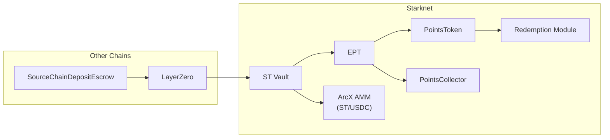

<Info>
**Course level: Advanced**

Complete API reference for all ArcX contracts. Five on-chain contracts on Starknet, three off-chain oracles, one cross-chain escrow, and a Pendle-style AMM.
</Info>

---

## Contract Map



| Contract | Instances | Scope |
|---|---|---|
| **ST (Epoch Vault)** | One per epoch per strategy | `ST-PacificaFundingArb-E007` |
| **EPT** | One per epoch per exchange per strategy | `EPT-Pacifica-E007` |
| **PointsToken** | One per exchange | `xPC`, `xHL`, `xET` |
| **PointsCollector** | One global | Claims pool credits for LPs |
| **ArcX AMM** | One per epoch (ST/USDC pool) | Pendle-style time-decay curve |
| **Redemption Module** | Shared trait (not standalone) | Imported by EPT and PointsToken |
| **SourceChainDepositEscrow** | One per supported source chain | Ethereum, Arbitrum, Solana |

---

## ST Vault (Epoch Vault)

ST is an ERC4626-like vault that accepts USDC deposits, mints share tokens based on oracle-reported NAV, and enables USDC redemption after finalization.

### State Variables

| Variable | Type | Access | Description |
|---|---|---|---|
| `currentNAV` | `u256` | Oracle write, public read | Latest reported NAV in USDC |
| `navTimestamp` | `u64` | Oracle write, public read | Timestamp of latest NAV update |
| `totalShares` | `u256` | Internal | Total ST shares outstanding |
| `finalNAV` | `u256` | Oracle write (once), public read | NAV at finalization |
| `finalized` | `bool` | Admin write (once), public read | Whether epoch is finalized |
| `paused` | `bool` | Admin write, public read | Whether deposits are paused |
| `epochStart` | `u64` | Immutable | Epoch start timestamp |
| `epochEnd` | `u64` | Immutable | Epoch end timestamp |
| `depositCutoff` | `u64` | Immutable | Seconds before epochEnd when deposits stop |
| `depositFeeRate` | `u256` | Admin configurable | Fee rate applied to deposits (basis points) |
| `epochId` | `u64` | Immutable | Unique epoch identifier |
| `strategyId` | `felt252` | Immutable | Strategy identifier |
| `eptContracts` | `Array<ContractAddress>` | Admin configurable | Associated EPT contract addresses |
| `ammAddress` | `ContractAddress` | Admin configurable | Associated ArcX AMM pool address |

### Functions

#### `deposit(usdcIn: u256, receiver: ContractAddress) -> (shares: u256, eptAmounts: Array<u256>)`

Deposits USDC into the vault, mints ST shares and EPT tokens.

**Validation:**
```
require(block_timestamp >= epochStart)
require(block_timestamp < epochEnd - depositCutoff)
require(block_timestamp - navTimestamp <= MAX_NAV_STALENESS)  // 30 min
require(!paused)
require(usdcIn > 0)
```

**Computation:**
```
netUSDC = usdcIn - depositFee(usdcIn)
shares = netUSDC * totalShares / currentNAV    // or netUSDC if first deposit
```

**Side effects:**
1. Transfers `usdcIn` USDC from caller to vault
2. Mints `shares` ST to `receiver`
3. For each associated EPT contract: mints `netUSDC` EPT to `receiver`
4. Emits `Deposit` event

**Returns:** Shares minted and array of EPT amounts (one per exchange).

---

#### `redeem(shares: u256, receiver: ContractAddress) -> u256`

Burns ST shares and returns proportional USDC after finalization.

**Validation:**
```
require(finalized == true)
require(shares > 0)
require(balance[caller] >= shares)
```

**Computation:**
```
usdcOut = shares * finalNAV / totalShares
```

**Side effects:**
1. Burns `shares` from caller
2. Transfers `usdcOut` USDC to `receiver`
3. Emits `Redeem` event

**Returns:** USDC amount transferred.

---

#### `updateNAV(navValue: u256, timestamp: u64)` (Oracle only)

Updates the vault's NAV. Called by the NAV Oracle approximately every 5 minutes.

**Validation:**
```
require(caller == authorizedOracle)
require(timestamp > navTimestamp)    // monotonically increasing
require(!finalized)
```

**Side effects:**
1. Sets `currentNAV = navValue`
2. Sets `navTimestamp = timestamp`
3. Emits `NAVUpdated` event

---

#### `finalizeNAV(navValue: u256)` (Oracle only)

Sets the final NAV and marks the epoch for finalization.

**Validation:**
```
require(caller == authorizedOracle)
require(!finalized)
require(block_timestamp >= epochEnd)
```

---

#### `finalize()` (Admin only)

Marks the epoch as finalized, enabling redemptions.

**Validation:**
```
require(caller == admin)
require(finalNAV > 0)        // finalizeNAV must have been called
require(!finalized)
```

**Side effects:**
1. Sets `finalized = true`
2. Emits `EpochFinalized` event

---

#### `pause()` / `unpause()` (Admin only)

Pauses or resumes deposits. Does not affect epoch lifecycle, trading, or redemptions.

---

#### View Functions

| Function | Returns | Description |
|---|---|---|
| `sharePrice() -> u256` | `currentNAV / totalShares` | Current price per ST share |
| `getNav() -> (u256, u64)` | `(currentNAV, navTimestamp)` | Latest NAV and its timestamp |
| `isFinalized() -> bool` | `finalized` | Whether redemptions are enabled |
| `getEpochInfo() -> EpochInfo` | Struct | `epochId`, `epochStart`, `epochEnd`, `strategyId` |
| `previewDeposit(usdcIn: u256) -> u256` | Expected shares | Preview without executing |
| `previewRedeem(shares: u256) -> u256` | Expected USDC | Preview without executing (requires finalized) |

### Events

```
event Deposit {
    depositor: ContractAddress,
    receiver: ContractAddress,
    usdcIn: u256,
    netUSDC: u256,
    sharesMinted: u256,
    navAtDeposit: u256,
    epochId: u64
}

event Redeem {
    redeemer: ContractAddress,
    receiver: ContractAddress,
    sharesBurned: u256,
    usdcOut: u256,
    epochId: u64
}

event NAVUpdated {
    navValue: u256,
    timestamp: u64,
    epochId: u64
}

event EpochFinalized {
    finalNAV: u256,
    totalShares: u256,
    epochId: u64
}

event Paused { by: ContractAddress }
event Unpaused { by: ContractAddress }
```

---

## EPT (Expected Points Token)

EPT is an ERC20 with a built-in credit accrual system. Every transfer triggers a checkpoint that settles accrued credits for both sender and receiver.

### State Variables

| Variable | Type | Access | Description |
|---|---|---|---|
| `creditRate` | `u256` | Oracle write, public read | Credits per EPT per second |
| `globalCreditIndex` | `u256` | Internal | Cumulative credit-seconds per EPT unit |
| `lastCheckpointTime` | `u64` | Internal | Timestamp of last global checkpoint |
| `totalCredits` | `u256` | Public read | Running sum of all settled credits |
| `totalPoints` | `u256` | Oracle write (once), public read | Points reported at finalization |
| `finalized` | `bool` | Admin write (once), public read | Whether epoch is finalized |
| `userCreditIndex[addr]` | `u256` | Internal | User's last-seen globalCreditIndex |
| `userCredits[addr]` | `u256` | Public read | User's accumulated settled credits |
| `alreadyClaimed[addr]` | `u256` | Internal | Points already claimed by user |
| `pointsTokenAddress` | `ContractAddress` | Immutable | Associated PointsToken contract |
| `redeemFeeRate` | `u256` | Admin configurable | Fee on PointsToken claims (basis points) |
| `epochId` | `u64` | Immutable | Unique epoch identifier |

### Functions

#### `transfer(to: ContractAddress, amount: u256)` (ERC20)

Standard ERC20 transfer with credit checkpointing.

**Side effects:**
1. `userCheckpoint(caller)`: settles caller's accrued credits
2. `userCheckpoint(to)`: settles receiver's accrued credits
3. Moves `amount` from caller to `to`
4. Emits `Transfer` event (standard ERC20)
5. Emits `CreditCheckpoint` events for both parties

---

#### `mint(to: ContractAddress, amount: u256)` (ST Vault only)

Mints EPT on deposit. Only callable by the associated ST Vault contract.

**Side effects:**
1. `userCheckpoint(to)`
2. Increases `balance[to]` by `amount`
3. Increases `totalSupply` by `amount`
4. Emits `Transfer` (from zero address) and `CreditCheckpoint`

---

#### `updateCreditRate(newRate: u256)` (Oracle only)

Updates the credit accrual rate. Called by the Credits Oracle.

**Side effects:**
1. `globalCheckpoint()`: settles all pending credits at old rate
2. Sets `creditRate = newRate`
3. Emits `CreditRateUpdated` event

---

#### `finalizePoints(points: u256)` (Oracle only)

Reports total points earned during the epoch.

**Validation:**
```
require(caller == authorizedOracle)
require(!finalized)
```

**Side effects:**
1. `globalCheckpoint()`: final credit settlement
2. Sets `totalPoints = points`
3. Computes `pointsPerCredit = totalPoints / totalCredits`
4. Stores `pointsPerCredit` for use by subsequent `claimPoints()` calls.
5. Emits `PointsFinalized` event

---

#### `claimPoints(receiver: ContractAddress) -> u256`

Claims PointsTokens based on accrued credits.

**Validation:**
```
require(finalized == true)
```

**Computation:**
```
userCheckpoint(caller)
pointsPerCredit = storedPointsPerCredit  // set during finalizePoints()
gross = userCredits[caller] * pointsPerCredit - alreadyClaimed[caller]
net = gross - redeemFee(gross)
alreadyClaimed[caller] += gross
PointsToken.mint(receiver, net)
```

**Returns:** Net PointsTokens minted.

---

#### `claimFor(holder: ContractAddress, receiver: ContractAddress) -> u256` (Admin only)

Claims points on behalf of a whitelisted address (used for AMM pool credit distribution).

**Validation:**
```
require(caller == admin || caller == pointsCollector)
require(isWhitelisted(holder))
```

---

#### View Functions

| Function | Returns | Description |
|---|---|---|
| `getCreditRate() -> u256` | Current `creditRate` | Rate credits accrue per EPT per second |
| `getUserCredits(addr) -> u256` | Settled + pending credits | Computes but doesn't write |
| `getTotalCredits() -> u256` | `totalCredits` + unsettled global | Includes pending credits |
| `getPointsPerCredit() -> u256` | `totalPoints / totalCredits` | Only meaningful after finalization |
| `previewClaim(addr) -> u256` | Expected net PointsTokens | Preview without executing |
| `getGlobalCreditIndex() -> u256` | Current `globalCreditIndex` | For indexers and analytics |

### Events

```
event CreditRateUpdated {
    oldRate: u256,
    newRate: u256,
    globalCreditIndex: u256,
    timestamp: u64,
    epochId: u64
}

event CreditCheckpoint {
    user: ContractAddress,
    creditsSettled: u256,
    cumulativeCredits: u256,
    balance: u256,
    epochId: u64
}

event PointsFinalized {
    totalPoints: u256,
    totalCredits: u256,
    pointsPerCredit: u256,
    epochId: u64
}

event PointsClaimed {
    user: ContractAddress,
    receiver: ContractAddress,
    grossPoints: u256,
    fee: u256,
    netPoints: u256,
    epochId: u64
}
```

---

## PointsToken

Standard ERC20 representing tokenized exchange points, 1:1 backed. One contract per exchange (xPC, xHL, etc.). Persists across epochs.

### State Variables

| Variable | Type | Access | Description |
|---|---|---|---|
| `totalSupply` | `u256` | Public read | Total PointsTokens in circulation |
| `authorizedMinters` | `Map<ContractAddress, bool>` | Admin configurable | EPT contracts + PointsCollector that can mint |
| `redemptionModuleAddress` | `ContractAddress` | Admin configurable | Where airdrop tokens are deposited |
| `exchangeId` | `felt252` | Immutable | Exchange identifier (e.g., "pacifica") |

### Functions

#### `mint(to: ContractAddress, amount: u256)` (Authorized minters only)

Mints PointsTokens. Only callable by finalized EPT contracts or PointsCollector.

**Validation:**
```
require(authorizedMinters[caller] == true)
```

---

#### `burn(amount: u256)`

Burns PointsTokens from caller's balance. Used during post-TGE redemption.

---

#### `addMinter(minter: ContractAddress)` / `removeMinter(minter: ContractAddress)` (Admin only)

Manages the set of authorized minters. Each new EPT contract (per epoch) must be added as a minter.

---

#### `redeem(amount: u256, receiver: ContractAddress) -> u256`

Burns PointsTokens and transfers airdrop tokens from the Redemption Module (post-TGE only).

**Computation:**
```
redemptionRate = totalAirdropTokens / totalPointsTokenSupply
airdropOut = amount * redemptionRate
```

**Returns:** Airdrop tokens transferred.

### Events

```
event PointsTokenMinted {
    to: ContractAddress,
    amount: u256,
    minter: ContractAddress,
    epochId: u64       // from the EPT that triggered the mint
}

event PointsTokenRedeemed {
    redeemer: ContractAddress,
    receiver: ContractAddress,
    pointsBurned: u256,
    airdropTokensOut: u256
}

event MinterAdded { minter: ContractAddress }
event MinterRemoved { minter: ContractAddress }
```

---

## PointsCollector

Admin-callable contract that claims PointsTokens on behalf of whitelisted addresses (AMM pool contracts). Used for distributing pool credits to LPs.

### Functions

#### `claimPoolCredits(eptAddress: ContractAddress, poolAddress: ContractAddress)`

Triggers `claimFor(poolAddress, this)` on the EPT contract, receiving PointsTokens.

**Validation:**
```
require(caller == admin)
require(isWhitelisted(poolAddress))
```

---

#### `distributeToLPs(merkleRoot: felt252, totalAmount: u256)`

Sets up a merkle distribution for LPs to claim their share of pool PointsTokens.

---

#### `claimFromMerkle(proof: Array<felt252>, amount: u256)`

LPs call this with their merkle proof to claim PointsTokens.

### Events

```
event PoolCreditsClaimed {
    eptAddress: ContractAddress,
    poolAddress: ContractAddress,
    pointsTokenAmount: u256,
    epochId: u64
}

event MerkleDistributionCreated {
    merkleRoot: felt252,
    totalAmount: u256,
    epochId: u64
}

event LPClaimed {
    lp: ContractAddress,
    amount: u256
}
```

---

## SourceChainDepositEscrow (Cross-Chain)

Deployed on each supported source chain (Ethereum, Arbitrum, Solana). Locks USDC and sends deposit messages to Starknet via LayerZero.

### State Variables

| Variable | Type | Access | Description |
|---|---|---|---|
| `deposits[depositId]` | `DepositInfo` | Public read | Deposit amount, sender, status, timestamp |
| `refundTimeout` | `uint256` | Admin configurable | Seconds after which unacknowledged deposits can be refunded |
| `arcxMultisig` | `address` | Immutable | Controls released USDC |

### Functions

#### `depositUSDC(amount: uint256, starknetReceiver: felt252, epochId: uint64) -> bytes32`

Locks USDC and sends a cross-chain deposit message.

**Side effects:**
1. Transfers USDC from caller to escrow
2. Generates unique `depositId`
3. Sends LayerZero message to Starknet ST Vault
4. Emits `DepositInitiated` event

**Returns:** `depositId` for tracking.

---

#### `cancel(depositId: bytes32)`

Refunds locked USDC if no acknowledgment received within timeout.

**Validation:**
```
require(deposits[depositId].sender == msg.sender)
require(block.timestamp > deposits[depositId].timestamp + refundTimeout)
require(deposits[depositId].status == PENDING)
```

**Side effects:**
1. Sets status to CANCELLED
2. Returns locked USDC to sender
3. Emits `DepositCancelled` event

---

#### `acknowledgeDeposit(depositId: bytes32, shares: uint256, eptAmount: uint256)` (LZ endpoint)

Receives acknowledgment from Starknet that deposit was processed.

**Side effects:**
1. Sets status to COMPLETED
2. Releases locked USDC to `arcxMultisig` for strategy deployment
3. Emits `DepositAcknowledged` event

### Events

```
event DepositInitiated {
    depositId: bytes32,
    sender: address,
    amount: uint256,
    starknetReceiver: felt252,
    epochId: uint64,
    timestamp: uint256
}

event DepositAcknowledged {
    depositId: bytes32,
    shares: uint256,
    eptAmount: uint256
}

event DepositCancelled {
    depositId: bytes32,
    sender: address,
    refundAmount: uint256
}
```

---

## Oracle Interfaces

### NAV Oracle

**Caller:** ArcX off-chain service
**Frequency:** Every 5 minutes during ACTIVE epoch
**Target:** ST Vault

```
// During epoch
updateNAV(navValue: u256, timestamp: u64)

// At finalization
finalizeNAV(navValue: u256)
```

| Parameter | Constraint |
|---|---|
| `navValue` | Must be >= 0. Represents total USDC value of strategy positions. |
| `timestamp` | Must be monotonically increasing. |
| `MAX_NAV_STALENESS` | 30 minutes. Deposits revert if `block_timestamp - navTimestamp > 30 min`. |

### Credits Oracle

**Caller:** ArcX off-chain service
**Frequency:** Every 5--15 minutes during ACTIVE epoch
**Target:** EPT

```
updateCreditRate(newRate: u256)
```

| Parameter | Constraint |
|---|---|
| `newRate` | >= 0. Represents credits per EPT per second. |
| Update cadence | Not enforced on-chain. No staleness check currently. |

### Final Points Oracle

**Caller:** ArcX off-chain service
**Frequency:** Once per epoch, after maturity
**Target:** EPT

```
finalizePoints(totalPoints: u256)
```

| Parameter | Constraint |
|---|---|
| `totalPoints` | Must be > 0 for meaningful distribution. |
| Timing | Called after strategy unwind and points tally. |
