<Info>
**Course level: Advanced**

This guide walks you through integrating with ArcX contracts on Starknet. Whether you are building a frontend, an analytics indexer, or an arbitrage bot, start here.
</Info>

**Prerequisites:** [What is ArcX?](/learn/protocol-overview), [The Three Tokens](/learn/token-economics), [How Epochs Work](/learn/epoch-lifecycle)

---

## What Does "Integrate ArcX" Mean?

ArcX is a set of on-chain contracts deployed on Starknet. Integrating means one or more of the following:

- **Reading on-chain state** -- current NAV, epoch status, user balances, credit accrual, AMM prices.
- **Submitting transactions** -- deposits, redemptions, point claims, AMM swaps.
- **Indexing events** -- building historical data for analytics dashboards, APY calculations, and TVL tracking.
- **Composing transactions** -- flash loops, arbitrage between the AMM and external venues, or aggregator routing.

All contracts are Cairo contracts on Starknet. You interact with them using standard Starknet tooling.

---

## Architecture

```mermaid
flowchart TB
    subgraph STARKNET["Starknet"]
        direction TB
        STV["ST Vault\n(per epoch per strategy)"]
        EPT["EPT\n(per epoch per exchange)"]
        PT["PointsToken\n(per exchange, persists)"]
        RM["Redemption Module\n(post-TGE burn->claim)"]
        AMM["ArcX AMM\n(ST/USDC, Pendle-style)"]
        PC["PointsCollector\n(LP credit distribution)"]

        STV --> EPT
        EPT --> PT
        PT --> RM
        STV --> AMM
    end

    subgraph OFFCHAIN["Off-Chain (ArcX)"]
        direction TB
        NAV["NAV Oracle\n(every 5 min)"]
        CR["Credits Oracle\n(activity-weighted)"]
        FP["Final Points Oracle\n(at finalization)"]
        SR["Strategy Runner\n(perp DEX trading)"]
    end

    subgraph CROSSCHAIN["Cross-Chain (EVM / Solana)"]
        direction TB
        ESC["SourceChainDepositEscrow"]
        LZ["LayerZero"]
    end

    NAV -->|"updateNAV()"| STV
    CR -->|"updateCreditRate()"| EPT
    FP -->|"finalizePoints()"| EPT
    ESC -->|"deposit msg"| LZ
    LZ -->|"deliver"| STV
```



| Contract | Instances | Key Functions |
|---|---|---|
| **ST Vault** | Per epoch per strategy | `deposit()`, `redeem()`, `flashLoop()` |
| **EPT** | Per epoch per exchange per strategy | `claimPoints()`, `transfer()` with checkpointing |
| **PointsToken** | Per exchange (persists) | `mint()`, `redeem()` (post-TGE) |
| **PointsCollector** | Global | `claimPoolCredits()`, merkle distribution |
| **ArcX AMM** | Per epoch (ST/USDC pool) | Pendle-style time-decay curve, `swap()` |
| **Escrow** | Per source chain | `depositUSDC()`, `cancel()` |

---

## Prerequisites

Before writing any integration code, make sure you have the following set up.

### Starknet Tooling

<Tabs>
  <Tab title="TypeScript (starknet.js)">
    ```bash
    npm install starknet
    ```

    [starknet.js](https://www.starknetjs.com/) is the primary JavaScript/TypeScript SDK for Starknet. Version 6.x or later is recommended.
  </Tab>
  <Tab title="Python (starknet.py)">
    ```bash
    pip install starknet-py
    ```

    [starknet.py](https://starknetpy.readthedocs.io/) provides full Starknet RPC support for Python-based integrations and bots.
  </Tab>
  <Tab title="Cairo (on-chain)">
    If you are writing on-chain contracts that compose with ArcX (e.g., a custom vault wrapper), you will need [Scarb](https://docs.swmansion.com/scarb/) and the Cairo compiler. ArcX contract ABIs will be published as a Scarb package at launch.
  </Tab>
</Tabs>

### Wallet Setup

For submitting transactions, you need a Starknet wallet:

- **[Argent X](https://www.argent.xyz/argent-x/)** -- browser extension wallet, most popular on Starknet.
- **[Braavos](https://braavos.app/)** -- alternative browser extension wallet with hardware wallet support.

For backend services and bots, you will use a raw account key pair rather than a browser wallet. See the starknet.js `Account` class documentation.

### RPC Providers

You need a Starknet RPC endpoint. Options include:

| Provider | Free Tier | URL Pattern |
|---|---|---|
| Blast API | Yes | `https://starknet-mainnet.public.blastapi.io` |
| Alchemy | Yes (limited) | `https://starknet-mainnet.g.alchemy.com/starknet/version/rpc/v0_7/{API_KEY}` |
| Infura | Yes (limited) | `https://starknet-mainnet.infura.io/v3/{API_KEY}` |
| Nethermind (Juno) | Self-hosted | Run your own Juno node |

<Tip>
For production integrations, use a dedicated RPC provider with an API key rather than a public endpoint. Public endpoints have rate limits and no SLA.
</Tip>

---

## Getting Started

<Steps>
  <Step title="Connect to Starknet">
    Instantiate an RPC provider pointing at Starknet mainnet (or Sepolia testnet for development).

    <CodeGroup>
    ```typescript TypeScript
    import { RpcProvider } from 'starknet';

    // Mainnet
    const provider = new RpcProvider({
      nodeUrl: 'https://starknet-mainnet.public.blastapi.io',
    });

    // Sepolia testnet
    const testnetProvider = new RpcProvider({
      nodeUrl: 'https://starknet-sepolia.public.blastapi.io',
    });

    // Verify connection
    const chainId = await provider.getChainId();
    console.log('Connected to chain:', chainId);
    ```

    ```python Python
    from starknet_py.net.full_node_client import FullNodeClient

    # Mainnet
    client = FullNodeClient(node_url="https://starknet-mainnet.public.blastapi.io")

    # Sepolia testnet
    testnet_client = FullNodeClient(
        node_url="https://starknet-sepolia.public.blastapi.io"
    )

    chain_id = await client.get_chain_id()
    print(f"Connected to chain: {chain_id}")
    ```
    </CodeGroup>
  </Step>

  <Step title="Instantiate the ST Vault Contract">
    Create a contract instance using the ABI and deployed address. ABI files will be published at launch.

    <CodeGroup>
    ```typescript TypeScript
    import { Contract } from 'starknet';

    // NOTE: Replace with actual deployed addresses at launch.
    // Each epoch has its own ST Vault instance.
    const VAULT_ADDRESS = '0x0123...abcd';

    // Load ABI from published JSON (shipped with ArcX SDK or fetched from on-chain class)
    import vaultAbi from './abis/st_vault.json';

    const vault = new Contract(vaultAbi, VAULT_ADDRESS, provider);
    ```

    ```python Python
    from starknet_py.contract import Contract

    # NOTE: Replace with actual deployed addresses at launch.
    VAULT_ADDRESS = 0x0123  # truncated for example

    vault = await Contract.from_address(
        address=VAULT_ADDRESS,
        provider=client,
    )
    ```
    </CodeGroup>

    <Warning>
    ST Vault and EPT contracts are **per-epoch**. Each new epoch deploys fresh contract instances at new addresses. Your integration must track which addresses correspond to which epoch. Use `getEpochInfo()` to verify.
    </Warning>
  </Step>

  <Step title="Read Epoch State">
    Query the current NAV, epoch info, and whether the epoch is finalized.

    <CodeGroup>
    ```typescript TypeScript
    // Current NAV and timestamp
    const [currentNAV, navTimestamp] = await vault.getNav();
    console.log(`NAV: ${currentNAV} USDC, updated at: ${navTimestamp}`);

    // Epoch metadata
    const epochInfo = await vault.getEpochInfo();
    console.log(`Epoch ${epochInfo.epochId}: ${epochInfo.epochStart} -> ${epochInfo.epochEnd}`);

    // Share price (NAV per share)
    const sharePrice = await vault.sharePrice();
    console.log(`Share price: ${sharePrice}`);

    // Finalization status
    const finalized = await vault.isFinalized();
    console.log(`Finalized: ${finalized}`);
    ```

    ```python Python
    # Current NAV and timestamp
    nav, nav_timestamp = await vault.functions["getNav"].call()
    print(f"NAV: {nav} USDC, updated at: {nav_timestamp}")

    # Epoch metadata
    epoch_info = await vault.functions["getEpochInfo"].call()
    print(f"Epoch {epoch_info.epochId}: {epoch_info.epochStart} -> {epoch_info.epochEnd}")

    # Finalization status
    finalized = await vault.functions["isFinalized"].call()
    print(f"Finalized: {finalized}")
    ```
    </CodeGroup>
  </Step>

  <Step title="Submit a Deposit">
    To write transactions, you need an `Account` instance with signing capability.

    <CodeGroup>
    ```typescript TypeScript
    import { Account, Contract, uint256 } from 'starknet';

    // For browser wallets, use the wallet adapter (e.g., get-starknet).
    // For backend services, construct an Account directly:
    const account = new Account(
      provider,
      ACCOUNT_ADDRESS,
      PRIVATE_KEY
    );

    // USDC contract on Starknet
    const USDC_ADDRESS = '0x053c91253bc9682c04929ca02ed00b3e423f6710d2ee7e0d5ebb06f3ecf368a8';
    import usdcAbi from './abis/erc20.json';
    const usdc = new Contract(usdcAbi, USDC_ADDRESS, account);

    // Step 1: Approve USDC spend
    const depositAmount = uint256.bnToUint256(100_000000n); // 100 USDC (6 decimals)
    await usdc.approve(VAULT_ADDRESS, depositAmount);

    // Step 2: Preview the deposit
    const vaultWithSigner = new Contract(vaultAbi, VAULT_ADDRESS, account);
    const expectedShares = await vaultWithSigner.previewDeposit(depositAmount);
    console.log(`Expected shares: ${expectedShares}`);

    // Step 3: Execute deposit
    const tx = await vaultWithSigner.deposit(depositAmount, account.address);
    console.log(`Deposit tx: ${tx.transaction_hash}`);

    // Step 4: Wait for confirmation
    await provider.waitForTransaction(tx.transaction_hash);
    console.log('Deposit confirmed');
    ```

    ```python Python
    from starknet_py.net.account.account import Account
    from starknet_py.net.signer.stark_curve_signer import KeyPair

    # Construct account for signing
    account = Account(
        client=client,
        address=ACCOUNT_ADDRESS,
        key_pair=KeyPair(private_key=PRIVATE_KEY, public_key=PUBLIC_KEY),
        chain=StarknetChainId.MAINNET,
    )

    # Step 1: Approve USDC spend
    deposit_amount = 100_000000  # 100 USDC (6 decimals)
    approve_call = usdc.functions["approve"].prepare_invoke_v1(
        VAULT_ADDRESS, deposit_amount
    )

    # Step 2: Execute deposit
    deposit_call = vault.functions["deposit"].prepare_invoke_v1(
        deposit_amount, account.address
    )

    # Batch both calls in a single transaction (multicall)
    tx = await account.execute_v1(calls=[approve_call, deposit_call], max_fee=int(1e16))
    await account.client.wait_for_tx(tx.transaction_hash)
    print(f"Deposit confirmed: {hex(tx.transaction_hash)}")
    ```
    </CodeGroup>

    <Info>
    Starknet supports native **multicall**: you can batch the USDC approval and the vault deposit into a single transaction, saving gas and avoiding approval-front-running.
    </Info>
  </Step>
</Steps>

---

## Integration Patterns

<Tabs>
  <Tab title="Frontend">
    ### Frontend Integration

    A frontend integration reads on-chain state to display strategy info and submits transactions on behalf of the user via their browser wallet.

    **Key tasks:**

    1. **Display strategy info** -- For each active epoch, show `currentNAV`, `sharePrice()`, `epochStart`/`epochEnd`, and deposit window status.
    2. **Deposit flow** -- Call `previewDeposit(amount)` to show expected shares and EPT, then execute `deposit()` after USDC approval.
    3. **Epoch status** -- Check `isFinalized()` and display the appropriate UI: deposit form (active), waiting (maturity), or redemption (finalized).
    4. **Redemption** -- Post-finalization, call `previewRedeem(shares)` to show expected USDC, then execute `redeem()`.
    5. **Points claiming** -- Call `previewClaim(user)` on the EPT contract, then execute `claimPoints()`.

    **Wallet connection:** Use [get-starknet](https://github.com/starknet-io/get-starknet) or [starknet-react](https://github.com/apibara/starknet-react) for React-based frontends. These handle Argent X and Braavos wallet detection automatically.

    <CodeGroup>
    ```typescript starknet-react (React hook)
    import { useContract, useStarknet } from '@starknet-react/core';

    function DepositButton({ vaultAddress, amount }: Props) {
      const { account } = useStarknet();
      const { contract: vault } = useContract({
        abi: vaultAbi,
        address: vaultAddress,
      });

      async function handleDeposit() {
        if (!account || !vault) return;

        // Multicall: approve + deposit in one transaction
        const calls = [
          {
            contractAddress: USDC_ADDRESS,
            entrypoint: 'approve',
            calldata: [vaultAddress, amount, '0'],
          },
          {
            contractAddress: vaultAddress,
            entrypoint: 'deposit',
            calldata: [amount, '0', account.address],
          },
        ];

        const tx = await account.execute(calls);
        await account.waitForTransaction(tx.transaction_hash);
      }

      return <button onClick={handleDeposit}>Deposit</button>;
    }
    ```

    ```typescript Reading positions
    // Fetch user positions across all active epochs
    async function getUserPositions(
      userAddress: string,
      vaultAddresses: string[],
      eptAddresses: string[],
      provider: RpcProvider
    ) {
      const positions = [];

      for (const addr of vaultAddresses) {
        const vault = new Contract(vaultAbi, addr, provider);
        const shares = await vault.balanceOf(userAddress);
        const price = await vault.sharePrice();
        const epochInfo = await vault.getEpochInfo();
        const finalized = await vault.isFinalized();

        positions.push({
          vault: addr,
          epochId: epochInfo.epochId,
          shares: shares,
          value: (shares * price) / 10n ** 18n,
          finalized,
        });
      }

      return positions;
    }
    ```
    </CodeGroup>

    <Tip>
    Always call `previewDeposit()` or `previewRedeem()` before executing the actual transaction. This lets you show the user what they will receive and detect potential reverts (e.g., stale NAV, epoch not finalized) before they sign.
    </Tip>

    For detailed sequence diagrams of every flow (deposit, cross-chain, redemption, claiming), see [Integration & Deployment](/build/integration-and-deployment).
  </Tab>

  <Tab title="Indexer / Analytics">
    ### Indexer / Analytics Integration

    An indexer listens to on-chain events and builds derived datasets for dashboards, analytics, and historical queries.

    **Key events to index:**

    | Event | Contract | Use Case |
    |---|---|---|
    | `Deposit` | ST Vault | Track deposits, compute TVL |
    | `Redeem` | ST Vault | Track withdrawals |
    | `NAVUpdated` | ST Vault | Build NAV time-series, compute returns |
    | `EpochFinalized` | ST Vault | Trigger finalization UI |
    | `CreditRateUpdated` | EPT | Build credit rate history |
    | `CreditCheckpoint` | EPT | Per-user credit accrual tracking |
    | `PointsFinalized` | EPT | Final points distribution data |
    | `PointsClaimed` | EPT | Track claim activity |

    **Derived metrics you can compute:**

    <CodeGroup>
    ```typescript Strategy APY
    // From NAVUpdated events over time
    function computeEpochAPY(
      initialNAV: bigint,
      finalNAV: bigint,
      epochDurationDays: number
    ): number {
      const epochReturn = Number(finalNAV - initialNAV) / Number(initialNAV);
      const annualized = epochReturn * (365 / epochDurationDays);
      return annualized;
    }
    ```

    ```typescript TVL Calculation
    // Sum currentNAV across all active vaults
    async function computeTotalTVL(
      activeVaults: string[],
      provider: RpcProvider
    ): Promise<bigint> {
      let totalTVL = 0n;

      for (const addr of activeVaults) {
        const vault = new Contract(vaultAbi, addr, provider);
        const [nav] = await vault.getNav();
        totalTVL += nav;
      }

      return totalTVL;
    }
    ```

    ```typescript Implied EPT Cost
    // EPT implied cost from AMM ST price
    // If ST trades at $0.90 and sharePrice is $1.00,
    // the implied EPT cost = 1 - (ST_amm_price / sharePrice)
    function impliedEptCost(
      stAmmPrice: number,
      sharePrice: number
    ): number {
      return 1 - stAmmPrice / sharePrice;
    }
    ```
    </CodeGroup>

    **Indexing tooling:** Use [Apibara](https://www.apibara.com/) (Starknet-native indexing) or build a custom indexer using the starknet.js event polling API. Apibara supports streaming events with cursor-based pagination and is recommended for production.

    For the full list of events and their schemas, see [Contract Reference](/build/contract-reference).
  </Tab>

  <Tab title="Aggregator / Bot">
    ### Aggregator / Bot Integration

    Bots and aggregators compose ArcX transactions programmatically: flash loops, AMM arbitrage, or multi-protocol routing.

    **Flash loop composition:**

    The flash loop deposits USDC, sells the received ST on the ArcX AMM for USDC, and re-deposits. This can be done atomically on Starknet using multicall.

    <CodeGroup>
    ```typescript Flash Loop (multicall)
    import { Account, Contract, uint256 } from 'starknet';

    async function executeFlashLoop(
      account: Account,
      vaultAddress: string,
      ammAddress: string,
      usdcAddress: string,
      initialAmount: bigint,
      iterations: number
    ) {
      const calls = [];
      let currentAmount = initialAmount;

      for (let i = 0; i < iterations; i++) {
        // Approve USDC -> Vault
        calls.push({
          contractAddress: usdcAddress,
          entrypoint: 'approve',
          calldata: [vaultAddress, currentAmount.toString(), '0'],
        });

        // Deposit USDC -> Vault (mints ST + EPT)
        calls.push({
          contractAddress: vaultAddress,
          entrypoint: 'deposit',
          calldata: [currentAmount.toString(), '0', account.address],
        });

        // Approve ST -> AMM
        calls.push({
          contractAddress: vaultAddress, // ST is the vault token
          entrypoint: 'approve',
          calldata: [ammAddress, currentAmount.toString(), '0'],
        });

        // Swap ST -> USDC on AMM
        // NOTE: Exact swap calldata depends on AMM interface.
        // Use slippage protection (minAmountOut) in production.
        calls.push({
          contractAddress: ammAddress,
          entrypoint: 'swap',
          calldata: [/* ST amount, minUsdcOut, deadline */],
        });

        // Estimate next deposit amount (~90% of current, depends on ST discount)
        currentAmount = (currentAmount * 90n) / 100n;
      }

      const tx = await account.execute(calls);
      return tx.transaction_hash;
    }
    ```

    ```typescript AMM Price Reading
    // Read the current ST/USDC price from the ArcX AMM
    async function getStPrice(
      ammAddress: string,
      provider: RpcProvider
    ): Promise<bigint> {
      const amm = new Contract(ammAbi, ammAddress, provider);

      // The AMM uses a Pendle-style time-decay curve.
      // getSpotPrice returns the current marginal price of ST in USDC.
      const spotPrice = await amm.getSpotPrice();
      return spotPrice;
    }
    ```
    </CodeGroup>

    **Arbitrage monitoring:**

    Compare the AMM spot price of ST against the oracle-reported `sharePrice()`. If the AMM price deviates significantly from the NAV-implied share price, there is an arbitrage opportunity:

    - **AMM price < sharePrice**: Buy ST on AMM, hold to maturity, redeem at NAV. Profitable if strategy does not lose money.
    - **AMM price > sharePrice**: Deposit USDC to mint ST (at NAV), sell on AMM at premium. Rare, but possible near epoch start.

    <Warning>
    Flash loops and bot transactions interact with live AMM liquidity. Always use `minAmountOut` slippage parameters on swap calls. The AMM's time-decay curve means prices shift as the epoch approaches maturity -- ST converges toward NAV as `maturityTime` approaches.
    </Warning>
  </Tab>
</Tabs>

---

## Testnet Development

<Info>
ArcX contracts will be deployed on **Starknet Sepolia testnet** before mainnet launch. Contract addresses will be published in the ArcX documentation and developer Discord at that time.
</Info>

To develop against the testnet:

1. **Switch your provider** to Sepolia: `https://starknet-sepolia.public.blastapi.io`
2. **Get testnet ETH** for gas from the [Starknet Sepolia faucet](https://faucet.starknet.io/).
3. **Get testnet USDC** -- ArcX will deploy a mock USDC contract on Sepolia. Address TBD at launch.
4. **Use testnet contract addresses** -- All vault, EPT, AMM, and escrow addresses will differ from mainnet.

<CodeGroup>
```typescript Testnet Configuration
const TESTNET_CONFIG = {
  provider: new RpcProvider({
    nodeUrl: 'https://starknet-sepolia.public.blastapi.io',
  }),
  // These addresses are placeholders -- replace with actual testnet deployments.
  contracts: {
    stVault: '0x0abc...def0',   // Testnet ST Vault (current epoch)
    ept:     '0x0def...1234',   // Testnet EPT
    usdc:    '0x0fed...5678',   // Testnet mock USDC
    amm:     '0x0567...89ab',   // Testnet ArcX AMM
  },
};
```

```python Testnet Configuration
TESTNET_CONFIG = {
    "node_url": "https://starknet-sepolia.public.blastapi.io",
    # These addresses are placeholders -- replace with actual testnet deployments.
    "contracts": {
        "st_vault": 0x0ABC,   # Testnet ST Vault (current epoch)
        "ept":      0x0DEF,   # Testnet EPT
        "usdc":     0x0FED,   # Testnet mock USDC
        "amm":      0x0567,   # Testnet ArcX AMM
    },
}
```
</CodeGroup>

---

## Key Gotchas

<Warning>
**NAV staleness check.** Deposits revert if the NAV oracle has not updated within 30 minutes (`MAX_NAV_STALENESS`). If your deposits are failing, check `navTimestamp` against the current block time before submitting.
</Warning>

<Warning>
**Epoch-specific contracts.** ST and EPT are deployed fresh each epoch. `ST-E007` and `ST-E008` are entirely different contracts. Your integration must discover and track new addresses each epoch. Use `getEpochInfo()` to verify you are targeting the correct epoch.
</Warning>

<Tip>
**Multicall everything.** Starknet's native account abstraction supports batching multiple calls in a single transaction. Always batch USDC approval + deposit (or approval + swap) to save gas and avoid front-running between the approval and the action.
</Tip>

<Info>
**EPT is not tradeable.** There is no AMM pool for EPT. It is acquired only via deposits (including flash loops). Do not attempt to create EPT liquidity pools or route EPT through DEX aggregators.
</Info>

For a comprehensive list of pitfalls (cross-chain timing, incremental claims, minter authorization, and more), see the Common Pitfalls section in [Integration & Deployment](/build/integration-and-deployment#common-pitfalls).

---

## Next Steps

<CardGroup cols={2}>
  <Card title="Contract Reference" icon="file-code" href="/build/contract-reference">
    Every state variable, function signature, validation rule, and event across all ArcX contracts.
  </Card>
  <Card title="Integration & Deployment" icon="plug" href="/build/integration-and-deployment">
    Sequence diagrams, frontend patterns, indexer setup, AMM integration, common pitfalls, and the per-epoch deployment checklist.
  </Card>
</CardGroup>
