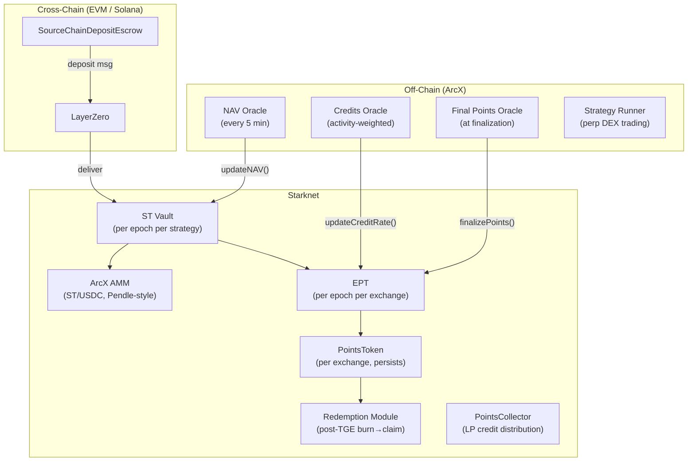

<Warning>
This page is outdated and does not reflect the current protocol design. It will be updated in a future release. For the current architecture, see [How ArcX Works](/learn/protocol-overview).
</Warning>

<Info>
**Course level: Advanced**

Building on ArcX? Five on-chain contracts, three off-chain oracles, one cross-chain escrow, and a Pendle-style AMM. This section covers every interface, event, and integration pattern.
</Info>

**Prerequisites:** [What is ArcX?](/learn/protocol-overview), [The Three Tokens](/learn/token-economics), [How Epochs Work](/learn/epoch-lifecycle)

---

## Architecture

| Contract | Instances | Key Functions |
|---|---|---|
| **ST Vault** | Per epoch per strategy | `deposit()`, `redeem()`, `flashLoop()` |
| **EPT** | Per epoch per exchange | `claimPoints()`, `transfer()` with checkpointing |
| **PointsToken** | Per exchange (persists) | `mint()`, `redeem()` (post-TGE) |
| **PointsCollector** | Global | `claimPoolCredits()`, merkle distribution |
| **ArcX AMM** | Per epoch (ST/USDC pool) | Pendle-style time-decay curve, `swap()` |
| **Escrow** | Per source chain | `depositUSDC()`, `cancel()` |

### Supported Source Chains

| Chain | Escrow Contract | Bridge |
|---|---|---|
| Ethereum | SourceChainDepositEscrow (EVM) | LayerZero |
| Arbitrum | SourceChainDepositEscrow (EVM) | LayerZero |
| Solana | SourceChainDepositEscrow (SVM) | LayerZero |

---

<CardGroup cols={2}>
  <Card title="Contract Reference" icon="file-code" href="/build/contract-reference">
    Every state variable, function signature, validation rule, and event across all contracts.
  </Card>
  <Card title="Integration & Deployment" icon="plug" href="/build/integration-and-deployment">
    Frontend patterns, indexer setup, AMM integration, common pitfalls, and deployment checklist.
  </Card>
</CardGroup>
