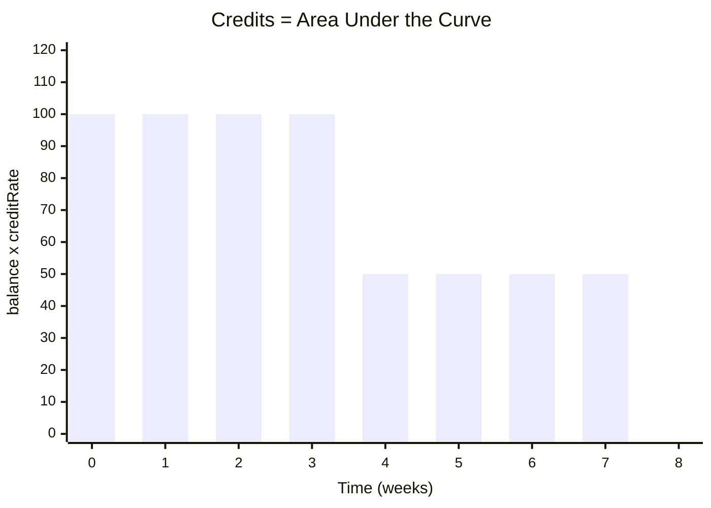

## Why Credits Exist

Without credits, points distribution would be trivially gameable. Consider the naive alternative:

*At epoch end, distribute points proportional to EPT balance.*

**The attack:** Deposit 10,000 USDC one second before finalization. Claim the same points share as someone who deposited 10,000 USDC at epoch start. Zero effective cost (deposit, claim, redeem ST), infinite points per dollar.

Credits prevent this by tracking **balance x time x activity**. Your share of points is proportional to your *cumulative contribution* over the epoch, not your balance at a single snapshot.

---

## The Credit Formula

### Continuous Form

For a single user holding a constant balance over a time interval with a constant creditRate:

$$\text{credits} = \text{balance} \times \text{creditRate} \times \Delta t$$

In the general case, where both balance and creditRate change over time, credits are the integral:

$$\text{credits}_i = \int_0^T \text{balance}_i(t) \times \text{creditRate}(t) \, dt$$

Your credits are the area under the curve of `(your EPT balance) x (the credit rate)` over time. Holding more EPT, for longer, at higher rates = more credits.



*The bars represent Alice's `balance × creditRate` over time. She held 100 EPT at creditRate=1 for weeks 1--4, then transferred 50 EPT, holding 50 for weeks 5--8. Her total credits are the sum of these values over time.*

### Points Distribution

At finalization, the Final Points Oracle reports `totalPoints` earned during the epoch. Your share:

$$\text{pointsPerCredit} = \frac{\text{totalPoints}}{\text{totalCredits}}$$

$$\text{yourPoints} = \text{yourCredits} \times \text{pointsPerCredit} - \text{alreadyClaimed}$$

Where `totalCredits` is the sum of all individual credits across all holders, and `alreadyClaimed` tracks incremental claims.

This is a **pro-rata** system: you receive points in proportion to your credit share of the total.

---

## The Constant Rate Proof

An important mathematical property: if creditRate is constant throughout the entire epoch, its exact value doesn't matter.

**Proof:**

Let creditRate = k (constant) for all time. For user i holding b_i EPT for t_i seconds:

$$\text{credits}_i = k \times b_i \times t_i$$

$$\text{totalCredits} = k \times \sum_j (b_j \times t_j)$$

$$\text{points}_i = \text{totalPoints} \times \frac{\text{credits}_i}{\text{totalCredits}} = \text{totalPoints} \times \frac{k \times b_i \times t_i}{k \times \sum_j(b_j \times t_j)} = \text{totalPoints} \times \frac{b_i \times t_i}{\sum_j(b_j \times t_j)}$$

The constant k cancels in the ratio. **Any constant rate, whether 1, 100, or 1,000,000, produces identical point distribution.**

<Tip>
**What this means practically:**
- If strategy activity is roughly uniform across the epoch, the creditRate value is irrelevant
- Constant rate = 1 is a valid degenerate case: it reduces to pure time-weighted balance
- Variable rate only changes outcomes when activity varies AND different users hold EPT during different activity periods
</Tip>

**When does this matter?** In the oracle-down fallback. If the Credits Oracle stops publishing, credits accrue at the last known rate. If that rate stays constant for the rest of the epoch, the exact constant chosen doesn't affect distribution. The system degrades gracefully.

---

## Variable Rate: Why It Exists

The constant rate proof shows that constant rates are *mathematically* sufficient. So why use a variable rate?

### The Fairness Argument

A funding arb strategy opens \$500K of OI at epoch start, then the market shifts and the strategy scales down to \$50K OI mid-epoch. Exchange points are earned proportional to OI. Most of the epoch's points came from the first half.

**Constant rate (rate = 1):**
- Alice (100 EPT, full epoch): 100 x 1 x 604,800 = 60.48M credits
- Bob (100 EPT, second half only): 100 x 1 x 259,200 = 25.92M credits

**Variable rate (rate proportional to OI):**
- Alice Phase 1 (first half, rate=500): 100 x 500 x 345,600 = 17.28B
- Alice Phase 2 (second half, rate=50): 100 x 50 x 259,200 = 1.296B
- Alice total: **18.576B**
- Bob Phase 2 only (second half, rate=50): 100 x 50 x 259,200 = **1.296B**

| | Constant Rate | Variable Rate |
|---|---|---|
| Alice's share | 70.0% | 93.5% |
| Bob's share | 30.0% | 6.5% |

With constant rate, Bob gets 30% of points even though he held EPT only during the low-activity period (when the strategy was generating very few points). With variable rate, Alice correctly gets ~93.5% because she held EPT during the high-OI period when nearly all the points were being generated.

### The Pricing Argument

Variable creditRate makes EPT valuation more informationally efficient. When creditRate is high (strategy is active), EPT accrues credits faster, making it more valuable to hold *right now*. This information flows into flash loop economics: during high-activity periods, the implied cost of EPT through the flash loop better reflects its true value.

With constant rate, EPT's only value driver is time remaining. The market can't distinguish "strategy has high OI" from "strategy is idle."

<AccordionGroup>
<Accordion title="Why not just use a simple time-weighted average balance?">
Time-weighted average balance is equivalent to the constant-rate credit system (creditRate = 1). It works, but it can't distinguish high-activity from low-activity periods. Variable creditRate adds this dimension, making the distribution fairer when strategy activity fluctuates.
</Accordion>

<Accordion title="Can I game the system by depositing right before a creditRate increase?">
In theory, yes. If you knew creditRate was about to increase, depositing beforehand would earn you more credits during the high-rate period. In practice, creditRate reflects real-time strategy activity (OI, volume), which is partially observable on exchange dashboards. This is public information, and flash loop demand should already reflect expected future rates. You're competing against the market's collective information.
</Accordion>
</AccordionGroup>

---

## On-Chain Implementation

### State Variables

The contract avoids computing the integral explicitly. Instead, it uses a **globalCreditIndex** pattern, a single accumulator that tracks cumulative credit-seconds per EPT unit:

```
Contract state (global):
  creditRate         : u256    // Credits per EPT per second (set by oracle)
  globalCreditIndex  : u256    // Cumulative credit-seconds per EPT unit
  lastCheckpointTime : u64     // Timestamp of last global checkpoint
  totalCredits       : u256    // Running sum of all settled credits

Per-user state:
  userCreditIndex[addr] : u256 // User's last-seen globalCreditIndex
  userCredits[addr]     : u256 // User's accumulated settled credits
```

`globalCreditIndex` increases monotonically. The difference between two snapshots of globalCreditIndex tells you how many credit-seconds per EPT accrued in that interval. Multiply by the user's balance, and that's how many credits they earned.

### Algorithm: Global Checkpoint

Called before any state-changing operation. Advances the global index by the time elapsed x current rate:

```
fn globalCheckpoint():
    dt = block_timestamp - lastCheckpointTime
    if dt > 0:
        globalCreditIndex += creditRate × dt
        lastCheckpointTime = block_timestamp
```

**What this does:** If 300 seconds have passed since the last checkpoint and creditRate = 10, the global index increases by 3,000. This means each EPT unit earned 3,000 credit-seconds during that interval.

### Algorithm: User Checkpoint

Called lazily on every transfer, mint, or claim. Settles a user's accrued credits:

```
fn userCheckpoint(addr):
    globalCheckpoint()                              // ensure index is current
    delta = globalCreditIndex - userCreditIndex[addr]  // credits per EPT since last seen
    newCredits = balance[addr] × delta              // total new credits for this user
    userCredits[addr] += newCredits                 // accumulate
    totalCredits += newCredits                      // track global total
    userCreditIndex[addr] = globalCreditIndex       // mark as seen
```

**Why this is gas-efficient:** No iteration over all holders. Each user's credits are settled only when they interact with the contract. Between interactions, credits are implicitly accruing via the global index.

<AccordionGroup>
<Accordion title="Why settle credits lazily instead of on every block?">
Gas efficiency. Starknet charges for computation. Settling credits on every block for every holder would be prohibitively expensive. Lazy settlement achieves mathematical equivalence: the result is identical to continuous tracking, but computation only happens when needed (on transfer, claim, or rate change).
</Accordion>
</AccordionGroup>

### Algorithm: Credit Rate Update

When the Credits Oracle publishes a new rate:

```
fn updateCreditRate(newRate):
    globalCheckpoint()      // settle all accrued credits at the OLD rate
    creditRate = newRate    // future credits accrue at the NEW rate
```

<Tip>
**Critical detail:** The global checkpoint *must* run before the rate changes. This ensures credits for the old period are locked in at the old rate. Without this, switching from rate 10 to rate 20 would retroactively apply rate 20 to the old period for any user who hasn't checkpointed yet.
</Tip>

### Algorithm: Transfer

Every EPT transfer checkpoints both parties:

```
fn transfer(from, to, amount):
    userCheckpoint(from)    // lock sender's credits so far
    userCheckpoint(to)      // lock receiver's credits so far
    balance[from] -= amount
    balance[to] += amount
```

After this, the sender's future credit accrual is based on their reduced balance, and the receiver's future accrual is based on their increased balance. No credits are lost or created. They're settled at the exact moment of transfer.

### Algorithm: Mint (On Deposit)

```
fn mint(to, amount):
    userCheckpoint(to)      // settle any existing credits
    balance[to] += amount
    totalSupply += amount
```

The new EPT starts accruing credits from the mint timestamp. It earns zero credits for time before it existed.

### Algorithm: Claim Points (Post-Finalization)

```
fn claimPoints(addr):
    require(finalized == true)
    userCheckpoint(addr)                                        // final settlement
    require(totalCredits > 0, "no credits accrued")             // guard: zero-activity epoch
    pointsPerCredit = totalPoints / totalCredits
    gross = userCredits[addr] × pointsPerCredit - alreadyClaimed[addr]
    net = gross - redeemFee(gross)
    alreadyClaimed[addr] += gross
    PointsToken.mint(addr, net)
```

<AccordionGroup>
<Accordion title="Can I see my accrued credits before finalization?">
Yes. A read-only function can compute `(globalCreditIndex + creditRate x timeSinceCheckpoint - userCreditIndex) x balance + userCredits`. This is a view call, no gas cost, and shows your current credit balance at any time.
</Accordion>
</AccordionGroup>

---

## Worked Examples

*All examples use a 604,800-second epoch (7 days) for simplicity. The math works identically for longer epochs (8--12 weeks). Only the numbers scale.*

<Tabs>
<Tab title="Example 1: Single Holder">
### Single Holder, Constant Rate

The simplest possible case. One user, no transfers, constant creditRate.

```
Setup:
  Epoch duration: 604,800 seconds
  Alice deposits $100 at t=0 → receives 100 EPT
  creditRate = 1 (constant)
  totalPoints at finalization = 1,000

Credits:
  Alice: 100 × 1 × 604,800 = 60,480,000

Points:
  pointsPerCredit = 1,000 / 60,480,000
  Alice: 60,480,000 / 60,480,000 × 1,000 = 1,000 points

Alice is the only holder → she gets all 1,000 points. As expected.
```
</Tab>

<Tab title="Example 2: Two Holders">
### Two Holders, No Transfers, Constant Rate

Two users deposit at different times. Neither transfers.

```
Setup:
  Epoch: 604,800 seconds
  Alice deposits $100 at t=0 → 100 EPT
  Bob deposits $60 at t=259,200 (Day 3) → 60 EPT
  creditRate = 1 (constant)
  totalPoints = 1,000

Credits:
  Alice: 100 × 1 × 604,800 = 60,480,000  (held full epoch)
  Bob:    60 × 1 × 345,600 = 20,736,000  (held Day 3 onward)
  Total: 81,216,000

Points:
  Alice: 60,480,000 / 81,216,000 × 1,000 = 744.7 points
  Bob:   20,736,000 / 81,216,000 × 1,000 = 255.3 points

Check: 744.7 + 255.3 = 1,000 ✓
```

Alice gets ~74.5% of points despite holding only 62.5% of total EPT supply (100 out of 160). Her advantage: the full epoch of accrual vs Bob's partial period. Time-weighting at work.
</Tab>

<Tab title="Example 3: Transfer (Constant)">
### Mid-Epoch Transfer, Constant Rate

Alice transfers half her EPT to Bob on Day 3. Shows credit checkpointing.

```
Setup:
  Epoch: 604,800 seconds
  Alice deposits $100 at t=0 → 100 EPT
  Day 3 (t=259,200): Alice transfers 50 EPT to Bob
  creditRate = 1 (constant)
  totalPoints = 1,000

Phase 1: t=0 to t=259,200 (3 days)
  Alice: 100 × 1 × 259,200 = 25,920,000

  [Transfer checkpoint at t=259,200]
  Alice: 25,920,000 credits locked, now holds 50 EPT
  Bob: 0 credits, now holds 50 EPT

Phase 2: t=259,200 to t=604,800 (4 days = 345,600s)
  Alice: 50 × 1 × 345,600 = 17,280,000
  Bob:   50 × 1 × 345,600 = 17,280,000

Final:
  Alice: 25,920,000 + 17,280,000 = 43,200,000
  Bob:   17,280,000
  Total: 60,480,000

Points:
  Alice: 43,200,000 / 60,480,000 × 1,000 = 714.3 points
  Bob:   17,280,000 / 60,480,000 × 1,000 = 285.7 points

Check: 714.3 + 285.7 = 1,000 ✓
```

Alice keeps 71.4% even though she only holds 50% of EPT after the transfer. Her first 3 days at full position earned her a permanent credit advantage.
</Tab>

<Tab title="Example 4: Transfer (Variable)">
### Mid-Epoch Transfer WITH Variable Rate

Same as Example 3, but the strategy's activity doubles on Day 4. This is the key example showing why variable rates change the outcome.

```
Setup:
  Epoch: 604,800 seconds
  Alice deposits $100 at t=0 → 100 EPT
  Day 3 (t=259,200): Alice transfers 50 EPT to Bob
  Day 4 (t=345,600): Oracle updates creditRate from 10 → 20 (OI doubled)
  totalPoints = 1,000

Phase 1: t=0 to t=259,200 (creditRate = 10, 259,200s)
  Alice: 100 × 10 × 259,200 = 259,200,000

  [Transfer checkpoint at t=259,200]
  Alice: 259,200,000 locked, now holds 50 EPT
  Bob: 0 credits, now holds 50 EPT

Phase 2: t=259,200 to t=345,600 (creditRate still 10, 86,400s)
  Alice: 50 × 10 × 86,400 = 43,200,000
  Bob:   50 × 10 × 86,400 = 43,200,000

  [Rate change at t=345,600: globalCheckpoint settles at old rate]

Phase 3: t=345,600 to t=604,800 (creditRate = 20, 259,200s)
  Alice: 50 × 20 × 259,200 = 259,200,000
  Bob:   50 × 20 × 259,200 = 259,200,000

Final:
  Alice: 259,200,000 + 43,200,000 + 259,200,000 = 561,600,000
  Bob:   43,200,000 + 259,200,000 = 302,400,000
  Total: 864,000,000

Points:
  Alice: 561,600,000 / 864,000,000 × 1,000 = 650.0 points
  Bob:   302,400,000 / 864,000,000 × 1,000 = 350.0 points

Check: 650 + 350 = 1,000 ✓
```

**Compare to constant-rate (Example 3):** Alice got 714.3 points vs 650.0 here. Bob got 285.7 vs 350.0. The variable rate **rewarded Bob more** because he held EPT during the high-activity period (Day 4 onward, rate=20). The constant rate couldn't distinguish high-activity from low-activity periods.
</Tab>

<Tab title="Example 5: Smart Contract">
### Smart Contract Holding EPT

When EPT sits in a smart contract (e.g., a vault or aggregator), the contract address accrues credits. This example shows how those credits work.

```
Setup:
  Epoch: 604,800 seconds
  Alice deposits $100 → 100 EPT
  Day 1: Alice transfers 20 EPT to a DeFi contract
  Day 5: Alice retrieves her 20 EPT from the contract
  creditRate = 1 (constant)
  totalPoints = 1,000

Credits (Alice's wallet):
  Phase 1 (Day 0-1): 100 × 1 × 86,400 = 8,640,000
  [Transfer: Alice checkpointed, now holds 80 EPT in wallet]
  Phase 2 (Day 1-5): 80 × 1 × 345,600 = 27,648,000
  [Retrieval: Alice checkpointed, now holds 100 EPT]
  Phase 3 (Day 5-7): 100 × 1 × 172,800 = 17,280,000
  Alice wallet total: 53,568,000

Credits (contract address):
  Phase 2 (Day 1-5): 20 × 1 × 345,600 = 6,912,000
  Contract total: 6,912,000

Grand total: 60,480,000

Points:
  Alice (wallet):  53,568,000 / 60,480,000 × 1,000 = 885.7 points
  Contract:         6,912,000 / 60,480,000 × 1,000 = 114.3 points
```

<Tip>
The contract "absorbs" credits for the period it held EPT. Those credits belong to whoever controls the contract, not to Alice after she transferred EPT. If the contract is an ArcX AMM pool holding ST/USDC liquidity that happens to receive EPT, the PointsCollector mechanism ensures these credits reach the actual participants.
</Tip>
</Tab>

<Tab title="Example 6: Attack Defeated">
### The Last-Second Depositor Attack (Defeated)

Shows exactly why credits prevent the naive attack.

```
Setup:
  Epoch: 604,800 seconds
  Alice deposits $100 → 100 EPT at t=0
  Eve deposits $100 → 100 EPT at t=604,740 (1 minute before epoch end)
  creditRate = 1 (constant)
  totalPoints = 1,000

Credits:
  Alice: 100 × 1 × 604,800 = 60,480,000
  Eve:   100 × 1 × 60      = 6,000
  Total: 60,486,000

Points:
  Alice: 60,480,000 / 60,486,000 × 1,000 = 999.9 points
  Eve:        6,000 / 60,486,000 × 1,000 = 0.1 points
```

Eve holds the same EPT balance as Alice but gets 0.1 points (0.01% share) vs Alice's 999.9 (99.99%). The attack is economically neutralized. Eve gets almost nothing for her last-second deposit.

**Without credits (naive snapshot):** Eve would get 500 points (50%), making the attack wildly profitable. Credits make it worthless.
</Tab>
</Tabs>

---

## The globalCreditIndex Walkthrough

The globalCreditIndex is the most important state variable. It's how the contract avoids iterating over all holders. Here's a step-by-step trace through Example 4:

```
t=0: Epoch starts
  globalCreditIndex = 0
  lastCheckpointTime = 0
  creditRate = 10

t=0: Alice deposits 100 EPT
  → mint(Alice, 100)
  → userCheckpoint(Alice):
      globalCheckpoint(): dt=0, no change
      delta = 0 - 0 = 0
      newCredits = 100 × 0 = 0
      userCredits[Alice] = 0
      userCreditIndex[Alice] = 0
  → balance[Alice] = 100

t=259,200: Alice transfers 50 EPT to Bob
  → transfer(Alice, Bob, 50)
  → userCheckpoint(Alice):
      globalCheckpoint():
        dt = 259,200 - 0 = 259,200
        globalCreditIndex = 0 + 10 × 259,200 = 2,592,000
        lastCheckpointTime = 259,200
      delta = 2,592,000 - 0 = 2,592,000
      newCredits = 100 × 2,592,000 = 259,200,000
      userCredits[Alice] = 259,200,000
      totalCredits = 259,200,000
      userCreditIndex[Alice] = 2,592,000

  → userCheckpoint(Bob):
      globalCheckpoint(): dt=0 (just ran)
      delta = 2,592,000 - 0 = 2,592,000
      newCredits = 0 × 2,592,000 = 0  (Bob has no balance yet!)
      userCredits[Bob] = 0
      userCreditIndex[Bob] = 2,592,000

  → balance[Alice] = 50, balance[Bob] = 50

t=345,600: Oracle updates creditRate to 20
  → updateCreditRate(20):
      globalCheckpoint():
        dt = 345,600 - 259,200 = 86,400
        globalCreditIndex = 2,592,000 + 10 × 86,400 = 3,456,000
        lastCheckpointTime = 345,600
      creditRate = 20

t=604,800: Epoch ends, finalization triggered
  → claimPoints(Alice):
      userCheckpoint(Alice):
        globalCheckpoint():
          dt = 604,800 - 345,600 = 259,200
          globalCreditIndex = 3,456,000 + 20 × 259,200 = 8,640,000
          lastCheckpointTime = 604,800
        delta = 8,640,000 - 2,592,000 = 6,048,000
        newCredits = 50 × 6,048,000 = 302,400,000
        userCredits[Alice] = 259,200,000 + 302,400,000 = 561,600,000
        totalCredits += 302,400,000
        userCreditIndex[Alice] = 8,640,000

  → claimPoints(Bob):
      userCheckpoint(Bob):
        globalCheckpoint(): dt=0 (just ran)
        delta = 8,640,000 - 2,592,000 = 6,048,000
        newCredits = 50 × 6,048,000 = 302,400,000
        userCredits[Bob] = 302,400,000
        totalCredits += 302,400,000
        userCreditIndex[Bob] = 8,640,000

Final totalCredits: 259,200,000 + 302,400,000 + 302,400,000 = 864,000,000

Points:
  Alice: 561,600,000 / 864,000,000 × 1,000 = 650.0
  Bob:   302,400,000 / 864,000,000 × 1,000 = 350.0
```

<Tip>
The index trace matches Example 4 exactly. The key property: **Bob's userCreditIndex was set to 2,592,000 at the transfer (even though he had zero balance), so when he claims at globalCreditIndex = 8,640,000, the delta correctly captures only the period he actually held EPT.**
</Tip>

---

## Edge Cases and Invariants

### Edge Case: User Checkpoints Without Balance Change

If a user calls `claimPoints()` or any other checkpoint-triggering function, their credits are settled even if no transfer occurs. This is by design. It ensures `userCredits` is always current before computing point claims.

### Edge Case: Zero-Balance User

If a user transfers all their EPT and later receives some back, their `userCreditIndex` is updated at each interaction. When they receive EPT again, `delta x 0 = 0` credits for the gap period. Correct. They shouldn't earn credits while holding zero EPT.

### Edge Case: Oracle Goes Down

If the Credits Oracle stops publishing, `creditRate` stays at its last known value. Credits accrue at a constant rate. Per the constant rate proof, if the rate remains constant for the rest of the epoch, the exact constant doesn't affect the final distribution. The system degrades to time-weighted balance.

### Edge Case: First Depositor

When the first user mints EPT, `globalCreditIndex = 0` and `userCreditIndex = 0`. No credits are earned retroactively. The system starts fresh.

### Invariant: Credit Conservation

Credits are never created or destroyed by transfers. When Alice sends EPT to Bob:
1. Alice's accrued credits are settled (added to `totalCredits`)
2. Bob's accrued credits are settled (added to `totalCredits`)
3. Only balances change, not the credit index or settlement logic

This means `totalCredits` at finalization correctly equals the sum of all individual credits, regardless of how many transfers occurred.

### Invariant: No Double-Counting

The `alreadyClaimed` tracker in `claimPoints()` prevents double-counting. Even if a user calls `claimPoints()` multiple times, `gross - alreadyClaimed` ensures they only receive the incremental amount.

<AccordionGroup>
<Accordion title="What happens if creditRate is set to zero?">
No credits accrue. If creditRate is zero for the entire epoch, `totalCredits = 0` and the `pointsPerCredit` calculation would divide by zero. The oracle only sets creditRate = 0 if the strategy has zero activity, in which case `totalPoints` should also be zero. The contract guards against this edge case with a zero-totalCredits check.
</Accordion>
</AccordionGroup>

---

## Comparison: Pendle vs ArcX Credit Systems

| | Pendle (YT) | ArcX (EPT) |
|---|---|---|
| **What accrues** | Yield (SY tokens) | Credits (abstract units converted to points at finalization) |
| **Accrual mechanism** | Yield streams continuously in SY tokens. Real tokens drip to YT holders | Credits are abstract accounting. No tokens move until finalization |
| **Rate source** | SY exchange rate (on-chain, autonomous) | creditRate from oracle (off-chain, ArcX-operated) |
| **Variable rate?** | Implicitly, SY rate changes with underlying protocol APY | Explicitly, oracle pushes rate updates |
| **Maturity value** | YT → \$0 (all yield has streamed) | EPT → redeemable for PointsTokens (retains value) |
| **Checkpoint pattern** | Interest index (similar to Aave/Compound) | globalCreditIndex (same mathematical pattern) |

ArcX's credit system is architecturally similar to the interest accrual patterns used across DeFi (Aave's liquidity index, Compound's exchange rate). Credits don't represent real yield, though. They represent a claim on points that get distributed later, not a continuous stream of real tokens.
