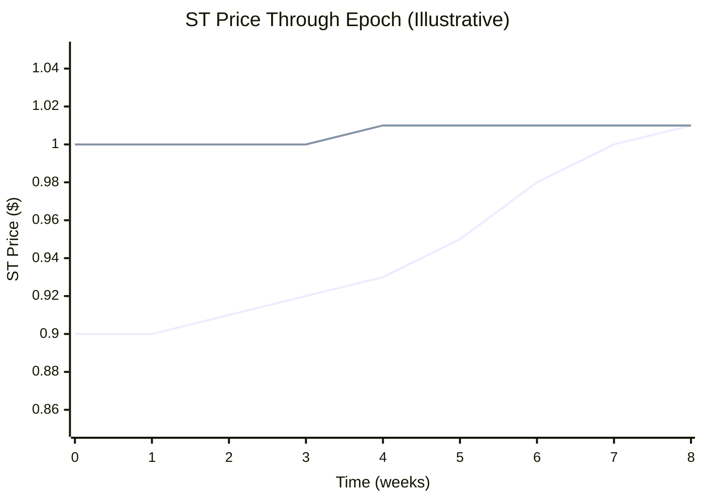

## The Minting Parity Equation

Every EPT pricing analysis starts from the same equation:

$$1 \text{ USDC deposited} = \frac{1}{R} \text{ ST} + 1 \text{ EPT}$$

Where R = ST exchange rate = NAV / totalShares.

This always holds. No exceptions. It's enforced by the deposit contract. When you deposit 1 USDC (ignoring fees for clarity), you receive exactly `1/R` ST shares and exactly 1 EPT.

### Deriving EPT Implied Cost

Since EPT is deposit-only (no secondary market), its "price" is the implied cost of acquiring it through the flash loop:

$$\text{EPT}\_\text{cost} = 1 - \frac{X}{R}$$

Where X = ST market price on the ArcX AMM and R = ST exchange rate.

You deposit \$1, receive ST + EPT, then sell the ST on the ArcX AMM. The EPT's cost is whatever USDC you don't recover from selling the ST. If your ST sale returns \$0.92, the EPT cost you \$0.08.

### Worked Example

Epoch 7. NAV = \$100,000. Total shares = 100,000. Exchange rate R = 1.0.

- You deposit \$1 --- receive 1 ST share + 1 EPT
- ST is trading at \$0.90 on the ArcX AMM (10% discount to NAV)
- `EPT_cost = 1 - 0.90/1.0 = $0.10`

If ST trades at NAV (X = R):
- `EPT_cost = 1 - 1.0/1.0 = $0.00`

EPT costs zero only if ST trades at exactly its exchange rate, meaning the market values ST at full NAV with zero discount. In practice, ST trades at a discount (from flash loop selling pressure), so EPT has a positive cost.

**Later in the epoch**, the strategy has grown. NAV = \$103,000. Total shares still 100,000. R = 1.03.

- ST trades at \$0.95 on the ArcX AMM
- `EPT_cost = 1 - 0.95/1.03 = 1 - 0.9223 = $0.0777`

The EPT implied cost tracks the spread between ST market price and its exchange rate.

<AccordionGroup>
<Accordion title="How does the deposit fee affect the minting parity equation?">
The equation `1 USDC = (1/R) ST + 1 EPT` ignores fees. With a deposit fee `f`, you deposit 1 USDC gross but receive tokens on the net amount: `1 USDC deposited = ((1-f)/R) ST + (1-f) EPT`. The implied cost becomes `EPT_cost = (1-f)(1 - X/R)`. The fee widens the no-arb band slightly. The flash loop only nets positive EPT if the EPT value exceeds the deposit fee.
</Accordion>
</AccordionGroup>

---

## Flash Loop Economics

The flash loop is the primary mechanism for acquiring EPT. Here's how it works.

### The Basic Loop

```
$100 deposit → receive (100/R) ST + 100 EPT
  Sell ST on ArcX AMM at price X → receive (100 × X/R) USDC
  Re-deposit that USDC → receive more ST + more EPT
  Sell ST again → receive USDC
  ... repeat
```

### The Math: Convergent Geometric Series

Each iteration recovers a fraction `X/R` of the previous deposit. With a 10% ST discount (X/R = 0.9):

| Iteration | Deposit | EPT Received | ST Sale Proceeds |
|---|---|---|---|
| 1 | \$100.00 | 100.00 | \$90.00 |
| 2 | \$90.00 | 90.00 | \$81.00 |
| 3 | \$81.00 | 81.00 | \$72.90 |
| 4 | \$72.90 | 72.90 | \$65.61 |
| ... | ... | ... | ... |
| Total (infinite) | \$1,000 | **1,000** | \$900 |

The total EPT from infinite iterations converges to:

$$\text{Total EPT} = \frac{\text{initial deposit}}{1 - X/R} = \frac{100}{1 - 0.9} = 1{,}000 \text{ EPT}$$

In practice, 5--7 iterations capture 90%+ of the theoretical maximum:

$$\text{EPT after n iterations} = \text{deposit} \times \frac{1 - (X/R)^n}{1 - X/R}$$

After 3 iterations: ~271 EPT from \$100. After 5: ~410 EPT. After 7: ~522 EPT.

### Effective Cost Per EPT

The effective cost per EPT through the flash loop is:

$$\text{cost per EPT} = \frac{\text{USDC spent (net)}}{\text{total EPT received}} = 1 - \frac{X}{R}$$

With X/R = 0.9 (10% discount): **\$0.10 per EPT**, regardless of how many iterations you run. The number of iterations determines *how many* EPT you get, not the cost per unit.

The flash loop is a capital multiplier, not a cost reducer. Each \$1 of capital buys EPT at the same effective cost. More iterations just let you deploy more of your initial capital into EPT.

### What Determines Leverage

| ST Discount (1 - X/R) | EPT Cost | Max EPT per \$100 | Effective Leverage |
|---|---|---|---|
| 5% | \$0.05 | 2,000 | 20x |
| 10% | \$0.10 | 1,000 | 10x |
| 15% | \$0.15 | 667 | 6.7x |
| 20% | \$0.20 | 500 | 5x |

Deeper ST discounts mean cheaper EPT but lower leverage (each iteration recovers less USDC). Narrower discounts mean more expensive EPT but higher leverage.

---

## One-Way Arbitrage

### Upward Arb: Works (via Flash Loop Pressure)

If the ST discount is "too narrow" relative to EPT demand, the flash loop creates self-correcting pressure:

1. Points farmers deposit and flash loop aggressively
2. Each loop iteration sells ST on the ArcX AMM
3. Selling pressure widens the ST discount
4. EPT becomes more expensive (cost per EPT rises)
5. Equilibrium: ST discount stabilizes where marginal points farmer stops looping

This is the **supply side** of the EPT market. More deposits + flash loops = more ST selling = wider discount = more expensive EPT.

**Worked example:**

- R = 1.0, ST trades at \$0.98 (2% discount)
- EPT_cost = \$0.02 per EPT (very cheap!)
- Points farmers aggressively flash loop, dumping ST
- ST price drops to \$0.90 (10% discount)
- EPT_cost rises to \$0.10 per EPT
- Flash loop activity slows (EPT is now 5x more expensive)
- Equilibrium reached

### Downward Arb: Broken

If the ST discount is "too wide" (EPT is too expensive), the correcting trade would be:

```
1. Buy cheap ST on the ArcX AMM
2. Combine with EPT
3. Burn ST + EPT → receive 1 USDC from vault
4. If cost < 1 USDC, profit.
```

**Step 3 is impossible.** There is no early redemption mechanism. You cannot burn ST + EPT for USDC before finalization.

**What this means:** The ST discount can be wider than "fair" with no mechanical correction. Yield seekers buying cheap ST provide some natural floor, but there's no guaranteed arbitrage.

<Info>
**Why no early redemption?** ArcX currently does not support redeeming ST or EPT before epoch maturity. This is a deliberate simplification. It eliminates the need for complex reserve management and allows the full deposit to work in the strategy for the entire epoch. See the [decentralization roadmap](/deep-dives/trust-model-and-security) for plans to add this capability.
</Info>

<AccordionGroup>
<Accordion title="Why doesn't ArcX support early redemption?">
Early redemption requires the strategy to unwind positions to return USDC. This is disruptive. Partially closing a funding arb position changes the strategy's risk profile for remaining holders. It also adds significant contract complexity (pro-rata unwinds, margin management, queuing). The current design prioritizes simplicity and speed to market. Early redemption is on the roadmap.
</Accordion>
</AccordionGroup>

---

## What Drives the ST Discount

The ST discount is the central pricing variable in the ArcX system. It determines EPT cost, flash loop leverage, and yield seeker returns.

### Factors That Widen the Discount

| Factor | Mechanism |
|---|---|
| **Strong points demand** | More flash loops = more ST selling pressure |
| **Low AMM liquidity** | Same selling volume moves price more |
| **High uncertainty** | Market demands larger discount for ST risk (strategy PnL unknown) |
| **Early in epoch** | Maximum time risk for yield seekers |
| **Low creditRate** | Less points activity = less flash loop demand, but also less reason to buy ST |

### Factors That Narrow the Discount

| Factor | Mechanism |
|---|---|
| **Yield seeker demand** | Buyers who want cheap ST for fixed APR |
| **Approaching maturity** | ArcX AMM time-decay curve pushes ST toward NAV |
| **Strong strategy performance** | Higher expected finalNAV makes ST more attractive |
| **AMM liquidity growth** | Deeper pools absorb selling pressure with less slippage |

### Equilibrium

The discount settles where two forces balance:

$$\text{Points farmer selling pressure} = \text{Yield seeker buying pressure}$$

Points farmers want cheap EPT (wide discount). Yield seekers want cheap ST (wide discount attracts them). The market-clearing ST price is where the last marginal points farmer's willingness to pay for EPT meets the last marginal yield seeker's willingness to accept ST risk.

---

## ST Price Through the Epoch

The ArcX AMM uses a Pendle-style time-decay curve for the ST/USDC pool. This creates a predictable price trajectory:



<Note>Chart values are illustrative and do not represent actual ArcX epoch data. Real prices depend on market conditions and AMM liquidity.</Note>

### Early Epoch

- Flash loop activity is heaviest (maximum time value for EPT)
- ST discount is widest (most selling pressure)
- Yield seekers get the best entry prices
- Time-decay curve provides a loose anchor

### Mid-Epoch

- Flash loop activity moderates
- ST discount narrows as the curve steepens
- Strategy performance data informs ST price (high NAV growth = narrower discount)
- EPT cost rises as discount narrows

### Late Epoch / Approaching Maturity

- Time-decay curve strongly pulls ST toward NAV
- Discount narrows significantly
- Flash loops become uneconomical (EPT is expensive, little time to accrue credits)
- ST converges toward finalNAV at finalization

### At Finalization

ST becomes directly redeemable for USDC at `finalNAV / totalShares`. No need to trade on the AMM. The discount collapses to zero.

---

## The Closed-End Fund Analogy

The ST discount has a well-studied TradFi parallel.

**Closed-end funds** (CEFs) in traditional finance routinely trade at discounts to their NAV. Unlike open-end mutual funds (where you can redeem shares at NAV), CEF shares trade on exchanges and cannot be redeemed on demand.

| | Open-End Fund | Closed-End Fund | ArcX ST |
|---|---|---|---|
| **Redemption** | On demand at NAV | Not available until termination | Not available before finalization |
| **Discount to NAV** | None (redeemable) | Common (5--20%) | Expected (varies with flash loop demand) |
| **Correction mechanism** | Redemption arbitrage | Activist investors, fund termination | Time-decay curve + yield seeker demand |
| **Why discount persists** | It doesn't | Illiquidity, sentiment, fees | No early redemption, flash loop selling pressure |

ST's discount is the same thing as closed-end funds trading at NAV discounts. The difference: ArcX's AMM pushes ST price toward NAV as maturity approaches. CEFs don't have that. ST *will* converge to NAV at maturity, making the discount a known, bounded opportunity for yield seekers.

---

## EPT vs Pendle YT: Why the Pricing Dynamics Differ

| | Pendle YT | ArcX EPT |
|---|---|---|
| **Tradeable?** | Yes (Pendle AMM) | No (deposit-only via flash loop) |
| **Terminal value** | \$0 (all yield streamed) | Positive (redeemable for PointsTokens) |
| **Time decay** | Monotonic --- \$0 | Not applicable (EPT doesn't trade) |
| **Price discovery** | AMM with custom logit curve | Implied cost via flash loop (1 - X/R) |
| **Two-way arb** | Yes (mint/redeem) | Only upward (flash loop selling pressure) |
| **AMM curve** | Custom logit with time-decay for YT | Pendle-style time-decay for ST (not EPT) |
| **Yield/points during epoch** | Continuous SY streaming to YT holders | Abstract credit accrual (settled at finalization) |

Pendle YT decays to \$0 because all yield has been streamed by maturity. ArcX EPT doesn't trade at all --- its cost is determined indirectly through the ST discount on the ArcX AMM. Simpler (no EPT AMM needed), but it means EPT cost depends entirely on ST market dynamics.

---

## Solutions to the Discount Problem

### Current Mitigations

ArcX accepts the one-way arb limitation and mitigates excessive ST discounts through:

1. **Pendle-style time-decay AMM**
   - The curve steepens as maturity approaches, pulling ST toward NAV
   - Provides a mathematical convergence mechanism
   - Yield seekers can model expected returns with confidence

2. **Two-sided market design**
   - Points farmers naturally sell ST (they want EPT)
   - Yield seekers naturally buy ST (they want fixed APR)
   - The two personas create organic liquidity

3. **Self-correcting economics**: the wider the discount, the more attractive ST is to yield seekers, which creates buying pressure that narrows the discount

### On the Roadmap: Delayed Redemption Intent

A planned mechanism:

```
1. User submits on-chain intent: "I will redeem ST + EPT at maturity"
2. This intent is visible to market-makers
3. Market-makers know there's guaranteed buying pressure at maturity
4. They front-run by buying ST now (creating buying pressure today)
5. Discount tightens
```

This creates synthetic downward arb pressure without requiring actual early redemption. The strategy's positions stay intact, but the market knows redemption will happen at maturity, reducing uncertainty discount.

### Future: Full Early Redemption

Eventually, the protocol could support early redemption (burn ST + EPT --- USDC). This requires:
- Strategy position unwinding (partial or queued)
- NAV impact management for remaining holders
- Contract complexity for pro-rata unwinds

This would close the arb loop entirely, creating Pendle-style two-way pricing.

<AccordionGroup>
<Accordion title="Is the ST discount a problem for ArcX's growth?">
The discount is what makes the two-sided market work. Points farmers need someone to buy their ST. Yield seekers need a discount to earn returns. The discount is the price that clears the market between these two groups. A "correct" discount is one where both sides are satisfied.
</Accordion>
</AccordionGroup>

---

## Implications for Each User Persona

### Points Farmers (Flash Loop)

Your effective EPT cost is determined by the ST discount at the time you flash loop:

| ST Discount | EPT Cost | EPT from \$100 (3 iterations) | Effective Multiplier |
|---|---|---|---|
| 5% | \$0.05 | ~271 | 2.71x |
| 10% | \$0.10 | ~271 | 2.71x |
| 15% | \$0.15 | ~271 | 2.71x |

<Note>All rows show the same number of iterations (3). What changes is **cost per EPT**: at a 5% discount, each EPT costs ~$0.05, while at a 15% discount, each costs ~$0.15. Deeper discounts mean you pay more per EPT but get more ST proceeds per loop.</Note>

*Note: 3 iterations give the same ~271 EPT regardless of discount depth. The discount determines the cost per EPT, not the number of EPT per iteration count. Deeper discounts mean each \$1 of unrecovered USDC buys more EPT, but you also recover less USDC per loop.*

**Optimal timing:** Flash loop early in the epoch for maximum credit accrual. The ST discount may be widest early (more selling pressure, less yield seeker demand) or mid-epoch (peak activity). Monitor ArcX AMM prices.

### Yield Seekers (Buy Discounted ST)

Your return is the spread between ST purchase price and finalNAV:

| Purchase Price | Strategy Return | Final Share Value | Your Return |
|---|---|---|---|
| \$0.90 | +1% | \$1.01 | **12.2%** in one epoch |
| \$0.92 | +1% | \$1.01 | **9.8%** in one epoch |
| \$0.95 | +1% | \$1.01 | **6.3%** in one epoch |
| \$0.90 | -2% | \$0.98 | **8.9%** in one epoch |
| \$0.90 | -5% | \$0.95 | **5.6%** in one epoch |

The discount provides a buffer against strategy losses. At a 10% discount, the strategy can lose up to 10% of NAV before your ST investment goes underwater. This is why yield seekers tolerate the strategy risk: the discount compensates them.

**Annualized returns:** If epochs run ~3 months, a 10% per-epoch return annualizes to ~46%. Even a conservative 5% per-epoch return annualizes to ~22%.

**Risks:**
- Strategy PnL could exceed the discount (ST redeems below purchase price)
- AMM liquidity risk if you need to sell ST before finalization
- Time-decay curve means early purchases are cheapest but carry the most time risk
