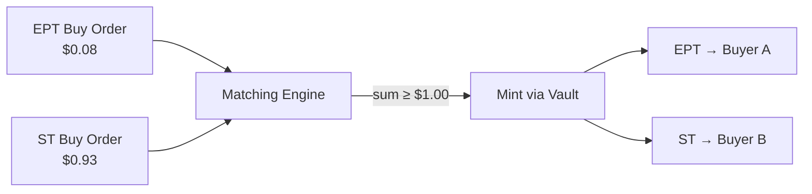

EPT price depends on one equation. This page walks through that equation and what drives it.

## The Minting Parity Equation

Every EPT pricing analysis starts from the deposit contract:

$$1 \text{ USDC deposited} = \frac{1}{R} \text{ ST} + 1 \text{ EPT}$$

where $R$ = NAV per share. Depositing 1 USDC always mints exactly $1/R$ ST shares and exactly 1 EPT. No exceptions.

Since the two tokens are co-minted, their prices are linked. If ST trades at price $X$ on the ST/USDC orderbook, the fair value of EPT is:

$$\text{EPT}_{\text{fair}} = 1 - \frac{X}{R}$$

**Intuition:** a \$1 deposit creates ST worth $X/R$ and 1 EPT. The EPT accounts for whatever value the ST does not. If ST trades at \$0.92 with NAV at \$1.00, then EPT fair value is \$0.08.

This isn't just a formula — cross-matching enforces it. Whenever an EPT buy and an ST buy appear at prices that sum to \$1 or more, the engine mints new tokens and fills both orders. That keeps the combined price from ever drifting above the minting cost.

---

## Interest Rate Framing

The natural question when looking at EPT prices is "is \$0.08 too expensive?" The better question is: **what is the implied return rate?**

EPT is a claim on future points. Its value depends on how many points you earn and what those points are worth at TGE. Instead of evaluating the absolute price, trace the full return.

### Worked Example

You buy 100 EPT at \$0.05 each (\$5 total) during an 8-week epoch. Here's how the return plays out:

| Step | What happens |
|---|---|
| **Buy** | 100 EPT × \$0.05 = \$5 spent |
| **Hold** | You accrue credits over the epoch. Your credit share works out to 50 points. |
| **Claim** | Epoch finalizes. You claim 50 PointsTokens. |
| **TGE** | Each point is worth \$0.20 at TGE. You burn 50 PointsTokens for \$10. |
| **Return** | \$10 out on \$5 in = **100% return over 8 weeks** |

That's the implied interest rate. It eliminates time decay as a concept and replaces it with one question: **what return am I getting on my EPT investment?**

Now compare the same \$0.05 price at different points in the epoch:

$$\text{Annualized (8 weeks left)} \approx \frac{100\%}{8} \times 52 = 650\%$$

$$\text{Annualized (2 weeks left)} \approx \frac{100\%}{2} \times 52 = 2{,}600\%$$

Same price, same expected payout, vastly different annualized rates. The interest rate frame makes this obvious. \$0.05 with 2 weeks left is a much better deal than \$0.05 with 8 weeks left.

### Why EPT Price Falls Over the Epoch

EPT accrues credits while you hold it. As the epoch progresses, fewer credits remain to be earned. An EPT purchased at Week 1 accrues credits for 7 more weeks. An EPT purchased at Week 6 accrues credits for 2 weeks. The market prices this in: EPT gets cheaper as the epoch advances, because each token has less earning potential left.

This is not mechanical decay imposed by a curve. It is the market correctly pricing a shrinking stream of future credits.

---

## Orderbook Price Dynamics

EPT trades on the **EPT/USDC orderbook**. Price discovery happens through standard limit orders. Buyers and sellers post bids and asks, and the matching engine executes trades.

### Secondary Trading

When an EPT holder sells to an EPT buyer, USDC changes hands. No minting or burning occurs. The seller keeps all credits earned up to the moment of sale. The buyer begins accruing from zero.

### Cross-Matching

The EPT/USDC and ST/USDC orderbooks are connected through the minting parity. When a buy order on the EPT book and a buy order on the ST book have prices that satisfy:

$$P_{\text{EPT}} + \frac{P_{\text{ST}}}{R} \geq 1$$

the matching engine can cross-match them. The protocol takes the combined USDC, deposits it into the vault, and delivers EPT to one buyer and ST to the other. This creates a price ceiling: the sum of buy-side prices across both books cannot persistently exceed the minting cost, because cross-matching mints new supply until the gap closes.

---

## One-Way Arbitrage

### Upward Arb Works

If EPT + ST buy prices exceed the minting cost, cross-matching creates new tokens and pushes prices back in line. This is a hard ceiling enforced by the protocol.

**Example:** EPT bids at \$0.12, ST bids at \$0.94 (sum = \$1.06 with R = 1.0). The engine mints, delivers tokens, and new supply pushes prices down to parity.

### No Downward Arb (Yet)

If the combined prices fall below minting cost, the correcting trade would require buying both tokens and burning them for USDC. There is no early redemption mechanism today, so this arbitrage path does not exist. The ST discount can therefore persist wider than fair value. Yield seekers buying cheap ST provide a natural floor, but there is no guaranteed mechanical correction on the downside.

Early redemption is on the roadmap for a future version.

---

## What Drives EPT Price

| Factor | Effect on EPT Price |
|---|---|
| **Time remaining** | More time = more credits to earn = higher EPT price |
| **Expected points value** | Higher expected TGE value = higher EPT price |
| **Strategy OI** | More open interest = more credits per update = higher EPT price |
| **ST discount** | ST price and EPT price are linked through minting parity |
| **Points demand** | More buyers on EPT orderbook = higher price |

ST price and EPT value are linked through [minting parity](#the-minting-parity-equation). Cross-matching enforces a ceiling: if buy-side prices sum above \$1, the engine mints new supply.

---

## What Drives the ST Discount

The ST discount is the other side of EPT pricing. The two are mechanically linked.

### Factors That Widen the Discount

| Factor | Mechanism |
|---|---|
| **Strong EPT demand** | More EPT buying triggers more cross-match mints, increasing ST supply |
| **Early in epoch** | Maximum time risk for ST holders before finalization |
| **High uncertainty** | Market demands larger compensation for unknown strategy PnL |

### Factors That Narrow the Discount

| Factor | Mechanism |
|---|---|
| **Yield seeker demand** | Buyers seeking fixed returns absorb ST supply |
| **Approaching maturity** | Less time risk remaining |
| **Strong strategy performance** | Higher expected NAV at finalization makes ST more attractive |

### Equilibrium

The discount settles where two forces balance:

$$\text{EPT buying pressure (drives mints, creates ST supply)} = \text{Yield seeker buying pressure (absorbs ST supply)}$$

Points farmers want cheap EPT, which requires a wide ST discount. Yield seekers want cheap ST, which the wide discount provides. The market-clearing price is where the marginal points farmer's willingness to pay for EPT meets the marginal yield seeker's willingness to hold ST risk.

---

## Worked Example (\$100)

**Setup:** NAV = \$1.00, ST trading at \$0.92 (8% discount to NAV).

### Fair EPT Price

$$\text{EPT}_{\text{fair}} = 1 - \frac{0.92}{1.00} = \$0.08$$

### Points Farmer: Buying EPT on the Orderbook

A points farmer places a buy order at \$0.08 per EPT.

$$\frac{\$100}{\$0.08} = 1{,}250\text{ EPT}$$

Compare this to a direct deposit: \$100 into the vault mints 100 ST and 100 EPT. Buying on the orderbook yields **12.5x more EPT** for the same capital. The leverage comes entirely from the price. No looping, no compounding, just buying EPT at its market price.

### Yield Seeker: Buying ST on the Orderbook

A yield seeker buys ST at \$0.92. If the strategy earns 1% over the epoch (final NAV = \$1.01):

$$\text{Return} = \frac{1.01 - 0.92}{0.92} \approx 9.8\%\text{ per epoch}$$

The 8% discount provides a buffer against strategy losses. The strategy can lose up to 8% of NAV before the ST buyer goes underwater.

### Where the Value Goes

| Participant | Pays | Receives | Exposure |
|---|---|---|---|
| Points farmer | \$100 USDC | 1,250 EPT | 12.5x leveraged points |
| Yield seeker | \$92 per ST | 1 ST (redeemable at final NAV) | Discounted USDC yield |
| Direct depositor | \$100 USDC | 100 ST + 100 EPT | Both exposures at par |

The same \$100 buys radically different exposure depending on which token you choose. We do not create value. We separate it. The points farmer concentrates into points. The yield seeker concentrates into USDC returns. The direct depositor gets the unseparated bundle.

For the full treatment of credit mathematics and how credits translate to points at finalization, see [Credit Mathematics](/deep-dives/credit-mathematics).
