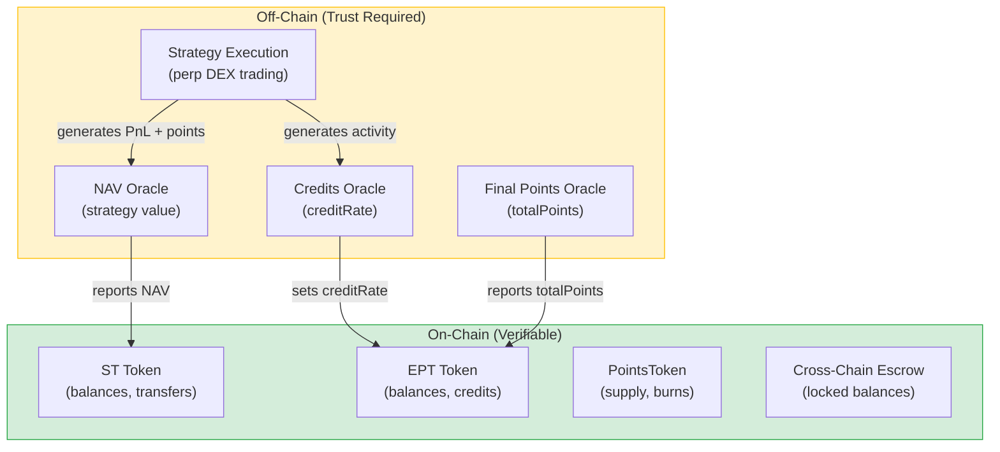

<Info>
**Course level: Intermediate**

**The core idea:** ArcX is a centralized system with documented trust boundaries. You trust ArcX with six things. Each one is bounded, partially verifiable, and on a path toward trustless verification.

Think of it like a managed fund with published auditing criteria: you trust the fund manager, but you know exactly what you're trusting them with and how to verify their behavior.
</Info>

**Prerequisites:** [What is ArcX?](/learn/protocol-overview), [The Three Tokens](/learn/token-economics), [How Epochs Work](/learn/epoch-lifecycle)

---

## TL;DR: The Six Trust Assumptions

Every interaction with ArcX requires you to trust ArcX with specific things. Here they all are, in one table:

| # | What You Trust ArcX With | What Could Go Wrong | How You Can Verify | Decentralization Path |
|---|---|---|---|---|
| 1 | **NAV reporting** | ArcX misreports strategy value to favor certain depositors | Compare reported NAV against exchange position dashboards | ZK proofs of exchange balances |
| 2 | **Credit rate accuracy** | ArcX manipulates creditRate to shift points allocation | creditRate derives from observable OI/volume on exchanges | On-chain verifiable activity feeds |
| 3 | **Points reporting** | ArcX underreports total points at finalization | Points visible on exchange dashboards. Community can cross-reference | On-chain points verification |
| 4 | **Points backing** | ArcX over-mints PointsTokens beyond real points held | Limited. Exchange points are per-account, not publicly queryable | Exchange APIs or ZK proofs of account state |
| 5 | **Strategy execution** | Bugs, negligence, or malfeasance causing unexpected losses | Strategy PnL reflected in NAV. Performance is observable over time | Isolated vaults, insurance mechanisms |
| 6 | **Cross-chain escrow** | Multisig misappropriates locked USDC during bridge transit | On-chain escrow balances are publicly visible | Trustless bridge integration |

**The honest version:** ArcX trades trustlessness for speed to market. Every trust assumption is documented here, every oracle is operated by ArcX, and every risk is bounded. Progressive decentralization is on the roadmap, but today, you are trusting ArcX.



*Green = on-chain, fully verifiable. Yellow = off-chain, trust required.*

---

## Trust Assumption 1: NAV Oracle

### What It Does

The NAV oracle reports the total USDC value of the strategy's positions every 5 minutes. This number determines:

- **How many ST shares you receive** when you deposit (`shares = netUSDC x totalShares / currentNAV`)
- **How much USDC you receive** when you redeem ST after finalization (`usdcOut = shares x finalNAV / totalShares`)

NAV is the single most important number in the protocol. If it's wrong, deposits and redemptions are mispriced.

### What Could Go Wrong

**Scenario: Inflated NAV.** ArcX reports NAV higher than reality. Late depositors receive fewer shares than they should (they're buying in at an inflated price). Early depositors benefit. Their shares are worth more relative to the actual underlying.

**Scenario: Deflated NAV.** ArcX reports NAV lower than reality. Late depositors receive more shares than they should (bargain entry). Existing holders are diluted.

**Scenario: Stale NAV.** The oracle stops updating. If the strategy's value changes while the oracle is stale, deposits happen at an outdated price.

### Mitigations

1. **NAV freshness check.** The contract enforces `MAX_NAV_STALENESS = 30 minutes`. If the oracle hasn't updated in 30 minutes, all deposits automatically revert. Your USDC stays in your wallet. You can't be harmed by stale data.

2. **Partial verifiability.** NAV is derived from positions on perp DEXes (Pacifica, Hyperliquid, Extended, etc.). These exchanges have public dashboards showing account positions. While you can't see ArcX's exact account, the strategy's expected exposure (e.g., "funding arb with \$500K OI") is checkable against on-chain and exchange data.

3. **Reputation enforcement.** ArcX's business depends on accurate reporting. Systematic misreporting would be detectable over time (depositors comparing expected vs. actual returns) and would destroy the protocol's credibility.

4. **Bounded impact per epoch.** Each epoch is independent. Even if NAV is slightly off for a few oracle updates, the final NAV at finalization determines actual redemptions. A single bad update doesn't compound.

### Decentralization Path

ZK proofs of exchange balances. A future system could generate zero-knowledge proofs that ArcX's exchange account holds the reported positions, without revealing the account itself. This technology is promising but not production-ready today.

<Accordion title="Why not just use Chainlink or Pyth for the NAV oracle?">
No exchange exposes a "strategy NAV" data feed. NAV is computed from ArcX's own exchange positions (principal + unrealized PnL across multiple perp DEXes). No third-party oracle can compute this without access to ArcX's exchange accounts. This is fundamentally different from price feeds (which aggregate public market data).
</Accordion>

<Accordion title="Can ArcX steal my funds?">
ArcX controls the oracles that determine deposit pricing and redemption values. In theory, ArcX could misreport NAV to extract value. In practice, this would be detectable (strategy returns that don't match exchange data) and would destroy the protocol's reputation. Cross-chain USDC has an additional protection: the refund timeout lets you self-rescue if anything goes wrong during bridging.
</Accordion>

<Accordion title="How do I know ArcX isn't front-running its own oracle updates?">
ArcX publishes NAV on-chain every 5 minutes. If ArcX were trading against its own NAV updates (e.g., depositing before publishing a favorable NAV), the pattern would be visible in on-chain transaction timing. Additionally, ArcX already knows the NAV in real-time (it runs the strategy). This informational advantage is used for market-making (setting fair spreads), which benefits users, not for exploiting deposits.
</Accordion>

---

## Trust Assumption 2: Credits Oracle

### What It Does

The Credits Oracle publishes `creditRate` during the epoch. This rate determines how fast EPT holders accumulate credits:

$$\text{credits} = \int(\text{balance} \times \text{creditRate}) \, dt$$

The creditRate reflects strategy activity: high open interest (funding arb) or high volume (market making) means a higher rate. See [Credit Mathematics](/deep-dives/credit-mathematics) for the full treatment.

### What Could Go Wrong

**Scenario: Manipulated creditRate.** ArcX inflates creditRate during a period when a favored address holds EPT, then deflates it afterward. The favored address accrues disproportionate credits and receives more points.

**Scenario: Stale creditRate.** The oracle stops updating. Credits continue accruing at the last known rate. If strategy activity changed significantly, some holders are over-weighted and others under-weighted.

### Mitigations

1. **Observable inputs.** creditRate derives from strategy activity metrics (OI, volume) that are observable on exchange dashboards. If ArcX reports high creditRate but the strategy has minimal OI visible on Pacifica, something is wrong.

2. **Bounded impact of staleness.** Even a multi-hour outage produces modest distortion unless activity changes dramatically during the outage. The globalCreditIndex pattern ensures that when the oracle resumes, the new rate applies going forward. Past accruals are already checkpointed.

3. **No on-chain staleness check (current limitation).** Unlike the NAV oracle (which has a 30-minute freshness requirement), there is currently no on-chain check for credit oracle staleness. Adding a `MAX_CREDIT_STALENESS` threshold is on the roadmap.

4. **Mathematical fairness guarantee.** The credit system is provably fair: your share of points equals your share of total credits, regardless of the creditRate schedule. Variable rates change *when* credits accrue fastest, not *whether* the math is correct. See [Credit Mathematics: Fairness Proof](/deep-dives/credit-mathematics#the-fairness-argument).

### Decentralization Path

On-chain verifiable activity feeds. If exchanges expose OI/volume data through on-chain oracles or verifiable APIs, creditRate could be computed on-chain rather than reported by ArcX.

---

## Trust Assumption 3: Points Reporting

### What It Does

At epoch finalization, the Final Points Oracle reports `totalPoints`: how many exchange points the strategy earned during the epoch. This number determines the conversion ratio:

$$\text{pointsPerCredit} = \frac{\text{totalPoints}}{\text{totalCredits}}$$

Every EPT holder's PointsToken allocation depends on this single number.

### What Could Go Wrong

**Scenario: Underreported points.** ArcX reports fewer points than actually earned, keeping the difference. Users receive fewer PointsTokens than they're owed.

**Scenario: Overreported points.** ArcX reports more points than earned. PointsTokens are over-minted relative to backing. This creates a fractional reserve. Each PointsToken is backed by less than 1 real point.

### Mitigations

1. **Exchange dashboards.** Most exchanges show points earned on public or account-visible dashboards. Community members who also farm on the same exchanges can cross-reference ArcX's reported points against their own observations of point generation rates.

2. **Aggregate consistency checks.** If ArcX runs a \$500K strategy on Pacifica for an epoch, the expected points are roughly estimable from Pacifica's published points program rules. A significant underreporting (say, 50%) would be visible to anyone who understands the program.

3. **Reputation enforcement.** Points reporting is a one-time event per epoch. Each finalization is a public, verifiable moment. Systematic underreporting would be flagged by the community.

### Decentralization Path

On-chain points verification. If exchanges build points verification APIs or attest to account-level points on-chain, the Final Points Oracle could be replaced with a trustless data feed.

---

## Trust Assumption 4: Points Backing

### What It Does

PointsTokens (xPC, xHL, etc.) are ERC20 tokens that represent real exchange points, 1:1 backed. When you claim EPT credits after finalization, you receive PointsTokens. Post-TGE, you burn PointsTokens to receive the exchange's airdropped tokens.

### What Could Go Wrong

**Scenario: Over-minting.** ArcX mints more PointsTokens than the real points it holds. If the exchange conducts a TGE and airdrop is based on real points (not PointsTokens), some PointsToken holders can't redeem at 1:1.

**Scenario: Points custody failure.** ArcX's exchange account is compromised or suspended. Real points are lost, but PointsTokens still exist. The backing is broken.

### Mitigations

1. **Supply transparency.** PointsToken is a standard ERC20 on Starknet. Total supply is publicly visible on-chain. Anyone can compare reported points per epoch against cumulative PointsToken supply.

2. **Per-epoch accounting.** Each epoch reports a specific `totalPoints` number. Over time, the sum of reported points across all epochs should match the PointsToken total supply (minus any already redeemed). This creates a running audit trail.

3. **Airdrop verification.** When a TGE occurs, the exchange typically announces total airdrop amounts publicly. The community can verify that ArcX received a proportional share and deposited it into the Redemption Module.

### Current Limitation

There is no on-chain verification mechanism for points backing. You cannot independently prove that ArcX's exchange account holds the points it claims. This is the hardest trust assumption to verify because exchange points are inherently off-chain and per-account.

### Decentralization Path

Exchange APIs for points verification (if exchanges build them), or ZK proofs of exchange account state. Direct exchange-to-contract distribution would eliminate the custody step entirely.

---

## Trust Assumption 5: Strategy Execution

### What It Does

ArcX executes trading strategies (funding arb, market making, etc.) on perp DEXes using deposited capital. Strategy performance determines NAV, which determines ST redemption value.

### What Could Go Wrong

**Scenario: Negligence.** A bug in the strategy runner causes unintended positions, leading to losses.

**Scenario: Style drift.** ArcX deviates from the stated strategy (e.g., taking directional bets instead of running a delta-neutral arb).

**Scenario: Malfeasance.** ArcX intentionally extracts value through unfavorable trades.

### Mitigations

1. **Maximum loss is bounded.** ST floors at \$0. Your maximum loss is your deposit. ST can never go negative. There is no margin call or additional liability. Even in a catastrophic strategy failure, your loss is capped.

2. **EPT is unaffected.** Strategy losses don't reduce your points. EPT accrues credits regardless of strategy PnL. If the strategy loses 100% of NAV, ST redeems for \$0 but you still claim your full PointsToken allocation.

3. **Observable performance.** NAV updates every 5 minutes. You can track the strategy's performance in near-real-time. If something looks wrong (unusual drawdowns, erratic NAV movements), you can sell your ST on the ArcX AMM to exit.

4. **Epoch isolation.** Each epoch is independent. A bad epoch doesn't compound into the next. Your capital doesn't automatically roll over. You make a fresh decision each epoch.

### Decentralization Path

Isolated vaults with insurance mechanisms. Future versions could add strategy constraints enforced on-chain (max leverage, max drawdown triggers) and insurance pools that cover losses beyond a threshold.

---

## Trust Assumption 6: Cross-Chain Escrow

### What It Does

When you deposit from Ethereum, Arbitrum, Solana, or other chains, your USDC is locked in a `SourceChainDepositEscrow` contract. A LayerZero message is sent to Starknet, where your ST + EPT are minted. An acknowledgment message returns to the source chain.

### What Could Go Wrong

**Scenario: Stuck message.** The LayerZero message never arrives on Starknet. Your USDC is locked in the escrow indefinitely.

**Scenario: Escrow compromise.** The escrow contract (controlled by an ArcX multisig) is compromised. Locked USDC is stolen.

### Mitigations

1. **Refund timeout (self-rescue).** If no acknowledgment arrives within `REFUND_TIMEOUT`, you can call `cancel(depositId)` on the source chain escrow. Your USDC is refunded directly to your wallet. You are never permanently locked out.

2. **Idempotency enforcement.** If a late-arriving message reaches Starknet after you've already cancelled, the contract rejects it (the depositId is marked cancelled). No double-minting can occur.

3. **Multisig requirement.** The escrow is controlled by a multisig, not a single key. This requires multiple signers to authorize any non-standard action.

4. **On-chain visibility.** Escrow balances are publicly visible. The community can monitor total locked USDC and compare it against expected cross-chain deposit volumes.

### Decentralization Path

Trustless bridge integration. As bridge technology matures, the escrow could be replaced with a trustless mechanism that doesn't require a multisig at all.

---

## Attack Vectors and Analysis

### Attack 1: NAV Sandwich

**The attack:** Deposit a large amount right before epoch end to capture strategy upside from a stale NAV reading.

```
1. Strategy gains 0.5% in the last 30 minutes
2. NAV oracle last updated 25 minutes ago (still "fresh" under the 30-min threshold)
3. Attacker deposits at the stale (lower) NAV
4. Epoch ends → attacker's shares are worth more than they paid
5. Profit = |finalNAV - staleNAV| / staleNAV × depositAmount - depositFee
```

**Why it's hard to profit:**

| Strategy Type | 30-min NAV Volatility | Minimum Fee to Neutralize |
|---|---|---|
| **Funding arb** | Very low (~0.005%). Funding rates move slowly. | ~0.01% (any reasonable fee works) |
| **Market making** | Moderate (0.1-0.5%). Inventory risk + spread capture. | 0.3-0.5% |

The deposit fee is calibrated per strategy to exceed the worst-case sandwich profit. Combined with the 30-minute NAV staleness window, the attack is economically unprofitable for typical strategies.

**Additional defenses:**
- `DEPOSIT_CUTOFF` parameter can close deposits before epoch end (configurable, default: 0)
- If empirical data shows the arb is profitable, the fee or cutoff can be adjusted

### Attack 2: Credit Manipulation via EPT Timing

**The attack:** If an attacker knows when creditRate will spike (e.g., the strategy is about to open large positions), they deposit right before the spike to accrue extra credits.

**Why it's bounded:**

- creditRate is published by ArcX's oracle. An external attacker doesn't know future creditRate values.
- Even if someone front-runs a creditRate update, their credit advantage is limited to the time they held EPT during the spike, typically minutes or hours out of a multi-week epoch. The credit share gained is proportionally small.
- The credit accrual formula is continuous and time-weighted. Brief holding periods produce minimal credits relative to full-epoch holders.

### Attack 3: PointsToken Over-Minting

**The attack:** ArcX mints more PointsTokens than real points, creating a fractional reserve.

**Why it's detectable:**

- Each epoch's `totalPoints` is reported at finalization. This is a public, on-chain number.
- Cumulative PointsToken supply is also on-chain.
- Anyone can sum all epoch totalPoints and compare against PointsToken totalSupply.
- A discrepancy (supply > sum of reported points) is immediate evidence of over-minting.

**The limitation:** You can verify PointsToken supply against *reported* points, but you can't independently verify that reported points match *real* points held by ArcX on the exchange. This is Trust Assumption 3 (Points Reporting).

### Attack 4: Oracle Liveness Failure

**The scenario:** The NAV oracle stops updating mid-epoch.

**Impact and response:**

| Component | Behavior During Oracle Outage |
|---|---|
| **Deposits** | Automatically revert after 30 minutes of staleness (on-chain check) |
| **Existing positions** | Unaffected. ST and EPT balances don't change |
| **Credit accrual** | Continues at the last known creditRate |
| **Trading on ArcX AMM** | Continues normally (the AMM is a separate on-chain contract) |
| **Finalization** | Delayed until oracle recovers and submits final NAV |
| **Admin action** | Can pause deposits as an additional safeguard |

The 30-minute freshness check is the key defense. New capital cannot enter at a stale price. The system protects itself automatically.

### Attack 5: Cross-Chain Double-Spend

**The attack:** Deposit via cross-chain, receive ST + EPT on Starknet, then cancel on the source chain and get a refund.

**Why it's impossible:**

1. The `cancel()` function requires that no acknowledgment has been received and that `REFUND_TIMEOUT` has elapsed.
2. If the deposit succeeded on Starknet, an acknowledgment is sent back to the source chain, marking the depositId as complete.
3. A completed depositId cannot be cancelled.
4. If the acknowledgment is delayed past `REFUND_TIMEOUT` and the user cancels first, the late-arriving deposit message on Starknet is rejected (depositId is marked cancelled on the source chain, and the Starknet contract checks this state).

Idempotency is enforced at the protocol level across both chains.

---

## What's On-Chain vs. Off-Chain

Understanding what lives where helps you assess what's verifiable:

| Component | Location | Verifiable? |
|---|---|---|
| ST token balances | Starknet (on-chain) | Fully verifiable |
| EPT token balances | Starknet (on-chain) | Fully verifiable |
| PointsToken supply | Starknet (on-chain) | Fully verifiable |
| Credit balances (per user) | Starknet (on-chain, via globalCreditIndex) | Fully verifiable |
| Deposit/redeem transactions | Starknet (on-chain) | Fully verifiable |
| Escrow balances | Source chain (on-chain) | Fully verifiable |
| NAV value | Published on-chain by oracle | Value verifiable, **accuracy** trust-dependent |
| creditRate | Published on-chain by oracle | Value verifiable, **accuracy** trust-dependent |
| totalPoints per epoch | Published on-chain by oracle | Value verifiable, **accuracy** trust-dependent |
| Strategy positions | Perp DEX exchange accounts (off-chain) | Partially verifiable via exchange dashboards |
| Real exchange points | Exchange accounts (off-chain) | Not independently verifiable |
| Strategy execution logic | ArcX servers (off-chain) | Not verifiable |

**The pattern:** Token mechanics (minting, burning, credit accrual, redemption) are fully on-chain and verifiable. The *inputs* to those mechanics (NAV, creditRate, totalPoints) are reported by ArcX and require trust.

<Accordion title="Can I see the smart contract code?">
Contract addresses and verification status will be published in the [Developer Integration Guide](/build/developer-integration-guide). On-chain contracts on Starknet are verifiable through standard block explorer tools.
</Accordion>

---

## Maximum Loss Scenarios

### Scenario 1: Strategy Loses Everything

The strategy loses 100% of capital. Final NAV = \$0.

| Token | Outcome |
|---|---|
| **ST** | Redeems for \$0. Total loss of deposited USDC. |
| **EPT** | Unaffected. Credits accrued normally during the epoch. |
| **PointsTokens** | Claimable as usual. Points were earned during strategy execution regardless of PnL. |

**Maximum loss = your deposit.** ST can never go negative. There is no margin call. EPT provides a partial offset. You still receive points even if the strategy collapses.

### Scenario 2: ArcX Misreports Final NAV

ArcX reports a final NAV lower than reality, extracting the difference.

| Who is harmed | How |
|---|---|
| **All ST holders** | Redeem for less USDC than they're owed |
| **EPT holders** | Not directly affected (points allocation is separate from NAV) |

**Detection:** Depositors who independently tracked the strategy's performance (via exchange dashboards, historical NAV updates) would notice the discrepancy. This is a reputational attack, detectable but not preventable on-chain.

### Scenario 3: Exchange Never Conducts TGE

You hold PointsTokens, but the exchange never launches a token.

| Token | Outcome |
|---|---|
| **PointsTokens** | Remain as tradeable ERC20s with no redemption path. Their value is whatever the secondary market assigns. |
| **ST** | Unaffected. USDC redemption is independent of TGE. |
| **EPT** | Already converted to PointsTokens at finalization. |

This is an exchange-level risk, not an ArcX protocol risk. ArcX cannot guarantee that any exchange will conduct a TGE.

### Scenario 4: Cross-Chain Bridge Outage

LayerZero goes down for an extended period. Your USDC is locked in the escrow.

| What happens | Timeline |
|---|---|
| Your USDC is locked | Immediately upon deposit |
| You wait for delivery | 1--5 minutes typical, up to 30 minutes |
| If message never arrives | Wait for `REFUND_TIMEOUT` to expire |
| Self-rescue | Call `cancel(depositId)` --- USDC refunded |

You are never permanently locked out. The refund timeout is your escape hatch.

<Accordion title="What's the worst that can happen to my deposit?">
Your ST can go to zero if the strategy loses 100% of capital. This is the absolute worst case. Your EPT (points) is unaffected. You still claim PointsTokens regardless of strategy performance. There is no scenario where you owe more than your deposit.
</Accordion>

---

## Emergency Procedures

### Deposit Pause

The admin can pause new deposits into the current epoch. This is the primary emergency tool.

| What pause does | What pause does NOT do |
|---|---|
| Blocks new deposits | Does not freeze trading on the ArcX AMM |
| Prevents new capital from entering at potentially bad prices | Does not stop credit accrual |
| Signals to the community that something needs attention | Does not trigger early maturity |
| | Does not affect existing positions |

Pause is conservative. It stops new money from entering while existing positions continue unchanged. The admin can unpause if the issue is resolved while the deposit window is still open.

### No Early Termination

There is no mechanism to terminate an epoch early. Once an epoch starts, it runs to its scheduled end. This is a deliberate design choice:

- Avoids the complexity of mid-epoch unwinds
- Prevents admin abuse (can't terminate to lock in favorable NAV)
- Ensures all participants experience the same epoch duration
- Simplifies the contract model

The tradeoff: in a genuine emergency, the only tool is pausing deposits. Existing positions ride out the epoch.

<Accordion title="What if ArcX goes offline?">
If ArcX disappears entirely: deposits in progress can be refunded via escrow timeout. Existing ST and EPT tokens remain on-chain and tradeable on the ArcX AMM. Finalization would be stuck (no oracle to report final NAV/points). In this extreme scenario, the community would need to coordinate recovery. The contracts exist on Starknet regardless of ArcX's operational status.
</Accordion>

<Accordion title="What happens to the protocol if Starknet goes down?">
All ArcX contracts live on Starknet. A Starknet outage would pause all on-chain activity (deposits, trading, redemptions). Strategy execution continues off-chain (perp DEX trades don't depend on Starknet). Once Starknet recovers, the protocol resumes. Cross-chain escrow on source chains (Ethereum, Arbitrum, Solana) is unaffected by Starknet outages. Refund timeouts still work.
</Accordion>

---

## How to Verify ArcX's Behavior

If you want to independently audit ArcX's reporting, here's what you can check:

### 1. Track NAV Over Time

- NAV is published on-chain every 5 minutes
- Record NAV updates throughout the epoch
- Compare the trajectory against expected strategy performance (e.g., if funding rates on Pacifica average 0.01%/8h, a \$500K strategy should return a predictable amount per epoch)
- Flag any unexplained jumps or discrepancies

### 2. Cross-Reference Points

- At finalization, `totalPoints` is published on-chain
- Compare against the exchange's published points program rules
- If Pacifica grants X points per \$1 of OI per day, and the strategy maintained \$500K OI for the epoch, expected points are estimable
- Significant discrepancies warrant investigation

### 3. Monitor PointsToken Supply

- PointsToken totalSupply is on-chain
- Sum all `totalPoints` from every finalized epoch for that exchange
- If totalSupply > sum of reported points, PointsTokens may be over-minted

### 4. Watch Escrow Balances

- Cross-chain escrow balances are on-chain on the source chain
- Track deposits, acknowledgments, and refunds
- Escrow balance should trend toward zero as deposits are acknowledged
- Persistent large balances may indicate stuck messages

### 5. Compare ST Redemption Values

- At finalization, compute expected redemption: `shares x finalNAV / totalShares`
- Compare against what you actually receive
- Any shortfall is evidence of a contract bug or misconfigured finalization

---

## Comparison: ArcX Trust Model vs. Alternatives

| | ArcX (Current) | Pendle | Typical Yield Aggregator (e.g., Yearn) | CEX Earn Products |
|---|---|---|---|---|
| **Strategy execution** | Trust ArcX | N/A (no strategy) | Trust strategist/governance | Trust exchange |
| **Price oracle** | Trust ArcX | On-chain (AMM-based) | Chainlink/on-chain | Trust exchange |
| **Yield/points reporting** | Trust ArcX | On-chain (SY wrapper) | On-chain (vault share price) | Trust exchange |
| **Asset custody** | Smart contract (Starknet) + ArcX exchange accounts | Smart contract only | Smart contract only | Full exchange custody |
| **Early exit** | Sell ST on ArcX AMM (no redemption) | Sell on Pendle AMM or redeem | Withdraw from vault | Depends on product |
| **Worst-case loss** | Deposit (ST --- \$0) | Opportunity cost (PT/YT mispricing) | Deposit (vault --- \$0) | Full balance (exchange hack) |
| **Verifiability** | Partial (oracles trust-dependent) | Full (all on-chain) | Full (all on-chain) | None |

ArcX's trust model is closer to a managed fund than a pure DeFi protocol. The tradeoff is intentional: off-chain strategy execution (perp DEX trading) requires off-chain data feeds. Fully on-chain alternatives (Pendle, Yearn) work because their underlying yield sources are themselves on-chain.

<Accordion title="Is this more or less risky than using Pendle?">
Different risk profile. Pendle is fully on-chain. You trust only smart contract risk. ArcX adds oracle risk (trusting ArcX's data feeds) and strategy risk (trusting ArcX's execution). In exchange, ArcX gives you access to perp DEX strategy returns and pre-TGE points markets that Pendle doesn't offer. The additional trust is the cost of accessing off-chain yield sources.
</Accordion>

---

## Decentralization Roadmap

ArcX is designed for progressive decentralization. Each trust assumption has a planned path toward trustless verification:

| Trust Assumption | Current | Next Step | End State |
|---|---|---|---|
| NAV reporting | ArcX oracle | Community monitoring dashboards | ZK proofs of exchange balances |
| Credit rate | ArcX oracle | On-chain staleness checks (`MAX_CREDIT_STALENESS`) | Verifiable activity feeds from exchanges |
| Points reporting | ArcX oracle | Public attestation of points balances | Exchange-native on-chain points |
| Points backing | Trust + reputation | Third-party attestation / audits | Direct exchange --- contract distribution |
| Strategy execution | Trust ArcX | Strategy constraints enforced on-chain | Isolated vaults with insurance |
| Cross-chain escrow | Multisig + timeout | Reduced signer threshold, monitoring | Trustless bridge integration |

The order reflects feasibility. Community monitoring dashboards and on-chain staleness checks are near-term. ZK proofs and trustless bridges are longer-term research goals.
