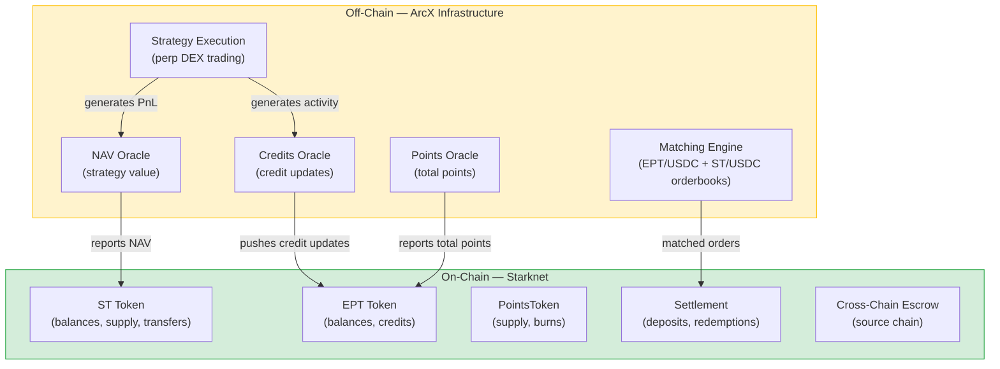

<Info>
**The core idea:** We settle tokens and balances on-chain, but run strategy execution and data reporting off-chain. Every off-chain component has a specific practical reason for being off-chain, a defined protection mechanism, and a path toward decentralization.

This page walks through each component, its safeguards, and the residual risks that remain.
</Info>

**Prerequisites:** [What is ArcX?](/learn/protocol-overview), [Epoch Lifecycle](/learn/epoch-lifecycle)

**Summary:** Six things live on-chain (tokens, settlement, credit balances, escrow). Five things run off-chain (matching engine, strategy execution, NAV oracle, credits oracle, points oracle). Each off-chain component is off-chain for a practical reason, has a defined protection, and is on a path toward decentralization. Strategy losses are market risk, not security incidents. The hardest thing to verify independently is points backing.

---

## What's On-Chain

These components live on Starknet. You can verify them directly with a block explorer.

| Component | What You Can Verify |
|---|---|
| **ST token** | Balances, transfers, total supply per epoch |
| **EPT token** | Balances, transfers, accumulated credit balances |
| **PointsToken** | Total supply, burns, per-address balances |
| **Settlement** | Every deposit and redemption executes as an on-chain transaction |
| **Credit balances** | Per-user credit accrual tracked on-chain |
| **Cross-chain escrow** | Locked USDC balances visible on source chains (Ethereum, Arbitrum, etc.) |

On-chain components are the foundation. Token mechanics (minting, burning, credit accrual, redemption) are fully auditable without trusting anyone. If it lives on Starknet, you can verify it yourself.

The critical distinction: We do not hold your tokens. ST, EPT, and PointsToken are standard tokens on Starknet. Your balances are yours. Our oracles feed *data* into the contracts (NAV, credit updates, total points), but the contracts enforce the math. No oracle input can directly transfer your tokens to someone else.

This means the on-chain layer provides a strong floor of verifiability. Even in a scenario where you distrust every off-chain component, you can still verify your token balances, the total supply, and the settlement of every transaction. The question is not "are my tokens safe?" (they are, on-chain) but "are the oracle inputs accurate?" (that requires the protections described below).

---

## What's Off-Chain (and Why)

We run five components off-chain. Each one is off-chain for a specific practical reason, not because of a preference for centralization. Click through each tab below to understand what the component does and why it cannot currently run on-chain.

<Tabs>
  <Tab title="Matching Engine" icon="gears">
    **What it does:** Matches buy and sell orders on the EPT/USDC and ST/USDC orderbooks. Handles cross-matching when a direct deposit triggers mints of both ST and EPT.

    **Why it's off-chain:** Orderbook matching requires sub-second latency and efficient price-time priority. On-chain orderbooks on Starknet would be too slow and too expensive for active trading. Settlement of matched orders happens on-chain. The matching itself is the off-chain step.

    **The pattern:** Off-chain matching, on-chain settlement. This is the same architecture used by dYdX, Paradex, and other performant DEXes.
  </Tab>
  <Tab title="Strategy Execution" icon="chart-mixed">
    **What it does:** Trades on perp DEXes (Hyperliquid, Paradex, etc.) using deposited capital. Generates PnL and earns exchange points.

    **Why it's off-chain:** The exchanges themselves are off-chain. You cannot execute trades on Hyperliquid from a Starknet smart contract. Strategy execution necessarily happens where the exchanges operate.

    **The pattern:** We execute trades on external exchanges using deposited capital. The results (PnL, points) are reported back to the on-chain contracts via oracles.
  </Tab>
  <Tab title="NAV Oracle" icon="dollar-sign">
    **What it does:** Reports the total USDC value of the strategy's positions. NAV determines how many ST shares you receive on deposit and how much USDC you receive on redemption.

    **Why it's off-chain:** NAV requires reading the strategy's account positions across multiple perp DEXes. These positions live in exchange accounts, not on-chain. No third-party oracle (Chainlink, Pyth) can compute strategy NAV because it requires access to our exchange account data. This is fundamentally different from price feeds, which aggregate public market data.
  </Tab>
  <Tab title="Credits Oracle" icon="calculator">
    **What it does:** Periodically pushes credit updates to the EPT contract. Each update reports a credits-per-EPT value reflecting the strategy's activity: open interest, volume, and other metrics that drive exchange point generation.

    **Why it's off-chain:** Credit update values derive from the strategy's trading activity on exchange accounts. OI and volume data come from the exchanges, not from on-chain sources. Until exchanges expose verifiable activity feeds, this data must be reported by us.
  </Tab>
  <Tab title="Points Oracle" icon="star">
    **What it does:** Reports total points earned by the strategy at epoch finalization. This single number determines the points-per-credit conversion ratio for all EPT holders.

    **Why it's off-chain:** Exchange points are tracked per-account on the exchange platform. They are not public on-chain data. We read our own account's points balance and report it to the contract.
  </Tab>
</Tabs>

---

## How Each Off-Chain Component Is Protected

Every off-chain component has specific safeguards that bound its risk.

The structure for each component below follows three questions: **What protects you?** (the mechanism that limits harm), **How can you verify it?** (what you can check independently), and **What bounds the impact?** (why problems, if they occur, are contained).

### NAV Oracle

**Protection:** Deposits automatically revert if NAV data is stale. The contract enforces a maximum staleness window. If the oracle has not updated within that window, no new deposits can execute. Your USDC stays in your wallet. This is an on-chain check that operates without any human intervention.

**Verification:** NAV is derived from positions on perp DEXes that have public dashboards. While you cannot see our exact account, the strategy's expected exposure (e.g., a funding arb with a stated capital deployment) is checkable against exchange data. NAV trajectory over an epoch should be consistent with observable market conditions. A funding arb should track funding rates, a directional strategy should track the underlying asset.

**Bounding:** Each epoch is independent. Even if NAV is slightly off for a few updates, the final NAV at finalization determines actual redemptions. A single stale update does not compound across epochs. Additionally, the deposit fee is calibrated to absorb small NAV discrepancies, making it economically unprofitable to exploit brief staleness windows.

### Credits Oracle

**Protection:** The credit system has a mathematical fairness guarantee. Your share of total points equals your share of total credits, regardless of the update schedule. Variable update amounts change *when* credits accrue fastest, not *whether* the allocation is fair. See [Credit Mathematics](/deep-dives/credit-mathematics) for worked examples.

**Verification:** Credit update values derive from observable strategy activity metrics (OI, volume) on exchange dashboards. If we push high credit updates but the strategy has minimal visible OI, the discrepancy is detectable. The inputs are not secret. They correspond to publicly observable exchange activity.

**Bounding:** Even a multi-hour staleness produces modest distortion unless strategy activity changes dramatically during the outage. When the oracle resumes, new updates apply going forward. Past accruals are already settled on-chain, so correcting forward does not retroactively alter prior balances.

### Points Oracle

**Protection:** Points reporting is a one-time event per epoch at finalization. The reported number is published on-chain and is permanently auditable. Unlike continuous oracles, this is a single data point that the community can scrutinize.

**Verification:** Most exchanges publish points program rules (e.g., X points per dollar of OI per day). If we run a strategy with known capital for a known duration, the expected points are roughly estimable. A large discrepancy (say, reported points at half the expected level) would be visible to anyone who understands the exchange's program rules and the strategy's stated activity.

**Bounding:** Each epoch's points are reported independently. There is no mechanism for errors in one epoch to affect another. The per-epoch structure creates a natural audit trail where each finalization can be verified in isolation.

### Strategy Execution

**Protection:** Loss is bounded. Your maximum loss is your deposit. ST can never go negative. There is no margin call or additional liability. EPT accrues credits regardless of strategy PnL, so points exposure is unaffected by strategy performance.

**Verification:** NAV updates reflect strategy performance in near-real-time. You can track the NAV trajectory throughout the epoch. Unusual drawdowns or erratic movements are observable. You can sell your ST on the ST/USDC orderbook to exit at any time during the epoch.

**Bounding:** Epoch isolation prevents compounding. A bad epoch does not automatically roll your capital into the next one. You make a fresh decision each epoch. Capital returned at finalization is yours. You choose whether to re-enter.

<Note>
Strategy losses are an expected outcome, not a security incident. A funding arb that underperforms or a directional strategy that moves against the position is the normal range of trading results. The security model protects against oracle manipulation and system failures, not against market risk. Strategy risk is covered on the [Strategy Token](/learn/strategy-token) page.
</Note>

### Matching Engine

**Protection:** Settlement is on-chain. The matching engine determines *which* orders fill, but the actual token transfers execute through Starknet smart contracts. A matching engine bug could cause missed fills or incorrect matching, but it cannot move tokens without on-chain settlement.

**Verification:** Every matched trade produces an on-chain settlement transaction. You can verify that your fills correspond to the orders you placed and that the prices match what was quoted.

**Bounding:** If the matching engine goes down, no trades execute, but no funds are at risk. Existing positions (ST, EPT balances) are unaffected. The worst case is missed trading opportunities, not fund loss.

### Cross-Chain Escrow

**Protection:** Refund timeout provides self-rescue. If the cross-chain message never arrives on Starknet, you can cancel after a timeout period and receive your USDC back on the source chain. You are never permanently locked out.

**Additional safeguards:**
- **Idempotency:** If a late-arriving message reaches Starknet after you have already cancelled, the contract rejects it. No double-minting can occur. The deposit ID is marked as cancelled on the source chain, and the Starknet contract checks this state.
- **Multisig control:** The escrow is controlled by a multisig, not a single key. Multiple signers must authorize any non-standard action.
- **On-chain visibility:** Escrow balances are publicly visible on the source chain. The community can monitor total locked USDC and compare against expected deposit volumes.

**Bounding:** The refund timeout means no funds can be locked indefinitely. The worst case is a temporary delay (the timeout period) before you can self-rescue. This is a safety net, not a normal flow. The vast majority of cross-chain deposits complete within minutes.

---

## Residual Risks

Despite the protections above, these risks remain. Each is listed with what happens, the impact, and what limits the damage.

| Risk | What Happens | Impact | Mitigation |
|---|---|---|---|
| **Oracle bug** | NAV or credit oracle reports incorrect data due to a software error | Mispriced deposits or skewed credit allocation for the affected period | Observable inputs allow detection. Impact is bounded per-epoch. Deposit fee absorbs small NAV errors. |
| **Strategy underperformance** | NAV drops. ST redeems for less than the deposit price. | Loss of deposited capital (partial or full) | Expected strategy risk, not a security issue. Maximum loss = deposit. EPT and points are unaffected. |
| **Matching engine downtime** | Orders cannot execute on EPT/USDC or ST/USDC orderbooks | Missed trading opportunities | On-chain settlement means no fund loss during downtime. Existing positions are unaffected. |
| **Points backing gap** | PointsTokens exceed real points if reporting is inaccurate | Each PointsToken is backed by less than 1 real point | Hardest assumption to verify independently. Exchange points are per-account and not publicly queryable. |
| **Exchange risk** | A perp DEX suffers an exploit, freeze, or insolvency | Strategy capital on that exchange is at risk | We diversify across exchanges where possible. Epoch isolation limits exposure duration. |
| **Smart contract bug** | A bug in ArcX's Starknet contracts causes incorrect settlement | Potential mispricing of deposits, redemptions, or credit accrual | Standard smart contract risk. Mitigated through audits and testing. Present in all DeFi protocols. |

Strategy underperformance is listed here for completeness, but it is a market risk, not a security risk. It is the expected range of outcomes when capital is deployed into trading strategies.

The points backing gap is the least verifiable risk in the system. Unlike NAV (which can be cross-referenced against exchange dashboards) or credits (which derive from observable OI), exchange points are per-account and opaque. Until exchanges build public attestation mechanisms, this remains a trust assumption with limited independent verification.

---

## Verification Steps

What you can check yourself to independently audit our behavior. None of these checks require special access or our cooperation. They use publicly available on-chain data and exchange information.

<Steps>
  <Step title="Track NAV over time">
    NAV is published on-chain periodically. Record updates throughout the epoch and compare the trajectory against expected strategy performance.

    - **Funding arb:** Returns should be consistent with observable funding rates on the underlying exchanges. A strategy collecting positive funding on Hyperliquid should show NAV growth correlated with Hyperliquid funding rate data.
    - **Directional strategy:** NAV should track the underlying asset's price movement, scaled by the strategy's stated leverage.
    - **Red flags:** Unexplained jumps (NAV moves 5% when underlying moves 0.5%), extended flat periods during volatile markets, or NAV decreases that do not correspond to any market event.
  </Step>
  <Step title="Cross-reference points against exchange programs">
    At finalization, compare the reported total points against the exchange's published points program rules.

    - Look up the exchange's points formula (e.g., X points per dollar of OI per day).
    - Estimate expected points from the strategy's known capital and epoch duration.
    - Significant discrepancies (more than normal rounding or timing differences) warrant investigation.
    - Note: some exchanges change point rates mid-program. Account for announced rate changes when estimating.
  </Step>
  <Step title="Monitor PointsToken supply">
    PointsToken total supply is on-chain. Sum the reported total points from every finalized epoch for a given exchange. If total supply exceeds the sum of reported points, there is evidence of over-minting. This check is simple arithmetic and requires no special access. Just a block explorer and the list of finalized epochs.
  </Step>
  <Step title="Watch cross-chain escrow balances">
    Escrow balances on source chains are publicly visible. Track deposits, acknowledgments, and refunds. Escrow balance should trend toward zero as deposits are acknowledged. Persistent large balances may indicate stuck messages (resolvable via the refund timeout). You can monitor the escrow contract address on any block explorer for the relevant source chain.
  </Step>
  <Step title="Compare ST redemption values at finalization">
    After finalization, compute your expected redemption: shares multiplied by final NAV divided by total shares. Compare against what you actually receive. Any shortfall is evidence of a contract bug or misconfigured finalization. This is the most direct verification available. It tests the entire pipeline from oracle report through on-chain settlement.
  </Step>
</Steps>

---

## On-Chain vs. Off-Chain Architecture

The diagram below shows the boundary between what lives on-chain (green) and what runs off-chain (yellow). Arrows show data flow: off-chain components feed data into on-chain contracts, and on-chain contracts enforce the token mechanics. The matching engine feeds matched orders into on-chain settlement. The three oracles feed data that the contracts use for share calculation, credit accrual, and points distribution.

*Green = on-chain, verifiable. Yellow = off-chain, protected by the safeguards described above.*

The key boundary: token mechanics (minting, burning, credit accrual, redemption) are fully on-chain. The *inputs* to those mechanics (NAV, credit updates, total points) are reported by our oracles. Settlement enforces that oracle-reported values flow through on-chain logic, not arbitrary off-chain decisions.

---

## Decentralization Roadmap

We are designing for progressive decentralization. Each off-chain component has a planned path toward reduced trust. The goal is not decentralization for its own sake, but reducing the number of things users must trust us to do correctly.

| Component | Current State | Next Step | End State |
|---|---|---|---|
| **NAV** | Our oracle | Community monitoring dashboards | Third-party attestation or ZK proofs of exchange balances |
| **Credits** | Our oracle | On-chain staleness checks | Verifiable activity feeds from exchanges |
| **Points** | Our oracle | Public attestation of points balances | Exchange-native on-chain verification |
| **Strategy** | Trust our execution | On-chain constraints (max leverage, drawdown triggers) | Isolated vaults with insurance |
| **Escrow** | Multisig + refund timeout | Reduced signer threshold, enhanced monitoring | Trustless bridge integration |

The order reflects feasibility:

- **Near-term** (no external dependencies): Community monitoring dashboards, on-chain staleness checks for the credits oracle, public attestation of points balances. These require only our engineering effort.
- **Medium-term** (requires exchange cooperation): Verifiable activity feeds, exchange-native points verification. These depend on exchanges exposing more data publicly or via APIs.
- **Long-term** (requires infrastructure advances): ZK proofs of exchange balances, trustless bridge integration, isolated vaults with insurance. These depend on technology that is actively being developed across the industry but is not production-ready today.

---

## Comparison: ArcX vs. Alternatives

How does our trust model compare to other ways of earning yield or farming points? The table below compares along the dimensions that matter most: where execution trust lies, how you exit, what data you can verify, and what your worst case looks like.

| | **ArcX** | **Pendle** | **Yield Aggregator** (e.g., Yearn) | **CEX Earn** |
|---|---|---|---|---|
| **Strategy execution** | Us (off-chain, perp DEXes) | N/A (no strategy) | Strategist / governance | Exchange |
| **Price discovery** | Orderbook (off-chain matching, on-chain settlement) | On-chain AMM | On-chain vault share price | Exchange-internal |
| **Yield / points data** | Our oracles | On-chain (SY wrapper) | On-chain (vault NAV) | Exchange-internal |
| **Asset custody** | Smart contract + exchange accounts | Smart contract only | Smart contract only | Full exchange custody |
| **Early exit** | Sell on ST/USDC or EPT/USDC orderbook | Sell on Pendle AMM | Withdraw from vault | Depends on product |
| **Worst-case loss** | Deposit amount (ST to zero) | Opportunity cost (mispricing) | Deposit amount (vault to zero) | Full balance (exchange failure) |
| **Verifiability** | Partial (on-chain settlement, off-chain oracles) | Full (all on-chain) | Full (all on-chain) | None |

We trade full on-chain verifiability for access to off-chain yield sources: perp DEX strategies and exchange points programs that do not exist on-chain. Fully on-chain protocols like Pendle work because their underlying yield is itself on-chain. Our off-chain components exist because perp DEX trading is inherently off-chain.

The tradeoff is intentional: more trust, but access to yield sources that pure on-chain protocols cannot reach. As perp DEXes and exchange point programs evolve toward more transparent and on-chain-verifiable architectures, our trust surface will shrink accordingly. The decentralization roadmap above tracks this progression.

<AccordionGroup>
  <Accordion title="How does this compare to Pendle's risk profile?" icon="scale-balanced">
  Different risk profile, not strictly more or less risky. Pendle is fully on-chain with only smart contract risk. ArcX adds oracle and strategy execution dependencies in exchange for access to perp DEX strategies and pre-TGE points. See [ArcX vs Pendle](/learn/pendle-comparison) for the full comparison.
  </Accordion>

  <Accordion title="Why can't ArcX use Chainlink or Pyth for the NAV oracle?" icon="link-slash">
  No exchange exposes a "strategy NAV" data feed. NAV is computed from ArcX's own exchange positions: principal plus unrealized PnL across multiple perp DEXes. No third-party oracle can compute this without access to our exchange accounts. This is fundamentally different from price feeds, which aggregate public market data.
  </Accordion>

  <Accordion title="What happens if ArcX goes offline?" icon="power-off">
  Deposits in progress can be refunded via the cross-chain escrow timeout. Existing ST and EPT tokens remain on-chain and tradeable on the orderbooks (if the matching engine is also down, they remain in your wallet but cannot trade). Finalization would be delayed. No oracle can report final NAV or points without ArcX. In this extreme scenario, the contracts and token balances persist on Starknet regardless of ArcX's operational status.
  </Accordion>

  <Accordion title="What if a perp DEX that we trade on gets exploited?" icon="triangle-exclamation">
  Strategy capital deployed on that exchange is at risk. This is exchange risk, not ArcX protocol risk. Epoch isolation helps: capital is deployed for a bounded period, not indefinitely. If the exploit occurs mid-epoch, the NAV oracle would reflect the loss, and ST would redeem at the reduced value. EPT and credit accrual are unaffected by exchange-level events.
  </Accordion>

  <Accordion title="What is my maximum possible loss?" icon="coins">
  Your maximum loss is your deposit amount. There is no margin call or additional liability. EPT credits and PointsToken allocation are unaffected by strategy PnL — you claim your full PointsToken allocation regardless.
  </Accordion>

  <Accordion title="Is ArcX audited?" icon="magnifying-glass">
  On-chain contracts on Starknet are verifiable through standard block explorer tools. Contract addresses and audit reports will be published when available. Smart contract risk is present in any DeFi protocol, including ArcX.
  </Accordion>
</AccordionGroup>
