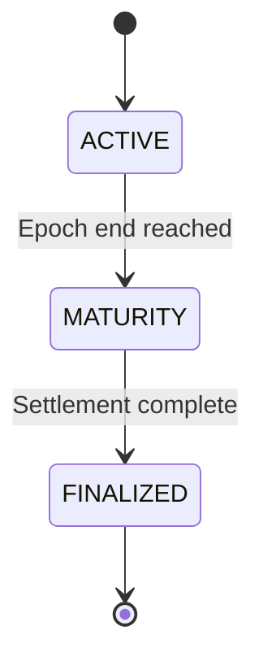

## What is an Epoch?

An epoch is a fixed time window — typically 8 to 12 weeks — during which a single strategy vault operates. Each strategy defines its own epoch schedule independently. When one epoch ends, a new one can begin; capital does not carry over between them.

## State Progression

Every epoch moves through exactly three states, always in this order:

---

## Active

This is the primary operating state, lasting the full epoch duration. Both the EPT/USDC and ST/USDC orderbooks are open for trading. The underlying strategy is executing on perp DEXes, and credits are accruing on EPT balances based on strategy activity.

During this phase, users can place orders to buy or sell EPT and ST on their respective orderbooks. New deposits mint both ST and EPT at the current NAV. Credit accrual begins at the moment of EPT minting.

---

## Maturity

When the epoch's scheduled end is reached, it enters Maturity. This transitional state lasts 1 to 2 days while the strategy unwinds its positions across perp DEXes and capital is returned to the vault.

No new orders are accepted and no new deposits can be made. Credit accrual is frozen as of the epoch end timestamp. The protocol waits for all positions to be closed and all capital to be settled before advancing.

---

## Finalized

Once settlement is complete, the epoch is finalized. ST holders can redeem their tokens for USDC at the final NAV. EPT holders can claim their PointsTokens based on their accumulated credit share.

There is no deadline on redemption. Tokens remain valid indefinitely once the epoch is finalized. Partial redemptions are supported for both ST and EPT.

---

## Key Details

- **Tokens are epoch-specific.** Each epoch mints new ST and EPT instances. Tokens from Epoch 7 and Epoch 8 are entirely separate.

- **No automatic rollover.** When an epoch finalizes, your capital stays as redeemable tokens until you explicitly redeem. To participate in the next epoch, you redeem and deposit again.

- **PointsTokens persist across epochs.** Unlike ST and EPT, the PointsTokens you claim are cumulative. Points claimed from Epoch 7 and Epoch 8 are the same token, accumulating in your wallet.

- **Multiple epochs can coexist.** One epoch may be Active while a previous one is still in Maturity or already Finalized.
