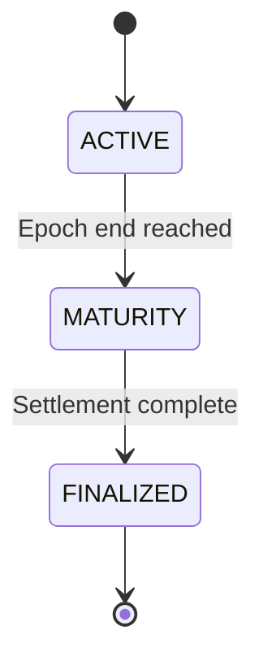

An **epoch** is a fixed time window during which a strategy vault operates. Each strategy defines its own epoch schedule. When one epoch ends, a new one can begin — capital does not automatically carry over.

Every epoch moves through exactly three states:

**Active** — The strategy is executing and orderbooks are open. Users can deposit (minting ST and EPT), or trade ST and EPT on their respective orderbooks. Credits accrue on EPT balances throughout this phase.

**Maturity** — The strategy unwinds its positions and capital is returned to the vault. No new deposits are accepted, but orderbooks remain open for trading. Credit accrual is frozen.

**Finalized** — Settlement is complete. ST holders redeem for USDC at the final NAV. EPT holders claim PointsTokens based on their accumulated credit share. There is no deadline on redemption — tokens remain valid indefinitely. To participate in the next epoch, you redeem and deposit again.
