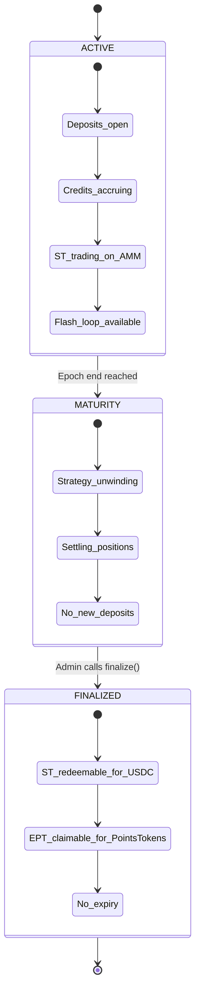
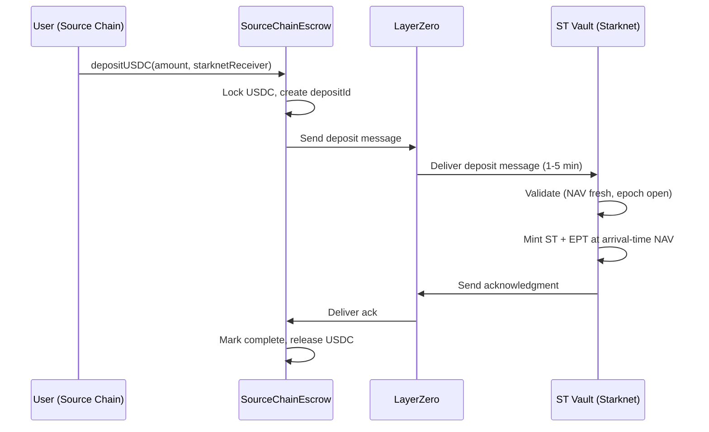
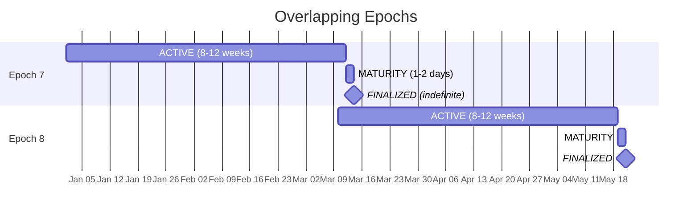

## What is an Epoch?

An epoch is a fixed window (typically 8--12 weeks) during which a strategy runs, earns returns, and accumulates exchange points. Think of it like a **closed-end mutual fund with a fixed maturity date**: the fund opens, runs for the epoch period, then closes and distributes proceeds to shareholders.

Every epoch is independent:
- New ST and EPT token instances are created per epoch
- Capital from one epoch does NOT roll over to the next
- Each epoch has its own NAV, its own credit accrual, and its own points total
- Multiple epochs can coexist in different states (Epoch 7 finalized while Epoch 8 is active)

**Why fixed windows?** Fixed windows give you clear start/end times, predictable maturity dates, and isolated risk per period.

---

## The Three States

Every epoch progresses through exactly three states, always in the same order:



### State 1: ACTIVE

**Duration:** The full epoch period (typically 8--12 weeks)

This is the main operating state. Everything is live:

| What's happening | Details |
|---|---|
| **Deposits open** | Users deposit USDC (directly on Starknet or via cross-chain escrow) |
| **NAV oracle updating** | ArcX reports strategy NAV every 5 minutes |
| **Credits accruing** | EPT holders accumulate credits based on `balance × creditRate × time` |
| **creditRate updating** | Credits Oracle publishes rate reflecting strategy activity (OI, volume) |
| **ST trading on ArcX AMM** | ST is tradeable on the ArcX AMM (Pendle-style ST/USDC pool) |
| **Flash loop available** | Deposit → sell ST → re-deposit for leveraged EPT |
| **Strategy executing** | ArcX runs the perp DEX strategy (funding arb, market making, etc.) |

**What users can do:**
- Deposit USDC → receive ST + EPT(s)
- Execute the flash loop for leveraged EPT exposure
- Buy/sell ST on the ArcX AMM
- Buy discounted ST as a yield seeker

**What users cannot do:**
- Redeem ST for USDC (must wait for finalization)
- Claim EPT credits for PointsTokens (must wait for finalization)
- Roll capital from a previous epoch (must redeem first, then re-deposit)

<AccordionGroup>
<Accordion title="What if I miss the deposit window?">
You wait for the next epoch. There's no penalty for missing a window. You simply deposit into the next one.
</Accordion>
</AccordionGroup>

---

### State 2: MATURITY

**Duration:** 1--2 days (asynchronous settlement)

The epoch has ended. The strategy is being unwound.

| What's happening | Details |
|---|---|
| **Strategy unwinding** | ArcX closes positions on perp DEXes, realizes PnL |
| **USDC returning** | Capital is bridged back to the Starknet vault |
| **No new deposits** | The deposit window has closed |
| **No oracle updates** | NAV and creditRate are frozen |
| **ST trading continues** | ST remains tradeable on the ArcX AMM (the protocol cannot pause the AMM) |

**What users can do:**
- Buy/sell ST on the ArcX AMM (prices will reflect maturity expectations)

**What users cannot do:**
- Deposit new USDC
- Redeem ST or claim EPT (not yet finalized)

**Why settlement is asynchronous:** Perp DEX positions don't close instantly. A funding arb strategy may have positions across multiple exchanges, each with its own settlement process. Exchange withdrawals can take hours to days. The protocol waits until all capital is returned before finalizing.

<AccordionGroup>
<Accordion title="What if settlement takes longer than expected?">
Finalization is delayed until all capital is returned and oracles report. During the delay, your tokens still exist and are tradeable on the ArcX AMM, but you can't redeem. In practice, 1--2 days covers most scenarios.
</Accordion>

<Accordion title="What happens to my credits during MATURITY?">
Credits stop accruing at epoch_end. The MATURITY and FINALIZED states don't generate new credits. Your credit balance is final as of the epoch end timestamp.
</Accordion>
</AccordionGroup>

---

### State 3: FINALIZED

**Duration:** Indefinite (no expiry on redemptions)

All capital is returned, final NAV and points are reported, and users can redeem.

| What's happening | Details |
|---|---|
| **Final NAV reported** | NAV Oracle publishes the definitive final NAV |
| **Total points reported** | Final Points Oracle reports totalPoints earned during the epoch |
| **Admin calls `finalize()`** | Locks in the conversion ratios for redemption |
| **Redemption open** | ST → USDC and EPT → PointsTokens |
| **No expiry** | Redeem anytime: days, weeks, or months after finalization |

**What users can do:**
- Burn ST → receive proportional USDC (`shares × finalNAV / totalShares`)
- Call `claimPoints()` on EPT → receive PointsTokens based on credit share
- Claim incrementally (partial redemptions supported via `alreadyClaimed` tracking)

**What users cannot do:**
- Deposit new USDC (epoch is closed)
- Earn more credits (credit accrual stopped at epoch end)

<AccordionGroup>
<Accordion title="Can I redeem only some of my ST or EPT?">
Yes. Both ST redemption and EPT claiming support partial execution:
- ST: burn any number of your shares → receive proportional USDC
- EPT: `claimPoints()` tracks `alreadyClaimed`, so you can call it multiple times if you transfer some EPT between claims
</Accordion>
</AccordionGroup>

---

## Following an Epoch: Alice's Journey

Let's follow Epoch 7 of the "Pacifica-Extended Funding Arb" strategy from start to finish.

### Week 1: Epoch Opens

Epoch 7 begins. The strategy is seeded with initial capital. NAV = \$50,000. Total shares = 50,000.

Alice deposits \$100 on Starknet.
- Deposit fee: \$0.50 (0.5%)
- Net: \$99.50
- ST shares received: `99.50 × 50,000 / 50,000 = 99.50` shares
- EPT received: 99.50 EPT_Pacifica + 99.50 EPT_Extended
- NAV after Alice: \$50,099.50

Alice decides to flash loop for maximum points exposure. She sells her ST on the ArcX AMM for ~\$89.55 (10% discount), re-deposits, and repeats twice more. Result: ~270 EPT_Pacifica + ~270 EPT_Extended from her original \$100.

### Week 4: Mid-Epoch Activity

The strategy is performing well. NAV has grown to \$51,500. creditRate is high. The strategy has \$400K of open interest across both exchanges, generating lots of points.

Alice holds ~270 EPT on each exchange. Credits have been accruing since Week 1 at high creditRate. She checks her estimated credit share on the ArcX interface.

### Week 7: Strategy Dips

Market conditions shift. NAV dips to \$51,000. creditRate drops as OI decreases temporarily. Alice's ST (what she didn't sell in the flash loop) is worth slightly less, but her EPTs continue accruing credits at a lower rate.

### Epoch End: Transition to MATURITY

At the scheduled end, Epoch 7 transitions to MATURITY.

- No more deposits accepted
- The Strategy Runner begins closing positions on Pacifica and Extended
- Capital is withdrawn from the exchanges
- This takes 1--2 days depending on exchange settlement times

### Settlement (1--2 Days)

ArcX closes all positions. Final strategy PnL: +2.8% for the epoch. USDC is bridged back to the Starknet vault.

### Finalization

All capital is returned. The oracles report:
- Final NAV = \$51,400 (after all settlement)
- Total points: 4,200 Pacifica points, 3,100 Extended points

Admin calls `finalize()`. Epoch 7 is now FINALIZED.

### Alice Redeems

**ST → USDC:**
Alice burns any remaining ST shares she held (from the last flash loop iteration).

**EPT_Pacifica → PointsTokens:**
Alice's ~270 EPT_Pacifica have been accruing credits since Week 1. She calls `claimPoints()`.
- Her credits are settled (full epoch of accrual across multiple deposit batches)
- She receives xPC tokens proportional to her credit share

**EPT_Extended → PointsTokens:**
Same process. She receives xET tokens.

**Later:**
Alice is in no rush to redeem. She waits 3 weeks and redeems then. No expiry, no penalty.

---

## Deposit Mechanics

Every deposit must pass four checks before minting tokens:

1. **Epoch is open:** You can't deposit before the start or after the end
2. **Deposit window active:** A configurable cutoff may close deposits early (default: open until epoch end)
3. **NAV is fresh:** If the NAV oracle is more than 30 minutes stale, deposits revert automatically. Your USDC stays safe.
4. **Not paused:** Admin can pause deposits in emergencies. Existing positions and trading are unaffected.

If any check fails, the transaction reverts and your USDC stays in your wallet.

**On a valid deposit:** A single transaction deducts the fee, mints ST shares at current NAV, mints EPT(s), and starts credit accrual. Both tokens land in your wallet instantly.

**Deposit fee:** Covers operational costs and defends against sandwich attacks. Varies by strategy, as low as 0.01% for funding arb, up to 0.5% for market making. See [Fee Structure](/learn/token-economics#fee-structure).

For the full deposit validation pseudocode, see the contract reference documentation.

<AccordionGroup>
<Accordion title="What if the NAV oracle goes down during the epoch?">
Deposits automatically revert after 30 minutes of staleness (Check 3 fails). The epoch itself continues. Existing positions, credits, and trading are unaffected. Admin can additionally pause deposits as a safeguard. Finalization is delayed until the oracle recovers and submits the final NAV.
</Accordion>

<Accordion title="Are there multiple deposits allowed per epoch?">
Yes. You can deposit multiple times during the ACTIVE period. Each deposit mints additional ST shares and EPT at the current NAV. Credits from each deposit accrue independently from their respective mint timestamps.
</Accordion>
</AccordionGroup>

---

## Cross-Chain Deposits

Not everyone has USDC on Starknet. ArcX supports deposits from other chains (Ethereum, Arbitrum, Solana, and others) via an escrow + messaging system.

### How It Works



**Step by step:**

1. You call `depositUSDC(amount, starknetReceiver)` on the SourceChainDepositEscrow on your chain
2. The escrow locks your USDC and creates a unique `depositId`
3. A LayerZero message is sent to the Starknet ST vault (typical latency: 1--5 minutes, worst case ~30 minutes)
4. On Starknet, the deposit message is validated: epoch window, NAV freshness, idempotency check
5. ST shares and EPT are minted at the **arrival-time NAV** (not the NAV when you initiated)
6. An acknowledgment message is sent back to the source chain, marking the deposit complete and releasing the locked USDC for strategy deployment

### NAV Slippage Risk

The NAV at the moment your deposit is processed on Starknet may differ from the NAV when you initiated. If the strategy gained 0.5% during the 5-minute transit, you're buying in at a higher NAV (fewer shares). If the strategy lost 0.5%, you're buying in at a lower NAV (more shares).

This is a known tradeoff of cross-chain deposits. For typical LZ latency (1--5 minutes) and typical strategy volatility, the slippage is small, especially for low-volatility strategies like funding arb.

### Refund Path: What If the Message Fails?

If the LayerZero message never arrives on Starknet (network congestion, bridge outage):

```
After REFUND_TIMEOUT expires:
  → You call cancel(depositId) on the source chain escrow
  → Escrow verifies: no acknowledgment received, timeout elapsed
  → Your USDC is refunded to your wallet
```

You are never permanently locked out. The refund timeout is your self-rescue mechanism.

**What if the message arrives late (after cancellation)?** The Starknet contract checks the `depositId` against the source chain state. A cancelled deposit ID is rejected. No double-minting can occur. Idempotency is enforced at the protocol level.

<AccordionGroup>
<Accordion title="What if I deposited from Ethereum and the bridge is slow?">
Typical LayerZero latency is 1--5 minutes (worst case ~30 minutes). Your USDC is locked in the escrow during transit. If the message never arrives, you can self-rescue by calling `cancel(depositId)` after the REFUND_TIMEOUT expires. Your USDC is refunded to your wallet on the source chain.
</Accordion>
</AccordionGroup>

---

## Back-to-Back Epochs

Epochs run consecutively without gaps. Here's how they overlap:



**Key rules:**

1. **No automatic rollover.** Your capital from Epoch 7 does not automatically move to Epoch 8. You must explicitly redeem ST from Epoch 7 and deposit into Epoch 8 if you want to continue.

2. **Multiple epochs coexist.** While Epoch 8 is ACTIVE, Epoch 7 might still be settling (MATURITY) or already finalized. Each epoch has its own contract instances and state.

3. **Tokens are epoch-specific.** `ST-PacificaFundingArb-E007` and `ST-PacificaFundingArb-E008` are completely separate tokens. Make sure you're interacting with the correct epoch.

4. **PointsTokens persist across epochs.** Your xPC from Epoch 7 and xPC from Epoch 8 are the same token (xPC). They accumulate in your wallet.

### Why No Rollover?

Each epoch has a potentially different risk profile. Risk profiles change between epochs. Requiring explicit re-deposit ensures:

- You decide whether to re-enter
- You can evaluate whether the strategy still fits your goals
- There's no "forgotten capital" sitting in a strategy you didn't re-evaluate
- Risk isolation is clean: each epoch is fully independent


---

## Emergency: Pause

The admin can pause deposits in an emergency situation (security incident, strategy issue, oracle malfunction).

| Action | Behavior |
|---|---|
| `pause()` | Admin-only. Pauses new deposits into the current epoch. |
| **Effect on epoch** | The epoch still runs to its scheduled end. There is no early termination mechanism. |
| **Effect on credits** | Credits continue accruing normally. creditRate is unaffected. |
| **Effect on trading** | ST remains tradeable on the ArcX AMM. ArcX cannot pause the AMM. |
| **Effect on redemption** | Once finalized, users can still redeem normally. |
| `unpause()` | Admin-only. Re-enables deposits if still within the deposit window. |

**What pause does NOT do:**
- Does not freeze trading (ArcX AMM is a separate protocol)
- Does not stop credit accrual
- Does not trigger early maturity
- Does not affect existing positions in any way

Pause is a conservative measure: it stops new money from entering while existing positions continue unchanged. Good for when the strategy needs attention but existing positions are fine.

<AccordionGroup>
<Accordion title="Can the admin terminate an epoch early?">
No. There is no early termination mechanism. The admin can pause deposits, but the epoch runs to its scheduled end. This simplifies the contract model and avoids the complexity of mid-epoch unwinds.
</Accordion>

<Accordion title="What if the Credits Oracle goes down?">
Credits accrue at the last known rate. If the strategy's actual activity changed significantly during the outage, some holders may be over- or under-weighted for that period. The impact is bounded. Even a multi-hour outage produces modest distortion unless activity changes dramatically. See [Credit Mathematics: Edge Cases](/deep-dives/credit-mathematics#edge-cases-and-invariants).
</Accordion>
</AccordionGroup>

---

## Sequence Diagrams

For deposit validation pseudocode and detailed contract mechanics, see the deep dive pages.
