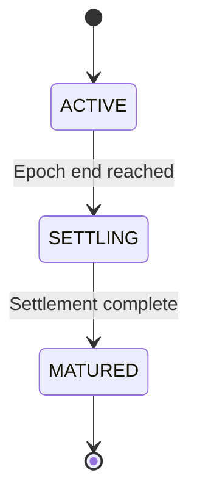

An **epoch** is a fixed time window during which a vault operates. Each vault defines its own epoch schedule. When one epoch ends, a new one can begin — capital does not automatically carry over.

Every epoch moves through exactly three states:

```mermaid
stateDiagram-v2
    [*] --> ACTIVE
    ACTIVE --> SETTLING : Epoch end reached
    SETTLING --> MATURED : Settlement complete
    MATURED --> [*]
```

**Active** — Deposits open. Credits accruing on vToken and EPT balances. Orderbooks open for trading (ST/vToken and EPT/vToken). Withdrawals available (two-phase).

**Settling** — The market maker unwinds positions and capital is returned to the vault. No new deposits. Orderbooks open for secondary trades only. Credit accrual stops.

**Matured** — Final NAV and points published. ST redeems for USDC. EPT claims PointsTokens. vToken holders can claim both directly. No deadline on redemption.
