<Info>
**Course level: Intermediate**

**The core idea:** EPT doesn't give you points directly. It accrues **credits** over time, and your final points share equals your share of total credits. **When** you deposit matters as much as **how much** you deposit.
</Info>

**Prerequisites:** [The Three Tokens](/learn/token-economics)

---

## What EPT Does For You

Want leveraged exposure to exchange points without locking all your capital into a strategy? EPT lets you do that through the flash loop: deposit USDC, sell the ST you receive, re-deposit the proceeds, and repeat. Each cycle gives you more EPT.

EPT is an ERC20 with a built-in credit accrual system. Each epoch creates a new EPT per exchange per strategy, e.g., `EPT-Pacifica-E007` for Pacifica points from Epoch 7. Think of it as a **pre-market futures contract** on exchange loyalty points.

**Multi-EPT:** If a strategy earns points on multiple exchanges, you receive a separate EPT for each. A \$100 deposit into Pacifica-Extended Funding Arb gives you 1 ST + 99.50 EPT_Pacifica + 99.50 EPT_Extended.

**EPT is deposit-only.** There is no secondary market for EPT. You obtain EPT by depositing USDC into a strategy. The flash loop is the primary mechanism for acquiring leveraged EPT exposure.

---

## The Credit System

The credit formula at its core:

$$\text{credits} = \text{balance} \times \text{creditRate} \times \Delta t$$

Your credits grow continuously while you hold EPT. The rate, `creditRate`, is set by ArcX's Credits Oracle and reflects strategy activity:

| Strategy Type | What creditRate reflects | Why |
|---|---|---|
| Funding arb | Current open interest (OI) | More OI = more exchange points |
| Market making | Trading volume throughput | More volume = more activity points |

**Why variable rate?** If the strategy was idle for 3 weeks then ramped up for 5 weeks, a constant rate would distribute credits equally across the epoch. Variable creditRate concentrates credit accrual during high-activity periods, aligning with when points were actually generated.

**Fallback:** If the Credits Oracle goes down, credits accrue at the last known rate. If creditRate were constant, it cancels out in the final ratio, as proven in [Credit Mathematics](/deep-dives/credit-mathematics).

<Accordion title="What happens to my credits if I transfer EPT?">
Both sender and receiver are checkpointed at the moment of transfer. The sender keeps all credits accrued up to that point. The receiver starts accruing fresh. No credits are lost. They just stop growing for the sender and start growing for the receiver.
</Accordion>

---

## Credit Checkpointing

Every time EPT moves (transfer, mint), the contract checkpoints both sender and receiver:

1. Compute sender's accrued credits since last checkpoint
2. Lock those credits to the sender
3. Do the same for the receiver
4. Execute the transfer

This is lazy evaluation: gas-efficient and mathematically equivalent to continuous tracking.

| Action | Effect on your credits |
|---|---|
| Hold for the full epoch | Maximum credit accrual |
| Deposit mid-epoch | Credits start from your deposit time |
| Transfer EPT to another wallet | Credits locked at checkpoint. You keep what you earned. |

---

## Worked Example: Two Depositors at Different Times

```mermaid
gantt
    title Credit Accrual: Alice vs Bob
    dateFormat X
    axisFormat %s

    section Alice (100 EPT)
    Full epoch (100 EPT)    :0, 604800

    section Bob (100 EPT)
    Deposits mid-epoch (100 EPT)    :259200, 604800
```



Alice deposits \$100 on Day 0. Bob deposits \$100 on Day 3 (mid-epoch). CreditRate = 10 (constant for simplicity).

**Day 0 onwards:** Alice holds 100 EPT → accruing credits immediately

**Day 3:** Bob deposits \$100 → receives 100 EPT → starts accruing credits

**Full epoch (604,800 seconds):**

| | Duration (seconds) | Credits | Share | Points (of 1,000) |
|---|---|---|---|---|
| Alice | 604,800 (full epoch) | 604,800,000 | 63.6% | 636 |
| Bob | 345,600 (Day 3 onward) | 345,600,000 | 36.4% | 364 |

Alice gets more because she deposited earlier and accrued credits for 3 extra days. The credit system correctly weights amount × duration.

For variable creditRate examples, see [Credit Mathematics](/deep-dives/credit-mathematics).

---

## The Flash Loop: Leveraged EPT

The flash loop is how you maximize EPT exposure:

```
$100 deposit → 100 EPT + ST shares
  Sell ST on ArcX AMM (~$90) → $90 cash
  $90 deposit → 90 EPT + ST shares
    Sell ST (~$81) → $81 cash
    $81 deposit → 81 EPT + ST shares
      ...
```

After multiple iterations, you hold ~270 EPT from a \$100 starting deposit. Your effective cost per EPT drops from \$1.00 to ~\$0.037.

**Why this works:** Each deposit creates EPT (which you keep) and ST (which you sell at a discount). The ST discount is the "price" you pay for points. The flash loop amplifies this by recycling the ST sale proceeds.

**Key insight:** All EPT from the flash loop accrues credits from the moment of each deposit. Earlier loop iterations earn more credits than later ones (more time remaining). This is why executing the flash loop early in the epoch is optimal.

---

## Claiming Points

After finalization, the Final Points Oracle reports `totalPoints`. The contract computes:

$$\text{pointsPerCredit} = \frac{\text{totalPoints}}{\text{totalCredits}}$$

$$\text{yourPoints} = \text{yourCredits} \times \text{pointsPerCredit} - \text{alreadyClaimed}$$

When you call `claimPoints()`: credits settled → gross PointsTokens computed → redemption fee deducted → net PointsTokens minted to your wallet.

No expiry. Claim incrementally; the contract tracks what you've already received.

---

## What Determines Your EPT's Value

Since EPT is deposit-only (no secondary market), its value is determined by the implied cost through the flash loop:

| Factor | Effect | Mechanism |
|---|---|---|
| ST discount on ArcX AMM | ↑ discount → ↓ EPT cost | Deeper ST discounts mean cheaper EPT via the flash loop |
| Expected creditRate | ↑ activity → ↑ EPT value | More active strategy = more credits per EPT |
| Time remaining | ↓ time left → ↓ EPT value | Less credits to earn for new deposits |
| Expected points value | ↑ TGE expectations → ↑ EPT demand | More deposits → more flash loops → more ST selling |
| Minting parity | Caps combined ST+EPT at \$1 | `EPT_implied_cost = 1 - X/R` |

**The minting parity equation:**

$$\text{EPT}_\text{fair} = 1 - \frac{X}{R}$$

Where X = ST market price and R = exchange rate. Full derivation in [EPT Pricing](/deep-dives/ept-pricing).

**The one-way arb:** If the combined value of ST + EPT from a \$1 deposit exceeds \$1, anyone can deposit and sell both at a profit. This caps the upside. But there is no early redemption to correct underpricing. See [EPT Pricing](/deep-dives/ept-pricing) for the full analysis.

<Warning title="What can go wrong">
- **Depositing late:** You accrue fewer credits than early depositors. Same capital, fewer points per dollar.
- **creditRate drops:** Strategy goes idle → credits accrue slower.
- **Points are worthless:** No TGE or negligible airdrop → EPT value approaches zero.
- **Flash loop at bad timing:** If ST discount widens after your loop, later depositors get EPT cheaper.
</Warning>
