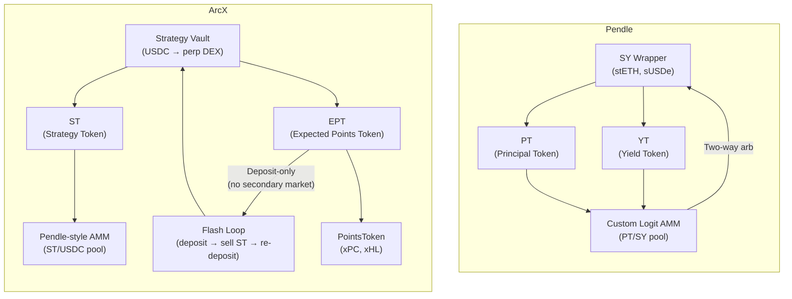

## 60-Second Cheatsheet

If you know Pendle, here's the mapping:

| Pendle | ArcX | Same? |
|---|---|---|
| **SY** (Standardized Yield wrapper) | Strategy Vault | Conceptually similar: both wrap an underlying into a standardized interface |
| **PT** (Principal Token) | **ST** (Strategy Token) | Similar: both represent the principal claim at maturity |
| **YT** (Yield Token) | **EPT** (Expected Points Token) | Structurally analogous but economically different; see below |
| *(no equivalent)* | **PointsToken** (xPC, xHL) | ArcX-only: tokenized exchange points, 1:1 backed |
| **PT + YT = Underlying** | **(1/R) ST + 1 EPT = \$1** | Same shape. Different constants. |
| Custom logit AMM (PT/SY pool) | Custom Pendle-style AMM (ST/USDC pool) | Similar: both use time-decay curves for the principal token |
| Flash swap (leveraged YT) | **Flash loop** (leveraged EPT) | Analogous: both enable leveraged exposure to the "yield" side |
| Two-way arbitrage | One-way arbitrage (upward only) | Different. ArcX has no early redemption |
| Variable maturity (weeks to years) | Fixed epochs (8--12 weeks) | Different. ArcX resets each epoch |
| Yield streaming (real-time SY drip to YT holders) | Credit accrual (settled at finalization) | Different mechanism, similar goal |
| YT decays to \$0 at maturity | EPT has positive terminal value | Fundamentally different |
| Implied APY (market price of yield) | *(no direct equivalent)* | ArcX prices points exposure, not yield percentage |
| vePENDLE (governance + fee share) | *(not yet)* | ArcX has no governance token currently |

---

## The Anchoring Equations

Both protocols have a core identity that governs token relationships and pricing:

**Pendle:**

$$\text{PT} + \text{YT} = \text{Underlying Asset}$$

One unit of underlying can always be split into PT + YT, and PT + YT can always be recombined into the underlying. This identity holds at all times and enables two-way arbitrage.

**ArcX:**

$$1 \text{ USDC deposited} = \frac{1}{R} \text{ ST} + 1 \text{ EPT}$$

Where R = ST exchange rate (NAV / totalShares). One dollar deposited produces a fixed combination of ST shares and EPT. But unlike Pendle, you can't reverse this. There's no early redemption to burn ST + EPT back into USDC before finalization.

**What the equations share:** Both are conservation equations. The parts add up to the whole. Both enable "upward arbitrage": if the tokens' combined market price exceeds the underlying, someone can mint and sell at a profit.

**Where they diverge:** Pendle's equation is reversible (mint and redeem at any time). ArcX's equation is one-directional (mint only, no early redemption). This one difference changes the entire pricing model.

---

## Architecture Comparison

---

## Five Critical Differences

### 1. What Gets Tokenized

| | Pendle | ArcX |
|---|---|---|
| **Input** | Yield-bearing asset (stETH, sUSDe, GLP...) | USDC deposited into a perp DEX trading strategy |
| **What's split** | Principal + yield stream | USDC outcome (strategy PnL) + exchange points outcome |
| **Yield/points source** | Native yield from the asset (staking rewards, lending interest) | Exchange points from strategy activity (trading, OI) |
| **Who runs the strategy** | The underlying protocol (Lido, Ethena, GMX...) | ArcX (centralized strategy execution) |

Pendle splits *what an asset earns* (yield). ArcX splits *what a strategy earns* (PnL + points). Pendle wraps existing yield-bearing positions. ArcX wraps an actively managed trading strategy that runs on perp DEXes.

### 2. Terminal Value: YT Goes to Zero, EPT Doesn't

This is the most important structural difference.

**Pendle YT** streams yield in real-time. By maturity, all yield has been paid out. YT = \$0 at maturity.

**ArcX EPT** accrues credits, an abstract accounting unit that converts to PointsTokens only at finalization. EPT retains terminal value equal to the market price of those PointsTokens.

| | Pendle YT | ArcX EPT |
|---|---|---|
| **During the period** | Yields stream in real-time (claimable SY) | Credits accrue (abstract, not claimable) |
| **At maturity** | \$0 (all yield already paid) | Positive (redeemable for PointsTokens) |
| **Time decay pattern** | Monotonic decay → \$0 | Decays toward terminal value, not zero |

### 3. Two-Way Arbitrage vs One-Way

**Pendle** has tight price corridor enforced by arbitrage in both directions. Any mispricing gets corrected.

**ArcX** only has the upward half: deposit + sell if overpriced. No early redemption to correct underpricing.

**Consequence:** The implied cost of EPT (via the flash loop) can diverge from theoretical fair value. Same thing as closed-end funds trading at NAV discounts.

### 4. AMM Design

**Pendle built a custom AMM** --- logit-based curve that concentrates liquidity around expected yield ranges, with time-aware parameters that steepen as maturity approaches. Flash swaps route YT trades through the PT/SY pool.

**ArcX also uses a Pendle-style AMM** with a time-decay curve for the ST/USDC pool. Key similarities:
- Time-decay curve that steepens as maturity approaches
- Concentrated liquidity around expected ST price ranges
- ST price naturally converges to redemption value near maturity

**Key differences from Pendle's AMM:**
- ST converges to finalNAV (unknown until settlement), not a predetermined 1:1 redemption value
- EPT has no AMM pool --- it's deposit-only, with the flash loop replacing secondary market trading
- No flash swap equivalent for EPT --- the flash loop serves a similar purpose but works differently

### 5. Flash Swap vs Flash Loop

**Pendle flash swap:** Atomic operation to buy leveraged YT. The AMM handles the routing: deposit underlying → mint PT + YT → sell PT into pool → keep YT. All in one transaction.

**ArcX flash loop:** Iterative operation to accumulate leveraged EPT. Deposit USDC → mint ST + EPT → sell ST on AMM → re-deposit proceeds → repeat. Multiple transactions (or batched atomically).

| | Pendle Flash Swap | ArcX Flash Loop |
|---|---|---|
| **Mechanism** | Atomic via AMM routing | Iterative deposit → sell → re-deposit |
| **What you get** | Leveraged YT | Leveraged EPT |
| **Capital efficiency** | Very high (single tx) | High (multiple iterations) |
| **Price impact** | AMM absorbs in one trade | Each ST sale has separate price impact |
| **Max leverage** | Limited by AMM liquidity | Limited by ST discount depth |

---

## Strategy Mapping: Pendle Strategy → ArcX Equivalent

### "Buy PT for Fixed Yield" → "Buy Discounted ST"

| Pendle | ArcX |
|---|---|
| Buy PT at discount → redeem 1:1 at maturity | Buy ST below NAV on ArcX AMM → redeem at finalNAV |
| Fixed yield = discount to underlying | Return = finalNAV - purchase price |
| Guaranteed if held to maturity | Not guaranteed. Depends on strategy performance |

### "Buy YT for Leveraged Yield" → "Flash Loop for Leveraged EPT"

| Pendle | ArcX |
|---|---|
| Buy YT → receive yield stream → hope APY stays high | Flash loop → accumulate EPT → hope points are valuable at TGE |
| Leverage: YT costs ~5--10% of underlying → 10--20x yield exposure | Leverage: Flash loop gives ~2.7x EPT per dollar at 10% ST discount |
| Time decay: YT → \$0 (all yield streamed) | Time value: EPT terminal > \$0 (PointsToken claim) |

### "LP in Pendle Pool" → "Provide Liquidity on ArcX AMM"

| Pendle | ArcX |
|---|---|
| Provide PT/SY liquidity | Provide ST/USDC liquidity on ArcX AMM |
| Zero IL at maturity (PT converges to SY) | Reduced IL via time-decay curve (ST converges toward NAV) |
| Earn: swap fees + PENDLE incentives + native yield | Earn: swap fees from flash loop activity |

---

## Pricing Comparison

| | Pendle | ArcX |
|---|---|---|
| **Pricing concept** | Implied APY: market price of yield as annual percentage | Minting parity: `EPT_fair = 1 - X/R` derived from the flash loop cost |
| **What moves the price** | Changes in implied APY (supply/demand for yield) | Changes in ST discount, creditRate expectations, points sentiment |
| **Natural direction** | YT decays toward \$0; PT rises toward underlying | EPT implied cost varies with ST discount; ST converges toward finalNAV |
| **Arb enforcement** | Two-way (tight corridor) | One-way upward (ceiling only) |

---

## Trust Model Comparison

| | Pendle | ArcX |
|---|---|---|
| **Smart contracts** | Fully on-chain, audited, immutable core | On-chain token logic, off-chain oracles and strategy |
| **Strategy execution** | None. The underlying protocol runs it | ArcX runs the strategy (centralized) |
| **Oracle** | PY index derived from on-chain state | NAV, creditRate, totalPoints all reported by ArcX |
| **Redemption** | Trustless: PT+YT → underlying via smart contract | Admin-triggered finalization → then trustless redemption |
| **Overall trust level** | High (on-chain, audited, battle-tested) | Lower (centralized oracles, trust in strategy execution) |

Pendle is significantly more trustless. ArcX trades trustlessness for access to off-chain perp DEX strategies and pre-TGE points markets. See [Trust Model & Security](/deep-dives/trust-model-and-security).

---

## What ArcX Does That Pendle Doesn't

### Tokenizes Pre-TGE Points

Pendle doesn't create a separate points token. ArcX creates standalone, transferable PointsTokens (xPC, xHL) that persist across epochs and become redeemable after TGE.

### Multi-Exchange Points from a Single Deposit

A single ArcX deposit into a cross-exchange strategy (e.g., Pacifica-Extended funding arb) gives you points exposure on multiple exchanges simultaneously with separate EPTs per exchange.

### Deposit-Only EPT Model

Instead of a tradeable YT with time-decay AMM pricing, ArcX uses a deposit-only EPT model where the flash loop replaces secondary market trading. Simpler system, still gives you leveraged points.

---

## What Pendle Does That ArcX Doesn't

### Two-Way Arbitrage

Pendle's mint-and-redeem cycle creates tight pricing. ArcX's one-way arb allows persistent discounts on the implied EPT cost.

### Governance and Fee Distribution (vePENDLE)

vePENDLE holders vote on pool emissions, receive protocol fees, and boost LP rewards. ArcX has no governance token or fee-sharing mechanism currently.

### Permissionless Market Creation

Anyone can deploy a new SY wrapper on Pendle. ArcX strategy creation is permissioned.

### Real-Time Yield Claiming

Pendle YT holders can claim yield at any time. ArcX EPT holders must wait for finalization.

---

## When to Use Which

| If you want to... | Use Pendle | Use ArcX |
|---|---|---|
| Earn fixed yield on a yield-bearing asset | PT (buy at discount, redeem 1:1) | Not the primary use case |
| Get leveraged yield exposure | YT (buy cheap, receive yield stream) | Not applicable |
| Get leveraged pre-TGE points exposure | YT on point-earning assets (indirect) | Flash loop (direct, capital-efficient) |
| Split strategy PnL from points | Not possible | Deposit → flash loop (keep EPT, sell ST) |
| Buy discounted strategy exposure | Buy PT for fixed yield | Buy discounted ST for strategy returns |
| Access a trustless, audited system | Pendle (fully on-chain) | ArcX has centralized components |

<AccordionGroup>
<Accordion title="Can I use both Pendle and ArcX?">
Yes. They serve different purposes. Pendle is for yield optimization on DeFi assets. ArcX is for accessing and trading perp DEX strategy outcomes (PnL + points). You could use both: Pendle for fixed yield on staked assets, ArcX for points on perp strategies.
</Accordion>
</AccordionGroup>
