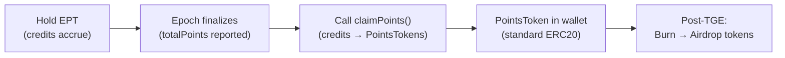

<Info>
**Course level: Intermediate**

**The core idea:** PointsToken (xPC, xHL) represents real exchange points, 1:1 backed. It persists across epochs. After the exchange's TGE, burn PointsTokens to receive airdropped tokens.
</Info>

**Prerequisites:** [The Three Tokens](/learn/token-economics), [Expected Points Token](/learn/expected-points-token)

---

## What PointsToken Does For You

Want to hold a tradeable, liquid representation of exchange points before TGE? PointsToken is that. Unlike ST and EPT which reset each epoch, there's **one PointsToken per exchange** that accumulates across all epochs.

| PointsToken | Exchange | Chain | Meaning |
|---|---|---|---|
| xPC | Pacifica | Solana | 1 xPC = 1 Pacifica point |
| xHL | Hyperliquid | Arbitrum | 1 xHL = 1 Hyperliquid point |
| xET | Extended | StarkNet | 1 xET = 1 Extended point |

Your xPC from Epoch 1 and Epoch 7 are the same token. They stack.

---

## How PointsTokens Are Minted

PointsTokens are only minted post-finalization. The path:

1. Epoch ends → strategy unwinds
2. Final Points Oracle reports `totalPoints`
3. Admin calls `finalize()`
4. You call `claimPoints()` on your EPT
5. Credits settled → gross points computed → redemption fee deducted → PointsTokens minted to your wallet

**There is no other way to create PointsTokens.** They aren't minted on deposit, bought from ArcX, or distributed via airdrop. The only path: hold EPT → accrue credits → claim after finalization.

(Exception: admin can mint for LPs via PointsCollector for pool credit distribution.)

---

## The Backing: Trust, Not Proof

Every PointsToken should correspond to a real exchange point in ArcX's exchange account:

$$\text{PointsToken supply} \leq \text{real points held by ArcX}$$

This invariant is enforced by **trust, not code**. When ArcX reports `totalPoints = 1,000`, users trust those points exist.

**There is no on-chain verification.** No ZK proof, no third-party attestation, no public dashboard. Community members can partially verify by cross-referencing airdrop amounts with PointsToken supply, but real-time verification isn't possible.

This is the protocol's most significant trust assumption. See [Trust Model](/deep-dives/trust-model-and-security) for the full analysis.

<AccordionGroup>
<Accordion title="Are PointsTokens safe if ArcX shuts down?">
PointsTokens are on-chain ERC20s. They stay in your wallet regardless. However, post-TGE redemption requires ArcX to bridge airdrop tokens into the Redemption Module. If ArcX ceases operations before TGE, that path is broken.
</Accordion>
</AccordionGroup>

---

## Post-TGE Redemption

When an exchange conducts its TGE:

1. Exchange sends airdrop tokens to ArcX
2. ArcX bridges them to Starknet
3. Tokens deposited into the Redemption Module
4. Conversion rate set: `redemptionRate = totalAirdropTokens / totalPointsTokenSupply`
5. You burn PointsTokens → receive airdrop tokens

**Multi-tranche support:** Airdrops arrive in batches. You don't have to redeem all at once. Burn a portion now, save the rest for later batches when the rate may be higher.

**Example:** You hold 1,000 xPC.

| Event | Action | Result |
|---|---|---|
| Batch 1: 50,000 PDX for 100,000 xPC supply | Burn 500 xPC | 250 PDX |
| Batch 2 (3 months later): rate rises to 0.8 | Burn remaining 500 xPC | 400 PDX |

---

## What Drives PointsToken Price

| Factor | Effect | Mechanism |
|---|---|---|
| TGE timing | Closer TGE → ↑ price | Less time discounting |
| Expected airdrop generosity | More tokens/point → ↑ price | Exchange announcements |
| Exchange token price (post-TGE) | Direct link | `xPC ≈ redemptionRate × PDX price` |
| Supply growth | More epochs → more supply → potential dilution | New supply each epoch |

PointsTokens are standard ERC20s. Transfer, trade, or hold freely.

<Warning title="What can go wrong">
- **No TGE:** If the exchange never launches a token, PointsTokens have no redemption path.
- **Over-minting:** ArcX could mint more PointsTokens than real points held. No on-chain enforcement.
- **Low airdrop:** Exchange distributes fewer tokens per point than expected.
- **Vesting:** Airdrop tokens may come with lockups on the exchange's timeline.
</Warning>
