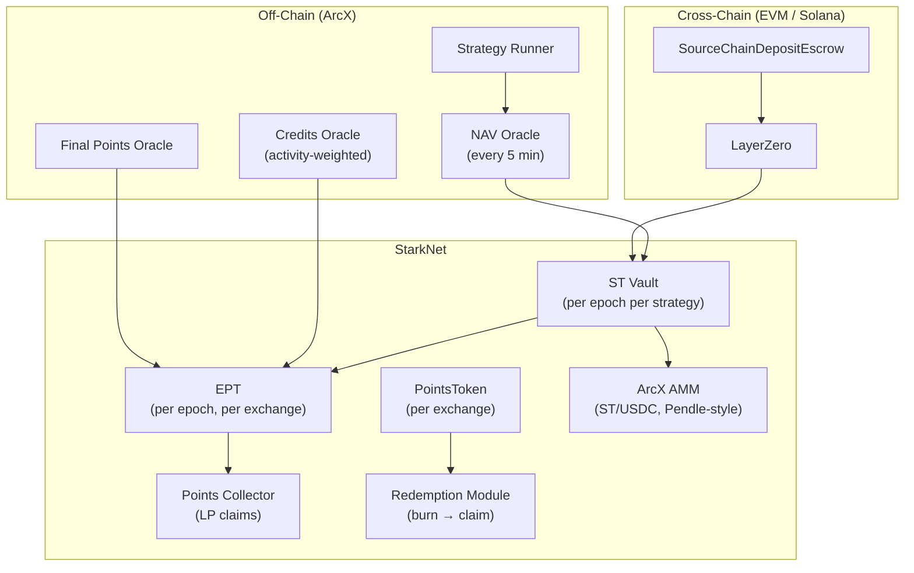

import FlashLoop from "/snippets/flash-loop.mdx";

<Info>
**Course level: Beginner**

**The core idea:** Deposit USDC, receive two tokens: ST (USDC outcome) + EPT (points outcome). The organizing equation (ignoring fees):

$$1 \text{ USDC deposited} = \frac{1}{R} \text{ ST} + 1 \text{ EPT}$$

ArcX is like a fund manager who separates your principal receipt from your loyalty points voucher. You can sell either one independently.
</Info>

**Prerequisites:** None. This is the starting point.

---

## The Problem: Points Farming is Broken

On platforms like <Tooltip tip="A protocol that requires users to lock capital for extended periods to earn exchange points, with no tradeable token representation.">TreadFi</Tooltip>, you **burn capital for points**. Deposit $100 into a protocol, watch it earn near-zero yield, and hope the airdrop makes up for it. Your capital is locked, illiquid, and doing nothing productive.

On perp DEXes like Pacifica, Hyperliquid, or Extended:

1. **Your capital is locked.** To earn points, you need positions open. That capital can't do anything else.
2. **Points and PnL are bundled.** A funding arb earns USDC returns AND exchange points, but they're stuck together.
3. **No liquidity for points.** Pre-TGE points have no market.
4. **No way to speculate on points alone.** Want more points exposure? You have to deposit more capital into the strategy.

**ArcX flips this:** Buy point tokens directly. No mental gymnastics. No burning capital to zero.

---

## The Solution: Tokenized Splitting + Flash Loop

ArcX splits a strategy position into two tokens at the moment of deposit:

$$1 \text{ USDC deposited} = \frac{1}{R} \text{ ST} + 1 \text{ EPT}$$

- **[<Tooltip tip="Strategy Token -- represents your claim on the USDC value of the underlying strategy at maturity.">ST</Tooltip> (Strategy Token)](/learn/strategy-token):** your claim on the USDC value at maturity
- **[<Tooltip tip="Expected Points Token -- represents your claim on exchange points earned during the epoch.">EPT</Tooltip> (Expected Points Token)](/learn/expected-points-token):** your claim on exchange points earned during the epoch

ST is tradeable on the ArcX AMM. EPT is obtained only via deposit (no secondary market).

<FlashLoop />

| Before ArcX | After ArcX |
|---|---|
| Earn points? Must lock capital in strategy | Deposit + flash loop: leveraged points, fraction of the capital |
| Want only USDC returns? Must hold points risk | Buy discounted ST on ArcX AMM: pure USDC exposure |
| Sell points pre-TGE? No market exists | Sell ST from deposit, keep EPT: monetize immediately |
| Burn capital for points (TreadFi) | Buy point tokens directly, no mental gymnastics |

---

## The Three Tokens

**TradFi analogies:** ST = **closed-end fund share**. EPT = **pre-market points futures**. <Tooltip tip="A standard ERC-20 token backed 1:1 by actual exchange points, minted when EPT credits are claimed after epoch finalization.">PointsToken</Tooltip> = **gift card** redeemable at TGE.

| | ST | EPT | PointsToken |
|---|---|---|---|
| **What** | Claim on USDC at maturity | Claim on exchange points | Tokenized points, 1:1 backed |
| **Minted** | On deposit | On deposit, alongside ST | At finalization, from EPT credits |
| **Risk** | Strategy loss (max: full deposit) | Late deposit = fewer credits | No TGE = no redemption |
| **Tradeable** | Yes, on ArcX AMM (ST/USDC) | Not tradeable (mint via deposit only) | Standard ERC20 |
| **Scope** | Per epoch | Per epoch, per exchange, per strategy | Per exchange, persists |

**Multi-EPT:** Strategies earning points on multiple exchanges mint a separate EPT for each. A \$100 deposit into Pacifica-Extended Funding Arb gives you ST shares + EPT_Pacifica + EPT_Extended (amounts after deposit fee; see [Token Economics](/learn/token-economics) for exact calculation).

<CardGroup cols={3}>
  <Card title="Strategy Token" icon="vault" href="/learn/strategy-token">
    NAV tracking, share pricing, redemption, early exit.
  </Card>
  <Card title="Expected Points Token" icon="star" href="/learn/expected-points-token">
    Credit system, checkpointing, worked examples.
  </Card>
  <Card title="PointsToken" icon="gift" href="/learn/points-token">
    Points backing, post-TGE redemption.
  </Card>
</CardGroup>

---

## Two Ways to Use ArcX

### 1. Points Farmer (Leveraged EPT via Flash Loop)

**Profile:** You want maximum points exposure with minimal capital.

Alice has \$100 and wants Pacifica points.

1. Alice deposits \$100 into Pacifica-Extended Funding Arb
2. She receives ST shares + EPT_Pacifica + EPT_Extended
3. She sells all ST on the ArcX AMM for ~\$90 (ST trades at ~10% discount)
4. She re-deposits the \$90, sells ST again, repeats
5. After 3 loops: ~270 EPT from \$100 of capital

**Result:** Alice has ~270 EPT (points exposure) from only \$100. Effective cost per EPT: ~\$0.037. Compare to TreadFi where \$100 gets you \$100 of points exposure that decays to zero.

**Risk:** Strategy loss reduces the USDC she recovers from ST sales. If points turn out worthless, EPT has no value.

### 2. Yield Seeker (Discounted ST for Fixed APR)

**Profile:** You want predictable USDC returns without points exposure.

Bob has \$90 and sees points farmers dumping ST on the ArcX AMM at a 10% discount.

1. Bob buys ST at \$0.90 on the ArcX AMM
2. The strategy earns ~1% over the epoch
3. At maturity, ST redeems at ~\$1.01
4. Bob's return: (\$1.01 - \$0.90) / \$0.90 = **12.2% in one epoch**

**Result:** If epochs run ~3 months, that's roughly **~49% annualized**. Bob doesn't care about points at all.

**Risk:** Strategy PnL could be negative (ST redeems below \$1.00). AMM liquidity risk if Bob needs to exit early.

### Secondary Personas

**The Depositor (Hold Everything):** Deposit \$100, hold both ST and EPT for the full epoch. Earn strategy returns AND points. Simple, no trading required.

**The Strategy Speculator:** Buy ST on the ArcX AMM at a discount without depositing. Pure bet on strategy performance. No points exposure.

For complete step-by-step instructions, see [Using ArcX](/learn/user-guide).

---

## What Can Go Wrong

<Warning>
- **Strategy loses money.** ST redeems for less than deposited. Worst case: \$0. EPT is unaffected.
- **Deposit late in epoch.** Fewer credits = fewer points at finalization.
- **No TGE.** If the exchange never launches a token, PointsTokens have no redemption path.
- **ArcX misreports data.** All oracles are ArcX-operated. See [Trust Model](/deep-dives/trust-model-and-security).
- **Cross-chain deposit stuck.** LayerZero transit typically 1-5 minutes. Refund timeout available if it fails.
</Warning>

---

## Architecture at a Glance

For the full component spec, see [Developer Integration Guide](/build/developer-integration-guide).

---

## Epochs and Trust

**Epochs:** ArcX runs in fixed epoch windows that progress through three stages: ACTIVE (deposits open, credits accruing), MATURITY (strategy unwinds, no new deposits), and FINALIZED (redemption unlocked). Each epoch is independent -- there is no automatic rollover. When one epoch finalizes, you redeem your ST for USDC and claim your EPT for PointsTokens, then decide whether to deposit into the next epoch. Epoch duration is strategy-specific but typically runs 1-3 months. See [How Epochs Work](/learn/epoch-lifecycle) for the full lifecycle, timing, and edge cases.

**Trust model:** ArcX operates all oracles (NAV, credits, final points), executes the underlying strategy off-chain, and is the sole backer of PointsTokens. This is an explicitly centralized system that trades trustlessness for speed to market and operational flexibility. The key trust assumptions are: ArcX reports NAV honestly, distributes points fairly, and does not misappropriate deposited funds. Every assumption, the attack vectors it opens, and the planned decentralization roadmap are documented in detail. See [Trust Model & Security](/deep-dives/trust-model-and-security) for the full analysis.
