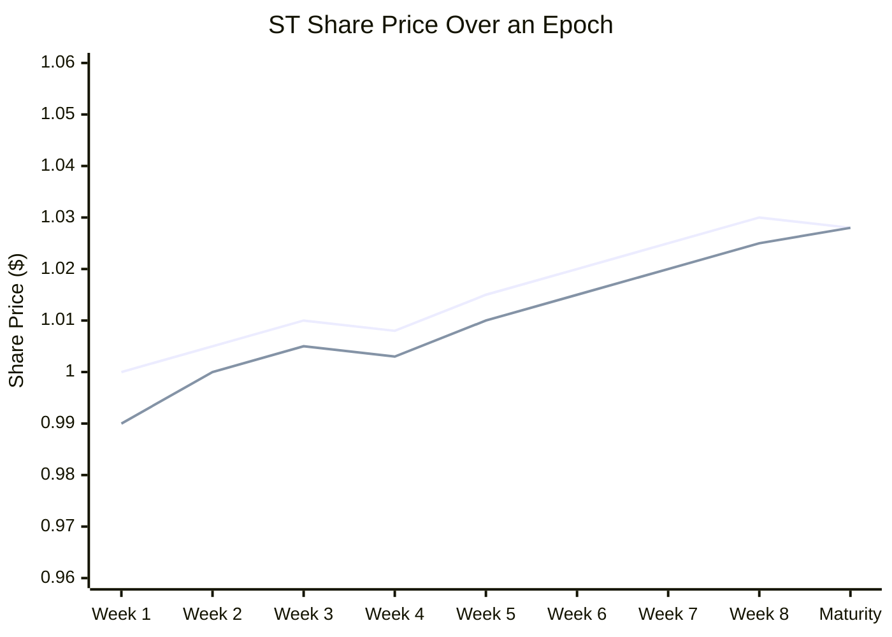

## What ST Does For You

Want exposure to a perp DEX strategy's USDC returns, without managing positions yourself? ST gives you that. Deposit USDC, receive ST shares. At the end of the epoch, redeem your shares for USDC based on how the strategy performed.

ST is an ERC4626-like vault share. Each epoch creates a new ST contract instance, e.g., `ST-PacificaFundingArb-E007` for Epoch 7. Think of it as a share in a **closed-end fund**.

---

## How Shares Are Calculated

The number of ST shares you receive depends on the current NAV (net asset value) at deposit time:

$$\text{shares} = \frac{\text{netUSDC} \times \text{totalShares}}{\text{currentNAV}}$$

**First depositor:** If you're first in a new epoch, the bootstrap rule applies: `shares = netUSDC` (1:1 ratio).

**Example: Two depositors at different NAVs**

| | Alice (Day 1) | Bob (Week 4) |
|---|---|---|
| Deposits | \$100 | \$100 |
| Deposit fee (0.5%) | \$0.50 | \$0.50 |
| Net USDC | \$99.50 | \$99.50 |
| NAV at deposit | \$10,000 | \$10,300 (strategy up 3%) |
| Total shares before | 10,000 | 10,099.50 |
| Shares received | `99.50 × 10,000 / 10,000 = 99.50` | `99.50 × 10,099.50 / 10,300 = 97.58` |

Alice gets 99.50 shares. Bob gets 97.58, fewer because the strategy has appreciated. Bob is buying in at a higher price per share. This is exactly how a mutual fund works.

<AccordionGroup>
<Accordion title="Can I lose more than my deposit?">
No. ST floors at \$0. The strategy's deposited capital is the margin, and there's no additional leverage. Your maximum loss is the USDC you deposited.
</Accordion>
</AccordionGroup>

---

## Share Price and NAV

$$\text{sharePrice} = \frac{\text{currentNAV}}{\text{totalShares}}$$

The NAV oracle updates every 5 minutes. As the strategy executes trades on perp DEXes, PnL flows into the NAV:

- Strategy earns funding payments → NAV increases → share price rises
- Strategy takes a loss → NAV decreases → share price falls
- Strategy is idle → NAV stays flat

**The floor:** ST share price floors at \$0. If the strategy loses its entire capital, your ST redeems for nothing. But it never goes negative. You cannot owe more than your deposit.

---

## Redemption

Once the epoch ends and the admin calls `finalize()`, you can redeem:

$$\text{usdcOut} = \frac{\text{yourShares} \times \text{finalNAV}}{\text{totalShares}}$$

- No fee on ST redemption
- No expiry: redeem days, weeks, or months after finalization
- Burns your ST shares and transfers USDC to your wallet

**Example:** Alice deposits \$100 (sole depositor). Fee = \$0.50. Net = \$99.50. Shares = 99.50. Strategy earns 3%. Final NAV = \$102.49.

$$\text{usdcOut} = \frac{99.50 \times 102.49}{99.50} = \$102.49$$

Net profit = \$1.99 after the \$0.50 fee.

<AccordionGroup>
<Accordion title="What if I never redeem my ST?">
It remains redeemable indefinitely after finalization. No expiry. Your USDC isn't forfeited.
</Accordion>
</AccordionGroup>

---

## Early Exit: Selling on the ArcX AMM

Before finalization, the only way to exit is selling ST on the ArcX AMM's ST/USDC pool. This is a custom Pendle-style AMM with a time-decay curve that accounts for the time remaining until maturity.

- **ST below fair value:** Arbitrageurs buy (price corrects upward)
- **ST above fair value:** Arbitrageurs sell (price corrects downward)

The time-decay curve steepens as maturity approaches, naturally pulling ST toward its redemption value. This means ST prices stay close to NAV during the epoch, with tighter spreads as finalization nears. As maturity approaches, the ST discount narrows because less time remains for uncertainty about the strategy's final performance. This benefits early yield seekers who bought ST at deeper discounts earlier in the epoch, since they locked in a wider gap between purchase price and eventual redemption value.

**Yield seeker worked example:** A yield seeker buys ST at $0.90 when the strategy earns 1% over the epoch. At maturity, each ST is worth ~$1.01. That's an 11% return in one epoch --- the 10% discount capture plus the 1% strategy performance.

---

## What Drives ST Price

| Factor | Effect | Mechanism |
|---|---|---|
| Strategy performance (PnL) | ↑ PnL → ↑ ST price | NAV oracle updates every 5 min |
| Flash loop selling pressure | ↓ ST price | Points farmers sell ST repeatedly to accumulate EPT |
| Yield seeker demand | ↑ ST price | Yield seekers buy discounted ST for fixed APR |
| Time to maturity | Converges to final NAV | ArcX AMM time-decay curve steepens near maturity |

**The two-sided market:** Points farmers sell ST at a discount (creating supply), yield seekers buy discounted ST (creating demand). This is the core flywheel that makes ArcX work. The ST discount reflects the "price" of points --- yield seekers capture this discount as their return.

<Warning title="What can go wrong">
- **Strategy loss:** NAV drops, your ST redeems for less than deposited. Worst case: \$0.
- **Thin AMM liquidity:** If you exit early and the pool has low liquidity, you may suffer slippage selling below fair value.
- **NAV staleness:** Deposits use oracle NAV, which can be up to 30 minutes old. The deposit fee covers this gap for typical strategies.
</Warning>
