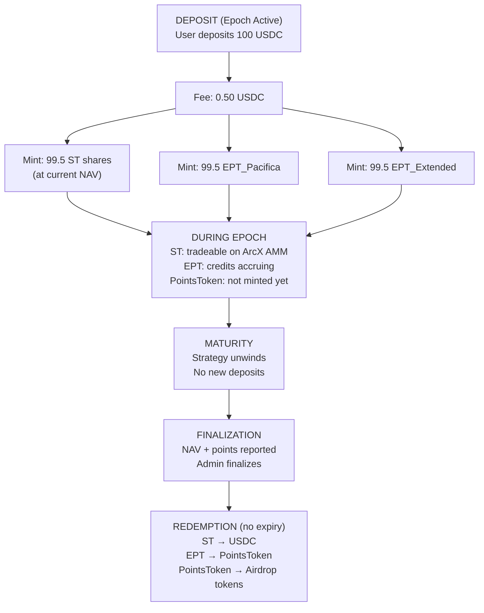

import FlashLoop from "/snippets/flash-loop.mdx";

<Info>
**Course level: Intermediate**

**The core idea:** A single USDC deposit creates two tokens: ST for the USDC outcome, EPT for the points outcome. A third token, PointsToken, bridges EPT credits to real exchange points.
</Info>

**Prerequisites:** [What is ArcX?](/learn/protocol-overview)

---

## How Tokens Are Created

The organizing equation:

$$1 \text{ USDC deposited} = \frac{1}{R} \text{ ST} + 1 \text{ EPT}$$

Where R = current ST exchange rate (<Tooltip tip="Net Asset Value -- the total USDC value held by the strategy vault, reported by the NAV oracle every ~5 minutes.">NAV</Tooltip> / totalShares). Every deposit produces both tokens in a single transaction:

```
deposit(100 USDC)
  ├─ deduct deposit fee → netUSDC = 99.5 USDC
  ├─ mint ST shares:  shares = netUSDC × totalShares / currentNAV
  └─ mint EPT:        amount = netUSDC (99.5 EPT)
```

**Multi-exchange strategies** create one EPT per exchange. Depositing \$100 into Pacifica-Extended Funding Arb gives you: 1 ST + 99.5 EPT_Pacifica + 99.5 EPT_Extended. Three tokens from one deposit.

<Note title="Why EPT is per net USDC, not per ST share">
Two users depositing \$100 at different NAVs get different ST shares but contributed the same capital. EPT tracks capital contribution, not share count.
</Note>

---

## Quick Reference

| | ST (Strategy Token) | EPT (Expected Points Token) | PointsToken (xPC, xHL) |
|---|---|---|---|
| **TL;DR** | Claim on USDC at maturity | Claim on exchange points | Tokenized points, 1:1 backed |
| **Analogy** | Closed-end fund share | Pre-TGE points futures | Gift card for airdrop tokens |
| **Minted when** | You deposit USDC | Alongside ST, automatically | At finalization, when you claim EPT |
| **Value driver** | Strategy PnL | <Tooltip tip="Credits accrue every second based on the creditRate, which measures the strategy's trading activity on the exchange. More activity = faster credit accrual.">Credits accrued</Tooltip> × points value | TGE timing × airdrop generosity |
| **Can go to zero?** | Yes (total strategy loss) | Effectively yes (worthless points) | Effectively yes (no TGE) |
| **Tradeable?** | Yes, on ArcX AMM | Not tradeable (mint via deposit only) | Yes, standard ERC20 |
| **Expiry** | None | None | None |
| **Scope** | Per epoch, per strategy | Per epoch, per exchange, per strategy | Per exchange, persists across epochs |

<CardGroup cols={3}>
  <Card title="Strategy Token (ST)" icon="vault" href="/learn/strategy-token">
    How ST shares are calculated, NAV tracking, redemption, and early exit via the ArcX AMM.
  </Card>
  <Card title="Expected Points Token (EPT)" icon="star" href="/learn/expected-points-token">
    The credit system, checkpointing, worked examples, and the minting parity equation.
  </Card>
  <Card title="PointsToken" icon="gift" href="/learn/points-token">
    Points backing, post-TGE redemption, multi-tranche airdrops.
  </Card>
</CardGroup>

---

## The Complete Token Lifecycle

Every token passes through a single <Tooltip tip="A fixed time window (typically 1-3 months) during which a strategy runs. Progresses through ACTIVE, MATURITY, and FINALIZED stages.">epoch</Tooltip> from minting to redemption:



---

## The Flash Loop

<FlashLoop />

---

## Token Naming

| Token | Pattern | Example | Scope |
|---|---|---|---|
| ST | `ST-{Strategy}-E{epoch}` | `ST-PacificaFundingArb-E007` | Per epoch per strategy |
| EPT | `EPT-{Exchange}-E{epoch}` | `EPT-Pacifica-E007` | Per epoch, per exchange, per strategy |
| PointsToken | `x{Exchange}` | `xPC`, `xHL`, `xET` | Per exchange, persists |

---

## Fee Structure

| Fee | When | Amount | Purpose |
|---|---|---|---|
| **Deposit fee** | At deposit | Per strategy (0.01%–0.5%) | Operational costs + sandwich defense |
| **Redemption fee** | EPT → PointsToken claim | Configurable per strategy; check contract parameters at launch | Protocol revenue |
| **ST redemption** | None | **No fee** | Deposit fee covers costs |
| **AMM swap fees** | Any ArcX AMM trade | Standard rates | AMM fee, not ArcX revenue |

The deposit fee serves double duty: covering real costs (bridging, spreads) and defending against sandwich attacks. For funding arb strategies, even 0.01% suffices. Market-making strategies need 0.3–0.5%.

---

## Frequently Asked Questions

<AccordionGroup>
<Accordion title="Can I lose more than my deposit?">
No. ST floors at \$0. Your maximum loss is the USDC you deposited. EPT and PointsTokens represent points claims, not capital positions.
</Accordion>

<Accordion title="Why did I receive 3 tokens from one deposit?">
The strategy earns points on two exchanges. You get 1 ST (combined USDC NAV) + 1 EPT per exchange. If the strategy used one exchange, you'd get 2 tokens.
</Accordion>

<Accordion title="What if I never redeem my ST or EPT?">
Both remain redeemable indefinitely after finalization. No expiry. PointsToken post-TGE redemption depends on the exchange's timeline.
</Accordion>

<Accordion title="Can I deposit across multiple epochs?">
Yes, but no automatic rollover. Redeem from Epoch N, then deposit into Epoch N+1. Each epoch is independent.
</Accordion>
</AccordionGroup>
