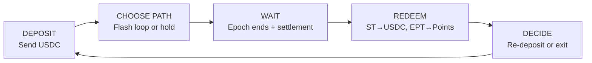

<Info>
**Course level: Beginner**

**The core idea:** Deposit USDC, receive two tokens, use the <Tooltip tip="Flash loop — sell your ST for USDC and re-deposit repeatedly, converting capital into leveraged points exposure.">flash loop</Tooltip> for leveraged points or buy discounted <Tooltip tip="Strategy Token — represents your share of the strategy's USDC returns.">ST</Tooltip> for yield. Redeem after finalization. That's the full loop.
</Info>

**Prerequisites:** [What is ArcX?](/learn/protocol-overview)

---

## The Full Loop in 60 Seconds



Every ArcX interaction follows the same cycle:

```
1. DEPOSIT    →  Send USDC, receive ST + EPT(s)
2. CHOOSE     →  Flash loop (leveraged points) or hold everything or buy more ST (yield)
3. WAIT       →  Epoch ends, strategy unwinds (1-2 days), admin finalizes
4. REDEEM     →  Burn ST → get USDC back. Claim EPT → get PointsTokens.
5. DECIDE     →  Re-deposit into the next epoch, or walk away. No rollover.
```

The rest of this guide walks through each step in detail.

---

## Before You Start

### What You Need

| Item | Details |
|---|---|
| **USDC** | On Starknet (for direct deposits) or on Ethereum/Arbitrum/Solana (for cross-chain deposits) |
| **A Starknet wallet** | [Argent X](https://www.argent.xyz/argent-x/) or [Braavos](https://braavos.app/) |
| **Gas (STRK or ETH)** | For Starknet transaction fees. Small amounts, typically under \$0.10 per transaction. |

### Choosing a Strategy

ArcX runs multiple strategies. Each strategy has its own vault, its own risk profile, and its own epoch schedule.

| What to check | Why it matters |
|---|---|
| **Strategy type** | Funding arb = lower risk, lower return. Market making = higher risk, higher return. |
| **Which exchanges** | Determines which <Tooltip tip="Expected Points Token — earns credits every second, redeemable for PointsTokens after finalization.">EPT</Tooltip>s you receive (EPT_Pacifica, EPT_Extended, etc.) and which points you earn. |
| **Current <Tooltip tip="Epoch — a fixed time period during which a strategy runs. Each epoch has its own deposit window, maturity date, and separate token contracts.">epoch</Tooltip>** | Is the deposit window open? How much time remains? Depositing late means fewer credits on your EPT. |
| **Deposit fee** | Varies by strategy. Funding arb: ~0.01--0.1%. Market making: ~0.3--0.5%. |
| **Historical performance** | Past NAV trajectory gives you a sense of typical returns. Past performance does not guarantee future results. |

<AccordionGroup>
<Accordion title="How much USDC do I need to start?">
There is no minimum deposit enforced by the protocol. However, very small deposits may not be economical after the deposit fee and gas costs. A practical minimum depends on the strategy's fee rate. At 0.5% fee, a \$100 deposit costs \$0.50 in fees.
</Accordion>

<Accordion title="What wallets are supported?">
Any Starknet-compatible wallet. The most common options are [Argent X](https://www.argent.xyz/argent-x/) and [Braavos](https://braavos.app/). For cross-chain deposits, any EVM wallet (MetaMask, Rabby, Coinbase Wallet, etc.) works on the source chain side.
</Accordion>

<Accordion title="Is there a mobile app?">
ArcX is a web application. Both Argent X and Braavos have mobile apps with built-in browsers that can access the ArcX interface.
</Accordion>
</AccordionGroup>

---

## Step 1: Deposit USDC

### Option A: Direct Deposit (Starknet)

If you already have USDC on Starknet:

<Steps>
  <Step title="Connect wallet">
    Connect your Starknet wallet to the ArcX app.
  </Step>
  <Step title="Select strategy">
    Select the strategy and epoch you want to enter.
  </Step>
  <Step title="Enter amount">
    Enter the USDC amount you want to deposit.
  </Step>
  <Step title="Review transaction">
    Review the transaction summary:
    - **Gross deposit:** your USDC amount
    - **Deposit fee:** deducted upfront (e.g., \$0.50 on a \$100 deposit at 0.5%)
    - **Net deposit:** USDC after fee (e.g., \$99.50)
    - **ST shares you'll receive:** based on current NAV
    - **EPT you'll receive:** equal to net USDC (e.g., 99.50 EPT per exchange)
  </Step>
  <Step title="Confirm">
    Confirm the transaction in your wallet.
  </Step>
  <Step title="Receive tokens">
    ST + EPT(s) appear in your wallet in the same transaction.
  </Step>
</Steps>

**What happens on-chain:**

```
Your wallet
  → sends 100 USDC to ST Vault
  → receives 99.50 ST shares (at current NAV)
  → receives 99.50 EPT_Pacifica
  → receives 99.50 EPT_Extended (if multi-exchange strategy)
  → credit accrual begins immediately
```

### Option B: Cross-Chain Deposit (Ethereum / Arbitrum / Solana)

If your USDC is on another chain:

<Steps>
  <Step title="Connect wallet">
    Connect your EVM or Solana wallet to the ArcX cross-chain deposit page.
  </Step>
  <Step title="Enter receiver">
    Enter your Starknet wallet address as the receiver.
  </Step>
  <Step title="Enter amount">
    Enter the USDC amount.
  </Step>
  <Step title="Confirm and lock">
    Confirm the transaction. Your USDC is locked in the escrow contract on your chain.
  </Step>
  <Step title="Wait for bridge">
    Wait for the LayerZero message to deliver (typically 1--5 minutes, worst case ~30 minutes).
  </Step>
  <Step title="Receive tokens">
    ST + EPT(s) are minted to your Starknet wallet at the **arrival-time NAV**.
  </Step>
</Steps>

**Important details:**

- **NAV slippage:** The NAV when your deposit processes on Starknet may differ slightly from when you initiated. For low-volatility strategies (funding arb), this is negligible.
- **If the message never arrives:** After `REFUND_TIMEOUT` expires, you can call `cancel(depositId)` on the source chain escrow to get your USDC back. You are never permanently locked out. See [How Epochs Work: Refund Path](/learn/epoch-lifecycle#refund-path-what-if-the-message-fails).

---

## Step 2: Choose Your Path

After depositing, you hold ST + EPT(s). What you do next depends on your goal.

### Path A: Flash Loop (Points Farmer)

**Goal:** Maximum points exposure with minimal capital.

This is ArcX's core innovation. The flash loop recycles your ST into more EPT:

<Steps>
  <Step title="Deposit USDC">
    Deposit \$100 → receive 99.50 EPT + ST shares.
  </Step>
  <Step title="Sell ST on ArcX AMM">
    Swap your ST for USDC on the ArcX AMM. ST trades at a ~10% discount, so you receive ~\$89.55.
  </Step>
  <Step title="Re-deposit">
    Deposit the \$89.55 → receive ~89.05 EPT + more ST.
  </Step>
  <Step title="Repeat">
    Sell ST again (~\$80.15), re-deposit, and so on. Each loop gives you more EPT.
  </Step>
</Steps>

**Result after 3 loops:** ~270 EPT from a \$100 starting deposit. Effective cost per EPT: ~\$0.037 instead of \$1.00.

**Why this works:** Each deposit creates EPT (which you keep) and ST (which you sell). The ST discount is the "price" you pay for points. Yield seekers who buy your discounted ST capture that discount as their return.

**When to flash loop:** As early in the epoch as possible. Earlier deposits accrue credits for longer, maximizing your points share.

### Path B: Buy Discounted ST (Yield Seeker)

**Goal:** Predictable USDC returns without points exposure.

Points farmers dump ST on the ArcX AMM at a discount. You buy it.

<Steps>
  <Step title="Browse the ArcX AMM">
    Check the ST/USDC pool for available discounted ST.
  </Step>
  <Step title="Buy ST at a discount">
    Buy ST at \$0.90 (10% discount to NAV).
  </Step>
  <Step title="Hold until maturity">
    The strategy earns ~1% over the epoch. ST redeems at ~\$1.01. Monitor the strategy's NAV via the ArcX dashboard. No action required — your ST accrues yield automatically.
  </Step>
  <Step title="Redeem after finalization">
    After the admin finalizes the epoch, call `redeemST()` to receive your USDC. Your return = (redemption price - purchase price) per ST. Example: (\$1.01 - \$0.90) / \$0.90 = **12.2% in one epoch**.
  </Step>
</Steps>

**Annualized:** If epochs run ~3 months, that's roughly **~49% annualized**. You don't care about points at all.

**Risk:** Strategy PnL could be negative (ST redeems below \$1.00). AMM liquidity risk if you need to exit early.

### Path C: Hold Everything (Depositor)

**Goal:** Maximize both USDC returns and points.

**What to do:** Nothing. Your ST tracks the strategy's NAV. Your EPT accrues credits every second. At finalization, you redeem both.

**Best for:** Depositors who want the full package: strategy returns + points.

---

## Step 3: During the Epoch

You can monitor your position on the ArcX interface:

- **ST share value:** Based on current NAV (updates every 5 minutes)
- **EPT credit accrual:** Estimated points earned so far
- **Strategy performance:** NAV chart, current <Tooltip tip="creditRate — the per-second rate at which each EPT accrues credits. Set by the admin and can change during an epoch.">creditRate</Tooltip>
- **Epoch countdown:** Time remaining until maturity

<Accordion title="The strategy is losing money. What do I do?">
You have two options:
1. **Hold.** The strategy may recover. You still earn points regardless of PnL. Wait for finalization and assess.
2. **Sell ST on the ArcX AMM.** You exit the USDC risk immediately (at market price). Keep your EPT to continue earning points.

You **cannot** redeem ST early. The only pre-maturity exit is selling on the ArcX AMM.
</Accordion>

---

## Step 4: Epoch Ends, Wait for Finalization

When the epoch ends:

1. **No more deposits accepted.** The deposit window closes.
2. **Strategy unwinds.** ArcX closes positions on the perp DEXes and returns capital to the Starknet vault. This takes 1--2 days.
3. **Oracles report.** The NAV Oracle publishes the final NAV. The Final Points Oracle reports total points earned.
4. **Admin calls `finalize()`.** This locks in the conversion ratios.

**During this waiting period:**
- Your tokens still exist
- You cannot redeem ST or claim EPT yet
- Credit accrual has stopped (it ended at epoch close)
- No action required from you

---

## Step 5: Redeem

Once the epoch is finalized, you can redeem. There is **no deadline**. Redeem whenever you want.

### Redeem ST for USDC

<Steps>
  <Step title="Go to redemption page">
    Go to the ArcX redemption page.
  </Step>
  <Step title="Select epoch">
    Select the finalized epoch.
  </Step>
  <Step title="Enter amount">
    Enter how many ST shares to redeem (all or partial).
  </Step>
  <Step title="Confirm">
    Confirm the transaction.
  </Step>
</Steps>

**What happens:**
```
Your ST shares are burned
You receive: shares × finalNAV / totalShares = USDC
No fee on ST redemption
```

**Example:** You hold 99.50 ST shares. Final NAV = \$51,400. Total shares = 50,099.50.
```
USDC out = 99.50 / 50,099.50 × $51,400 = $102.08
```

### Claim EPT for PointsTokens

<Steps>
  <Step title="Go to claims page">
    Go to the ArcX claims page.
  </Step>
  <Step title="Select EPT">
    Select the finalized epoch and the EPT you want to claim.
  </Step>
  <Step title="Confirm">
    Confirm the transaction.
  </Step>
</Steps>

**What happens:**
```
Your credits are settled (final checkpoint)
Gross points = yourCredits × (totalPoints / totalCredits)
Redemption fee deducted
Net PointsTokens minted to your wallet
```

---

## Step 6: What to Do with PointsTokens

After claiming, you hold PointsTokens (xPC, xHL, etc.) in your wallet. These persist across epochs and accumulate.

### Before TGE

| Action | Details |
|---|---|
| **Hold** | Accumulate PointsTokens across multiple epochs. Wait for the exchange's TGE. |
| **Trade** | PointsTokens are standard ERC20s, tradeable on Starknet DEXs. |
| **Speculate** | If you believe the TGE will be generous, hold. If you want USDC now, sell on the market. |

<Note>PointsToken trading is available on Starknet DEXs. Check the ArcX dashboard for current liquidity venues.</Note>

### After TGE

When the exchange conducts its TGE and distributes airdrop tokens:

1. ArcX receives the airdrop tokens
2. ArcX deposits them into the Redemption Module
3. A conversion rate is set: `redemptionRate = totalAirdropTokens / totalPointsTokenSupply`
4. Go to the ArcX redemption page
5. Burn your PointsTokens → receive airdrop tokens

**Multi-tranche:** Airdrops often come in batches (initial + vesting). You don't have to redeem all at once. Burn some now, keep the rest for later batches when the rate may be higher.

---

## Step 7: The Next Epoch

There is **no automatic rollover.** When a new epoch opens:

1. Redeem your ST from the previous epoch (if you haven't already)
2. Evaluate: do you want to re-enter? Same strategy? Different one?
3. Deposit into the new epoch. You'll receive new ST and EPT tokens

<Accordion title="Can I redeem from one epoch while depositing into the next?">
Yes. Epochs are independent. You can be redeeming from Epoch 7 (FINALIZED) while depositing into Epoch 8 (ACTIVE). The tokens are separate contracts. `ST-E007` and `ST-E008` don't interact.
</Accordion>

---

## Common Scenarios

### "I deposited from Ethereum and nothing happened."

Cross-chain deposits go through LayerZero. Typical delivery: 1--5 minutes. Worst case: ~30 minutes.

- **Check the escrow:** Your USDC is locked in the SourceChainDepositEscrow on Ethereum. This is verifiable on-chain.
- **Wait:** Most messages arrive within 5 minutes.
- **If it's been 30+ minutes:** The message may have failed. Wait for `REFUND_TIMEOUT` to expire, then call `cancel(depositId)` on the escrow to get your USDC back.
- **Your USDC is safe.** Either it arrives on Starknet (minting your tokens) or you self-rescue via the refund timeout.

### "I want maximum points. What's the optimal strategy?"

1. Deposit as early as possible in the epoch. More time = more credit accrual
2. Execute the flash loop immediately for maximum EPT exposure
3. Earlier flash loop iterations earn more credits than later ones
4. Don't deposit near epoch end expecting significant points

### "The epoch is finalized but I'm not in a rush to redeem."

No penalty. There is no expiry on redemptions. Redeem anytime after finalization. Days, weeks, or months later.

---

## Quick Reference: What Can I Do When?

| Action | During ACTIVE | During MATURITY | After FINALIZED |
|---|---|---|---|
| Deposit USDC | Yes | No | No |
| Flash loop (deposit + sell ST + re-deposit) | Yes | No | No |
| Buy/sell ST on ArcX AMM | Yes | Yes | Yes (but you can also redeem) |
| Redeem ST for USDC | No | No | **Yes** |
| Claim EPT for PointsTokens | No | No | **Yes** |
| Earn credits on EPT | Yes | No (stopped at epoch end) | No |
| Burn PointsTokens for airdrop | N/A | N/A | After TGE only |

---

## Fees Summary

| Fee | When | Amount | What it covers |
|---|---|---|---|
| **Deposit fee** | On USDC deposit | Varies by strategy (0.01%--0.5%) | Bridge costs, operational overhead, sandwich defense |
| **Redemption fee** | On EPT → PointsToken claim | Configurable (TBD) | Protocol revenue |
| **ST redemption** | On ST → USDC redemption | **None** | None |
| **AMM swap fees** | On every ArcX AMM trade | Standard rates | AMM protocol fee (not ArcX revenue) |
| **Gas** | On every Starknet transaction | Under \$0.10 typical | Starknet network fee |

---

## Checklist: Your First Epoch

<Steps>
  <Step title="Get USDC">
    Get USDC on Starknet (or on Ethereum/Arbitrum/Solana for cross-chain).
  </Step>
  <Step title="Set up wallet">
    Set up a Starknet wallet ([Argent X](https://www.argent.xyz/argent-x/) or [Braavos](https://braavos.app/)). Fund it with STRK/ETH for gas.
  </Step>
  <Step title="Choose a strategy">
    Check strategy type, exchanges, fee, and current epoch status.
  </Step>
  <Step title="Deposit USDC">
    Review the transaction summary, confirm in wallet. Verify tokens arrived.
  </Step>
  <Step title="Choose your path">
    Flash loop for points? Buy discounted ST for yield? Or hold everything?
  </Step>
  <Step title="Wait for finalization">
    Epoch ends + settlement (1--2 days). No action needed.
  </Step>
  <Step title="Redeem">
    Redeem ST for USDC. Claim EPT for PointsTokens.
  </Step>
  <Step title="Decide next epoch">
    Decide whether to re-deposit into the next epoch.
  </Step>
</Steps>

---

## Next Steps

<Columns cols={2}>
  <Card title="Credit Mathematics" icon="calculator" href="/deep-dives/credit-mathematics">
    Understand exactly how your points are calculated.
  </Card>
  <Card title="EPT Pricing" icon="chart-line" href="/deep-dives/ept-pricing">
    Learn about flash loop economics and ST pricing dynamics.
  </Card>
</Columns>
